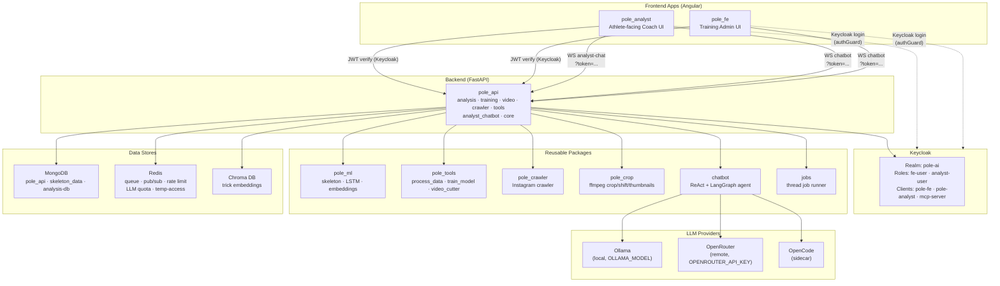

# Architecture — `pole-ai`

> High-level system architecture for the Athlete Trick Identification System. Shows the main
> components, their responsibilities, and how they communicate. Source of truth for structural
> decisions; for phase/ticket details see `DEVELOPEMENT.md`.

---

## 1. System Overview



### 1.1 Diagram Component Descriptions

| Component | Responsibility | Key Details |
| :--- | :--- | :--- |
| **pole_analyst** | Athlete-facing Angular app. Chat with coach, upload video, view analysis. | Sidebar nav (Library/Analysis/Profile), two-pane split, Keycloak auth (login deployed, per-user library deferred). |
| **pole_fe** | Training admin Angular app. Class management, crawling, training, histogram reference generation. | Keycloak auth, class stats histograms. |
| **Keycloak** | Identity provider. Realm `pole-ai`, roles `fe-user`/`analyst-user`, clients `pole-fe`/`pole-analyst`/`mcp-server`. | JWT verification at API layer. |
| **pole_api** | FastAPI backend. 5 slices: analysis, training, video, crawler, tools + analyst_chatbot + core. | Auth via Keycloak JWT (`core/auth.py`), two Mongo DBs, Redis-backed jobs. |
| **Ollama** | Local LLM provider for coach prompts. | `OLLAMA_MODEL` env var, `ChatOllama` integration. |
| **OpenRouter** | Remote LLM provider for prod deployments. | Direct HTTP via `httpx`. |
| **OpenCode** | Sidecar LLM for development. | Optional, for dev workflows. |
| **pole_ml** | ML package: skeleton extraction, LSTM training, embeddings, Chroma. | MediaPipe → normalized landmarks → LSTM → embeddings. |
| **pole_tools** | CLI tools: process_data, train_model, video_cutter, evaluate_video, find_by_similarity. | Called by API services. |
| **pole_crawler** | Instagram video crawler. | Called by crawler slice. |
| **pole_crop** | ffmpeg crop/shift/thumbnails. | Called by video + tools slices. |
| **chatbot** | ReAct + LangGraph agent framework. | `PoleLangGraphAgent` (StateGraph), `OllamaLLM`, `OpenRouterLLM`. |
| **jobs** | Thread-based job runner. | `Job` model with `entity_name` + paginated history. |
| **MongoDB** | Three databases: `pole_api` (app data), `skeleton_data` (ML data), `analysis-db` (analysis results). | Shared clients via `core/mongo.py`. |
| **Redis** | Queue, pub/sub, rate limiting, LLM quota, temp-access sessions. | Sliding-window rate limiter (429). |
| **Chroma DB** | Vector store for trick embeddings. | Nearest-neighbor retrieval for similarity. |

---

## 2. Auth Flow

```
User opens pole_analyst → authGuard redirects to Keycloak login page
→ User authenticates (magic link or credentials)
→ Keycloak redirects back with JWT
→ authInterceptor attaches Bearer token to all API requests
→ pole_api verifies JWT (core/auth.py: realm pole-ai, roles fe-user/analyst-user)
→ WS connections use ?token= query parameter (browsers can't set WS headers)
→ MEDIA requests also accept ?token= (thumbnails, video streams)
```

---

## 3. Data Stores

| Database | Purpose | Collections |
| :--- | :--- | :--- |
| `pole_api` | Application data | classes, clips, uploads, videos, crawls, posts, model_runs, cutter_configs, llm_usage |
| `skeleton_data` | ML data | skeleton_windows, skeleton_video_signals, skeleton_trick_histograms |
| `analysis-db` | Analysis results | videos, skeleton-landmarks, video_histograms, coach_* envelopes, athlete_profile |

---

## 4. Deployment Architecture

- **Local dev:** `docker-compose.yml` (Mongo + Redis + Ollama + Keycloak)
- **Production:** Kubernetes (k3s) — see `infrastracture/` (helm charts, k3s manifests, keycloak config)
- **CI/CD:** GitHub Actions — build, Trivy scan, deploy to k3s cluster
- **LLM:** Ollama (local) or OpenRouter (remote) depending on `LLM_PROVIDER` env

---

## 5. Key Architectural Decisions

| Decision | Rationale |
| :--- | :--- |
| **Classify-first pipeline** | Phase detection requires the correct trick class to select the right reference histograms. |
| **Separate analysis-db** | Analysis results grow independently from app data; easier backups and scaling. |
| **Redis for rate limiting** | Sliding-window rate limiter with 429 responses; per-session quotas. |
| **LLM quota tracking** | Per-user token budgets via `core/llm_quota.py`; exposed via `GET /api/me/llm-usage`. |
| **Coach prompts cached** | One-shot LLM calls cached per video+trick to avoid redundant inference. |
| **Analyst chatbot tools** | 17 deterministic tools (compare_sessions, cohort_percentiles, etc.) + coach data reads. |
| **Keycloak ?token= for WS** | Browsers cannot set custom headers on WebSocket handshake; query parameter is the standard workaround. |
| **Thread-based jobs** | Simple, no external queue dependency; Redis pub/sub for event relay to WS clients. |
