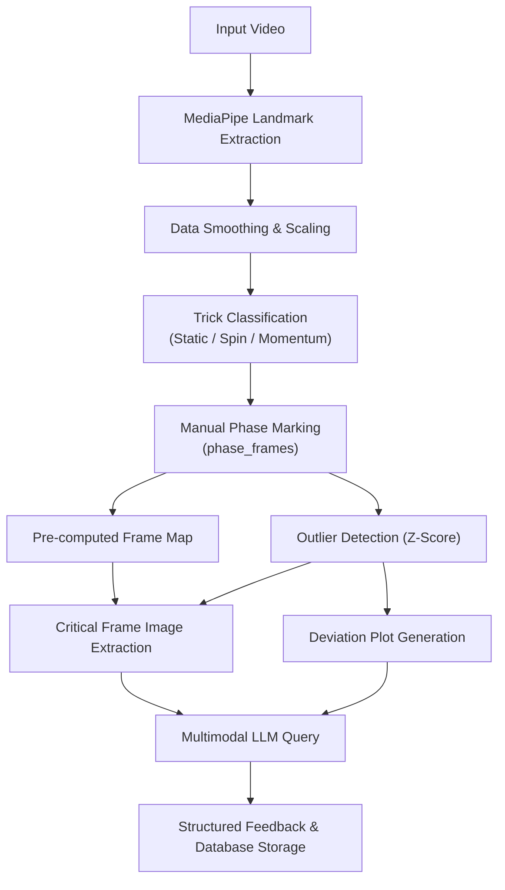

# 📋 Comprehensive Technical Requirements Document
## AI-Powered Pole Dance Coaching Agent

**Version:** 1.0  
**Date:** October 2023  
**Purpose:** This document defines all functional, non-functional, and data requirements for building an AI agent that analyzes pole dance tricks from video, detects execution phases, identifies technical flaws, and generates actionable coaching feedback using MediaPipe and Large Language Models.

---

## 1. System Overview

### 1.1 Objective
Develop an automated coaching system that:
- Takes raw video footage of a pole dance trick as input.
- Uses MediaPipe Pose to extract skeletal landmarks.
- Uses **manually marked phases**: **Entrance**, **Execution**, and **Exit** (entered by the
  user via `PUT /api/training/clips/{id}/phase-frames` — automatic phase detection is **removed**).
- Compares new attempts against a pre-built database of 21 reference attempts.
- Identifies the single frame with the most significant technical deviation (highest Z-score).
- Extracts that frame as an image, generates a contextual plot, and sends both to a multimodal LLM.
- Returns precise, actionable corrective feedback to the user.

### 1.2 System Architecture (High-Level Data Flow)


---

## 2. Input Requirements

### 2.1 Video Input Specifications
| Parameter | Requirement | Justification |
| :--- | :--- | :--- |
| **Format** | MP4, MOV, or AVI | Most common video formats |
| **Minimum Resolution** | 720p (1280x720) | MediaPipe requires visible skeletal features |
| **Minimum Framerate** | 30 fps | To capture fast rotational movements accurately |
| **Maximum Framerate** | 60 fps | Higher FPS increases processing time unnecessarily |
| **Duration** | 3 to 10 seconds | The trick must contain Entrance, Execution, and Exit |
| **Orientation** | Frontal or Profile | Frontal for symmetry metrics; Profile for height/propulsion metrics. For best results, user must record **two simultaneous videos** (front + side), but the system must handle single-angle videos gracefully. |
| **Background** | Plain, high-contrast | For optimal MediaPipe detection (e.g., white or black wall) |
| **Lighting** | Uniform, no backlighting | Prevents shadow occlusion of limbs |

### 2.2 Calibration Input
| Parameter | Requirement | Unit |
| :--- | :--- | :--- |
| **Athlete Height** | User-provided (measured standing) | Meters (e.g., 1.65) |
| **Pole Diameter (optional)** | 42mm or 45mm | Used for scale reference if height unavailable |

---

## 3. Core Processing Pipeline Requirements

### 3.1 Landmark Extraction (MediaPipe Pose)
| Requirement ID | Description | Acceptance Criteria |
| :--- | :--- | :--- |
| **LE-01** | Extract all 33 MediaPipe Pose landmarks per frame | Output must be a NumPy array of shape (num_frames, 33, 3) |
| **LE-02** | Confidence score filtering: Discard landmarks with `score < 0.5` | If >20% of landmarks are discarded in a frame, mark the frame as "unreliable" and use linear interpolation |
| **LE-03** | Interpolate occluded landmarks across frames | Use linear interpolation for gaps < 10 frames; for larger gaps, use cubic spline interpolation |
| **LE-04** | Convert normalized coordinates (0-1) to real-world meters using user height | Scale factor = `user_height / vertical_distance_between_ankles_and_head` on the first standing frame |

### 3.2 Data Smoothing & Filtering
| Requirement ID | Description | Acceptance Criteria |
| :--- | :--- | :--- |
| **SF-01** | Apply Savitzky-Golay filter to all coordinate series | Window size = 11, Polynomial order = 3 |
| **SF-02** | Calculate velocity (1st derivative) using central difference method | Ensure velocities are in meters/second (or radians/second for angles) |
| **SF-03** | Calculate acceleration (2nd derivative) for angular metrics | Units: rad/s² |

### 3.3 Metric Extraction & Computation
The system must compute the following metrics for **every frame**:
| Metric ID | Metric Name | Landmarks Used | Formula / Definition | Unit |
| :--- | :--- | :--- | :--- | :--- |
| **M-01** | Horizontal Hip Speed | Hip mid (23 & 24 mean) | `dx/dt` of Hip X-coordinate | m/s |
| **M-02** | Vertical Hip Speed | Hip mid (23 & 24 mean) | `dy/dt` of Hip Y-coordinate | m/s |
| **M-03** | Angular Speed (Torso) | Shoulder mid (11 & 12 mean) & Hip mid (23 & 24 mean) | `d(angle_from_vertical)/dt` | rad/s |
| **M-04** | Wrist Stability | Wrists (15 & 16) | Rolling standard deviation of the Euclidean distance between wrists over a 5-frame window | normalized units |
| **M-05** | Hip Angle (Flexion) | Shoulder (11), Hip (23), Knee (25) | Law of cosines on the 3-point vectors | degrees |
| **M-06** | Knee Angle | Hip (23), Knee (25), Ankle (27) | Law of cosines on the 3-point vectors | degrees |
| **M-07** | Shoulder Angle | Elbow (13), Shoulder (11), Hip (23) | Law of cosines on the 3-point vectors | degrees |
| **M-08** | Body Tilt Angle | Shoulder mid & Hip mid | Angle of the line connecting shoulder mid to hip mid relative to vertical | degrees |

*Note: M-01 to M-04 feed trick classification; M-05 to M-08 are optional but recommended for detailed coaching feedback. Phase boundaries are marked manually (see Section 4) — no metrics are used for automatic phase detection.*

### 3.4 Trick Classification
| Requirement ID | Description | Logic | Output |
| :--- | :--- | :--- | :--- |
| **TC-01** | Determine if the trick is a **Static Strength** trick | Check if Angular Speed (M-03) remains `< 0.5 rad/s` for >70% of the video duration | `STATIC` |
| **TC-02** | Determine if the trick is a **Dynamic Spin** | Check if Angular Speed (M-03) has a sustained period > 2.0 rad/s for >50% of the video | `SPIN` |
| **TC-03** | Determine if the trick is **Momentum-Based** (e.g., Handspring) | Check if Vertical Hip Speed (M-02) has a sharp peak > 3.0 m/s occurring within the first 30% of the video | `MOMENTUM` |
| **TC-04** | If metrics are ambiguous, default to `STATIC` | Conservative fallback | `STATIC` |

---

## 4. Phase Marking (Manual)

> **Decision (2026-08-13, PO):** automatic phase detection is **no longer a requirement** — the
> `PhaseDetector` state machine (PD-01..PD-05) was **removed** (`PAIML-POLE-AGENT-015`). Phase
> boundaries (`ENTRANCE` / `EXECUTION` / `EXIT`) are entered **manually** via
> `PUT /api/training/clips/{id}/phase-frames`, and every histogram/analysis path **requires**
> explicit `phase_frames` (no silent auto-detection).

### 4.1 Phase Boundary Contract (Manual Input)
| Requirement ID | Description | Data Type |
| :--- | :--- | :--- |
| **PM-01** | The user supplies absolute frame indices marking the end of the ENTRANCE and EXECUTION phases | Integer |
| **PM-02** | Phase ranges are passed as a dictionary: `{"ENTRANCE": [0, end1], "EXECUTION": [end1, end2], "EXIT": [end2, total_frames]}` | Dict of lists |
| **PM-03** | `HistogramAnalyzer.analyze(...)` raises a clear error when `phase_frames` are missing — phases are never auto-derived | `ToolError` |

---

## 5. Database & Storage Requirements

### 5.1 Reference Database (Training Data: 21 Videos)
The system must store aggregated statistics from the 21 reference videos.

**Schema: `reference_metrics` Table**
| Column Name | Type | Description |
| :--- | :--- | :--- |
| `trick_type` | VARCHAR(50) | STATIC, SPIN, MOMENTUM (Primary Key) |
| `metric_name` | VARCHAR(50) | horizontal_speed, vertical_speed, angular_speed, wrist_stability |
| `phase` | VARCHAR(20) | ENTRANCE, EXECUTION, EXIT |
| `mean_array` | JSON (Float[100]) | Mean value at each normalized index (0-99) |
| `std_array` | JSON (Float[100]) | Standard deviation at each normalized index (0-99) |
| `gradient_array` | JSON (Float[100]) | Mean gradient (slope) at each normalized index (0-99) |

**Schema: `thresholds` Table**
| Column Name | Type | Description |
| :--- | :--- | :--- |
| `trick_type` | VARCHAR(50) | STATIC, SPIN, MOMENTUM (Primary Key) |
| `config` | JSON | Full LLM-generated configuration (threshold values, percentages) |
| `created_date` | DATETIME | Timestamp of LLM analysis |

### 5.2 Attempt Logs (New Videos)
**Schema: `attempt_logs` Table**
| Column Name | Type | Description |
| :--- | :--- | :--- |
| `attempt_id` | UUID | Unique identifier for the attempt |
| `video_filename` | VARCHAR(255) | Original filename |
| `date_recorded` | DATETIME | Timestamp |
| `trick_type` | VARCHAR(50) | Classified trick type |
| `entrance_end_frame` | INTEGER | Absolute frame index |
| `execution_end_frame` | INTEGER | Absolute frame index |
| `total_frames` | INTEGER | Total frames in video |
| `phase_durations` | JSON | `{"ENTRANCE": 2.3, "EXECUTION": 1.8, "EXIT": 0.9}` (seconds) |
| `critical_frame` | INTEGER | Frame with highest Z-score deviation |
| `critical_phase` | VARCHAR(20) | Phase where critical frame occurred |
| `critical_metric` | VARCHAR(50) | Metric with highest Z-score |
| `max_z_score` | FLOAT | Highest Z-score detected |
| `ai_feedback` | TEXT | The textual advice returned by the LLM |
| `feedback_rating` | INTEGER | User rating (1-5) for feedback usefulness (future feature) |

---

## 6. Frame Mapping & Outlier Detection

### 6.1 Pre-computed Frame Mapping
| Requirement ID | Description | Logic |
| :--- | :--- | :--- |
| **FM-01** | Build an array mapping normalized indices (0-99) to absolute frame numbers for each phase | `np.round(np.linspace(start_frame, end_frame, 100)).astype(int)` |
| **FM-02** | Store maps in a dictionary `maps[phase_name] = array` | O(1) lookup for conversion |
| **FM-03** | Handle edge case: If phase duration < 100 frames, duplicate frames are allowed | Duplicates are okay; deduplication is optional for image extraction |

### 6.2 Resampling New Video Data
| Requirement ID | Description | Logic |
| :--- | :--- | :--- |
| **RS-01** | Extract the raw metric values for a specific phase from the new video | Slice the metric array using phase start/end frames |
| **RS-02** | Resample the extracted values to exactly 100 points using linear interpolation | `np.interp()` with new indices spanning 0 to len(metric)-1 |
| **RS-03** | Return resampled array of length 100 | Matches the shape of the reference database arrays |

### 6.3 Z-Score Calculation & Outlier Detection
| Requirement ID | Description | Logic |
| :--- | :--- | :--- |
| **OD-01** | Retrieve the `mean_array` and `std_array` from the database for the specific trick_type and phase | Query by trick_type and phase |
| **OD-02** | Calculate Absolute Deviation: `abs(resampled_metric - mean_array)` | Element-wise subtraction |
| **OD-03** | Calculate Z-Score: `abs_deviation / (std_array + epsilon)` | Epsilon = 0.001 to prevent division by zero |
| **OD-04** | Find the normalized index (0-99) where Z-Score is maximum | `np.argmax(z_scores)` |
| **OD-05** | Map the normalized index to an absolute frame using the pre-computed map | `absolute_frame = maps[phase_name][norm_index]` |
| **OD-06** | Store the following metadata: `phase`, `absolute_frame`, `norm_index`, `metric_value`, `mean_value`, `z_score` | Return as a structured dictionary |
| **OD-07** | Classify severity based on Z-score: <br> - Z > 3.0: **Critical** <br> - Z > 2.0: **High** <br> - Z > 1.5: **Medium** <br> - Z <= 1.5: **Low (ignore)** | Use this to decide whether to query the LLM |

---

## 7. LLM Integration Requirements

> **Removed (2026-08-13):** phase-threshold discovery (formerly LLM-TD-01..04) fed the automatic
> `PhaseDetector` config and was **removed** with automatic phase detection — phases are manual,
> so no LLM-generated `end_of_entrance_frame` / `end_of_execution_frame` config is produced or
> consumed.

### 7.1 Coaching Feedback (Inference Phase)
| Requirement ID | Description | Input | Output |
| :--- | :--- | :--- | :--- |
| **LLM-CF-01** | Extract the critical frame image from the video using OpenCV | `cv2.VideoCapture` and `cap.set(CAP_PROP_POS_FRAMES, frame_num)` | Image saved as `critical_frame.jpg` |
| **LLM-CF-02** | Generate a "Deviation Plot" showing: <br> - X-axis: Normalized Time (0-100%) <br> - Y-axis: Metric Value <br> - Blue line: Reference Mean <br> - Gray ribbon: Reference Std <br> - Red line: New attempt <br> - Red dot: Critical frame location | Use Matplotlib | Image saved as `deviation_plot.png` |
| **LLM-CF-03** | Build a context-rich prompt (see Section 7.4) including Z-score, deviation, phase, and metric details | Combine structured data | Prompt string |
| **LLM-CF-04** | Send the prompt + `critical_frame.jpg` + `deviation_plot.png` to a multimodal LLM (GPT-4o or Gemini Pro Vision) | API call with base64 images | Textual feedback |
| **LLM-CF-05** | Parse the LLM response to ensure it contains specific actionable advice | Must include: "What is wrong", "Why", "How to fix" | Structured feedback saved to `attempt_logs.ai_feedback` |

### 7.2 Exact Prompt for Coaching Feedback (LLM-CF-03)
```
"You are an expert pole dance coach with a deep understanding of biomechanics. I have analyzed a video of a trick and detected the **{phase_name}** phase. In this specific phase, the athlete's **{metric_name}** deviates significantly from their normal pattern.

Context:
- Metric value at this frame: {metric_value:.2f}
- Average value from 21 good attempts: {average_value:.2f}
- Z-score: {z_score:.2f} (This is a statistical outlier, indicating a likely technical flaw)

The attached image titled 'critical_frame.jpg' is the exact frame where this maximum deviation occurs.
The attached image titled 'deviation_plot.png' shows the time-series comparison.

Analyze the image and the plot together. Look specifically at the alignment of the hips, shoulders, grip, legs, and overall posture.

Provide a response with these exact sections:
1. **What is wrong?** (Diagnose the specific error in this frame)
2. **Why does this happen?** (Explain the biomechanical cause of the deviation)
3. **How to fix it?** (Give ONE clear, actionable cue for the athlete's next attempt)

Be concise, specific, and use pole dance terminology where appropriate. Use bullet points for each section."
```

---

## 8. Utility & Helper Functions

### 8.1 Image Extraction
| Function | Input | Output | Logic |
| :--- | :--- | :--- | :--- |
| `extract_frame(video_path, frame_number, output_path)` | Video path, frame integer, output path | Saves image | `cv2.VideoCapture`, `set()`, `read()` |

### 8.2 Visualization
| Function | Input | Output | Logic |
| :--- | :--- | :--- | :--- |
| `generate_deviation_plot(metric_name, phase, mean_db, std_db, new_video_metric, critical_norm_idx)` | Strings, arrays, int | Saves Matplotlib figure | Plot with filled ribbon, lines, and red dot |

### 8.3 Data Resampling
| Function | Input | Output | Logic |
| :--- | :--- | :--- | :--- |
| `resample_to_100(data_array)` | 1D array of length N | 1D array of length 100 | `np.linspace(0, len-1, len)`, `np.linspace(0, len-1, 100)`, `np.interp` |

### 8.4 Frame Mapping
| Function | Input | Output | Logic |
| :--- | :--- | :--- | :--- |
| `build_frame_map(start_frame, end_frame)` | Integers (start, end) | NumPy array (length 100) | `np.round(np.linspace(start, end, 100)).astype(int)` |

---

## 9. Non-Functional Requirements

### 9.1 Performance
| Requirement | Target | Measurement |
| :--- | :--- | :--- |
| **Video Processing** | Must process a 5-second video (150 frames) in < 10 seconds | Excluding MediaPipe warm-up |
| **LLM Coaching Feedback** | Must return advice within < 8 seconds | API latency + image upload |

### 9.2 Accuracy
| Requirement | Target | Measurement |
| :--- | :--- | :--- |
| **Outlier Detection** | Must identify the frame with the highest Z-score correctly | Compared to coach-identified flaw frame |

### 9.3 Scalability
| Requirement | Description |
| :--- | :--- |
| **Storage** | Must support up to 1,000 attempt logs per user without degradation |
| **Concurrency** | Must handle 5 simultaneous video processing requests |

### 9.4 Error Handling
| Condition | System Response |
| :--- | :--- |
| MediaPipe fails to detect a frame | Interpolate using neighboring frames. If >50% of frames fail, abort and return `"ERROR: Poor video quality"` |
| LLM API times out (>15 seconds) | Retry once. If fails, return fallback generic advice: `"Review your hip alignment in this frame"` |
| Database connection fails | Write to local disk cache and sync when connection is restored |
| Invalid LLM JSON response (threshold discovery) | Log error and retry with a stricter prompt specifying JSON format |

---

## 10. Security & Privacy
| Requirement | Description |
| :--- | :--- |
| **Data Local Processing** | All MediaPipe processing must occur locally (no cloud dependency for landmark extraction) |
| **API Keys** | LLM API keys must be stored as environment variables, not in code |
| **User Data** | Video files and processed data are stored locally; no data is uploaded except the critical frame image to the LLM provider (as per their privacy policy) |

---

## 11. Assumptions & Constraints
| Assumption | Implication |
| :--- | :--- |
| The user has a stable internet connection for LLM API calls | Feedback generation will fail without connectivity |
| The user calibrates the system by providing their height | Scaling to meters relies on this input |
| The 21 reference videos are of the **same** trick | The system is trick-specific; a different trick requires retraining the thresholds |
| The pole is a standard static or spinning pole | Detection heuristics account for both types |
| Videos are recorded from a stable camera (not handheld) | Shaky cameras introduce noise that degrades detection accuracy |

---

## 12. Future Expansion Considerations
| Feature | Description | Priority |
| :--- | :--- | :--- |
| **Multi-trick Library** | Store thresholds for multiple tricks and auto-select based on video content | High |
| **User Dashboard** | Web interface showing progress over time (histograms of Z-scores, improvement trends) | Medium |
| **Pose Overlay** | Overlay skeleton and critical frame annotations directly on the video | Low |
| **Audio Feedback** | Convert LLM text advice to speech for hands-free coaching during practice | Low |

---

## 13. Acceptance Test Plan
| Test ID | Test Scenario | Expected Result |
| :--- | :--- | :--- |
| **TC-01** | Provide a video of a clean, standard Invert with manually marked phase frames (`PUT /api/training/clips/{id}/phase-frames`) | The analysis honors the manual boundaries; the critical frame is found within the marked phases |
| **TC-02** | Provide a video where the athlete deliberately makes a mistake (e.g., bent knees in Execution) | Outlier detection must flag a frame within the Execution phase with Z-score > 2.0 |
| **TC-03** | Provide a spinning trick (e.g., Fireman Spin) | System must classify as `SPIN` and use the Angular Velocity heuristic (not Horizontal Brake) |
| **TC-04** | Provide a video with poor lighting (MediaPipe fails) | System must abort gracefully and return `"ERROR: Poor video quality"` |

---

## 14. Data Dictionary (Complete List of Artifacts)
| Artifact | Path / Location | Description |
| :--- | :--- | :--- |
| `landmarks.npy` | `./data/{video_id}/` | NumPy array of shape (frames, 33, 3) |
| `metrics.npy` | `./data/{video_id}/` | NumPy array of shape (frames, 8) for M-01 to M-08 |
| `phase_maps.npy` | `./data/{video_id}/` | Dictionary with ENTRANCE/EXECUTION/EXIT frame maps |
| `critical_frame.jpg` | `./output/{video_id}/` | Extracted image for LLM coaching |
| `deviation_plot.png` | `./output/{video_id}/` | Matplotlib figure showing deviation |
| `feedback.txt` | `./output/{video_id}/` | Raw LLM response text |
| `reference_data.db` | `./database/` | SQLite database with tables described in Section 5 |

---

This document serves as the complete blueprints for the development team. Every module, function, threshold, and fallback is defined explicitly to ensure zero ambiguity during implementation.