# Analysis Pipeline Flow

## Complete 5-Stage Pipeline

```mermaid
flowchart TD
    subgraph API["API Layer"]
        A["POST /api/analysis/videos/{id}/analyze<br/>{trick_label: ?, phase_frames: ?}"] --> B["AnalysisService.submit_analyze()"]
        B --> C["JobRunner.submit('analyze')"]
        C --> D["AnalyzeWorker.run()"]
    end

    subgraph P1["Stage 1: Extraction (progress 0 to 40%)"]
        D --> E["_extract_landmarks(video)"]
        E --> F["SkeletonExtractor.extract_skeleton_sequence()<br/>MediaPipe -> normalized landmarks"]
        F --> G{"Landmarks found?"}
        G -->|No| H["NoSkeletonDetectedError<br/>job=done, analyzed=false"]
        G -->|Yes| I["Store in analysis_db.skeleton_landmarks"]
    end

    subgraph P2["Stage 2: Processing (progress 40 to 70%)"]
        I --> J["HistogramDataProcessor.process()"]
        J --> K["Compute 8 biomechanical features/frame<br/>(angular_speed, body_tilt, hip_height,<br/>wrist_stability, torso_tilt_speed, ...)"]
        K --> L["Sliding windows (W=30, stride)"]
        L --> M["Resample to 300-pt curves"]
        M --> N["Write analysis_db.video_histograms"]
    end

    subgraph P3["Stage 3: Phase Detection"]
        N --> O{"Manual phase_frames<br/>or trick_label?"}
        O -->|Manual bounds| P["Skipped - use manual bounds"]
        O -->|No trick_label| Q["Skipped - no reference<br/>provisional equal split"]
        O -->|Has trick_label| R["DetectPhasesUseCase.detect_phases()<br/>Bhattacharyya window similarity<br/>against skeleton_trick_histograms"]
        R --> S{"3 phases confirmed?<br/>ENTRADA + EJECUCION + SALIDA"}
        S -->|All 3 confirmed| T["Detected - persist bounds"]
        S -->|Partial or low| U["DESCONOCIDO - keep provisional"]
    end

    subgraph P4["Stage 4a: Classification"]
        P & Q & T & U --> V
        V["_classify_video(landmarks, detection)"]
        V --> W["ClassifyTrickUseCase.classify()"]
        W --> X["Predictor(landmarks, phases)"]
        X --> Y["Returns (trick_label, confidence)"]
        Y --> Z{"confidence >= threshold?"}
        Z -->|Yes| AA["trick_label returned"]
        Z -->|No| BB["trick_label = None -> FE manual flow"]
    end

    subgraph P4b["Stage 4b: Scoring"]
        AA & BB --> FF
        FF["_score_video(video_id, trick_label, phases)"]
        FF --> GG{"trick_label non-empty?"}
        GG -->|Yes| HH["Load cohort signals<br/>skeleton_cohort_signals"]
        GG -->|No| II["Skipped - reason='no trick_label'"]
        HH --> JJ["build_video_summary()<br/>z-score per metric vs cohort"]
        JJ --> KK["Patch z_mean/scores/detections<br/>onto video_histograms doc"]
    end

    subgraph P5["Stage 5: Summary"]
        KK --> LL["analyzed = true"]
        II --> LL
    end

    subgraph RESULT["Read Path"]
        LL --> MM["GET /api/analysis/videos/{id}/summary"]
        MM --> NN{"Histogram doc has<br/>z_mean + scores + detections?"}
        NN -->|Yes| OO["Return summary"]
        NN -->|No| PP["404 - run analyze first"]
    end
```



## Bug: Circular Dependency (Before Fix)

When analyzing without a `trick_label`:

```
No trick_label in request
    -> resolved_label = ""  (analyze_worker.py:331)
    -> Phase detection skipped  (no trick_label to detect against)
    -> StubTrickPredictor returns (None, 0.0)  (echoes empty detection)
    -> _score_video skipped  (trick_label is empty)
    -> No z_mean/scores/detections written
    -> GET /summary -> 404
```

## Fix: HybridClassifier as Predictor

Replace `StubTrickPredictor` with a thin adapter around `HybridClassifier`:

1. Convert `landmark_frames` -> `(30, 14)` numpy window
2. Call `HybridClassifier.predict(X)` (LSTM inference + optional ChromaDB fallback)
3. Return `(label, confidence)` in the `Predictor` signature

This breaks the circular dependency because the LSTM classifies **directly from
landmarks**, independent of phase detection.

### After Fix: Flow with no trick_label

```
No trick_label in request
    -> resolved_label = ""
    -> Phase detection skipped (uses provisional 1/3 split)
    -> HybridClassifier.predict(landmarks)
       -> LSTM: handspring (0.92 confidence)
    -> trick_label = "handspring" (high confidence)
    -> _score_video with "handspring"
       -> Load cohort signals (8 metrics, 22 samples each)
       -> build_video_summary() -> z-scores vs cohort
       -> Patch z_mean/scores/detections onto histogram doc
    -> GET /summary -> Full summary returned
```
