# `pole_api` — API Flows (`API.FLOWS.md`)

> The end-to-end workflows you can drive through the `pole_api` API. Each flow
> lists the endpoint sequence and the state transitions involved. Per-endpoint
> details (schemas, errors) live in [`API.md`](./API.md) (auto-generated from
> OpenAPI via `scripts/generate_api_md.py`) and `/docs`. **This file is
> hand-maintained** — update it when a workflow or its endpoint order changes.

Legend: `POST …/X` → runs a **background job**; poll it with `GET /api/{slice}/jobs/{job_id}`.

---

## Flow 1 — Create a class (trick)

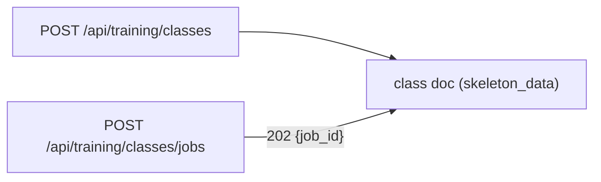

- **Sync:** `POST /api/training/classes` `{name, hashtags?, min_videos?, min_windows?, cutter_config?}` → `201` class.
- **Async (monitorable):** `POST /api/training/classes/jobs` (same body) → `202 {job_id}`, poll `GET /api/training/jobs/{job_id}`.
- Validation (unique name, reserved `transition`, hashtag format) is synchronous in both.
- **UC-01..06.**

---

## Flow 2 — Upload videos to a class (auto-embed)

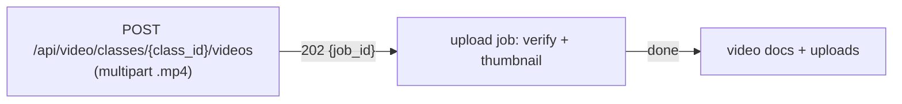

- `POST /api/video/classes/{class_id}/videos` with `files` → `202 {job_id, uploads[]}`.
- Poll `GET /api/video/jobs/{job_id}`; on `done` the uploads are `verified`.
- List: `GET /api/video/classes/{class_id}/uploads`.
- **UC-10..12.**

---

## Flow 3 — Crawl → QC (Instagram)

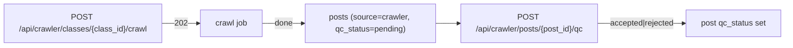

- `POST /api/crawler/classes/{class_id}/crawl` `{tags, limit?, min_wait?, max_wait?}` → `202 {job_id}`.
- Poll `GET /api/crawler/jobs/{job_id}`. List runs: `GET /api/crawler/classes/{class_id}/crawls`.
- List posts: `GET /api/crawler/classes/{class_id}/posts?qc_status=`.
- QC: `POST /api/crawler/posts/{post_id}/qc` `{status: accepted|rejected}`.
- **UC-20..24.**

---

## Flow 4 — Cut → Review (build the clip set)

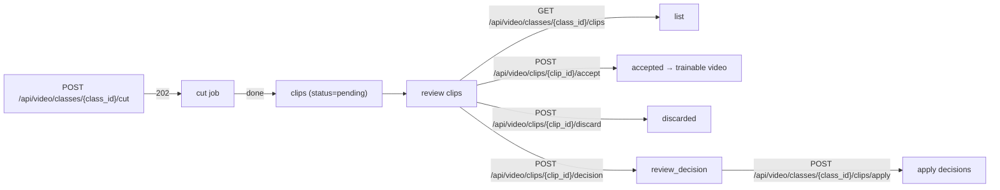

- Sources: `post | upload | video | path`. Supports `cutter_override`, `model_id`, `chroma_only`, `config_id`.
- Stream a clip: `GET /api/video/clips/{clip_id}/video`; pending counts: `GET /api/video/clips/pending-counts`.
- **UC-30..35.**

---

## Flow 5 — Data pipeline: extract → process → embed → promote

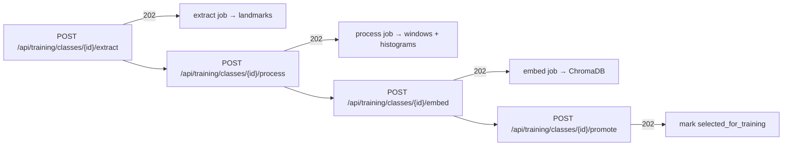

- Each step is a job; poll the corresponding `GET /api/training/jobs/{job_id}`.
- `extract` requires `video_ids` (clips); `process` requires prior extraction and `phase_frames`; `embed` optionally takes `model_id`.
- Toggle clip flag: `POST /api/training/classes/{id}/clip`; manual phase bounds: `PUT /api/training/clips/{video_id}/phase-frames`.
- Readiness: `GET /api/training/classes/{class_id}/stats`.
- **UC-40..43, UC-82..90.**

---

## Flow 6 — Train a new model (full) & fine-tune

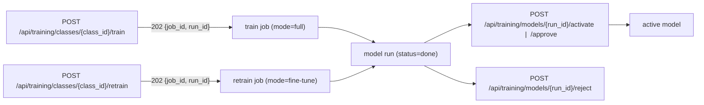

- Train body: `{classes, reembed?, use_augmentation?, use_class_weight?}`; retrain adds `base_model?`.
- Registry: `GET /api/training/models`, `GET /api/training/models/active`, `GET /api/training/models/chroma`, `GET /api/training/models/{run_id}`.
- **UC-50..54, UC-60..64.**

---

## Flow 7 — Histogram analysis (metrics, cohort, summary)

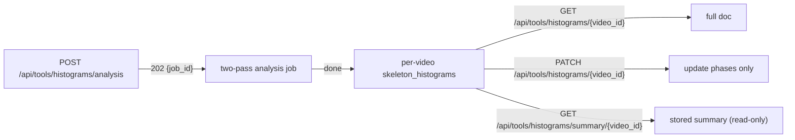

- Body `{video_ids}`; pass 1 resamples to 300 pts + cohort `mean/std`; pass 2 computes signed z-scores, 0-100 scores, detections (`|z|>1`) with one extracted JPEG per detection.
- **Error isolation:** per-video failures land in `result_json.failed`/`skipped`; the job ends `done`.
- Poll `GET /api/tools/jobs/{job_id}`.
- **Phase 11/12.**

---

## Flow 8 — Shift / re-crop a clip

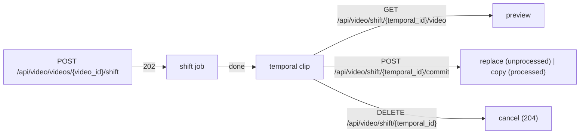

- Requires the target video to be a clip; two-phase (temporal → commit/cancel).

---

## Flow 9 — Athlete analysis (analysis slice)

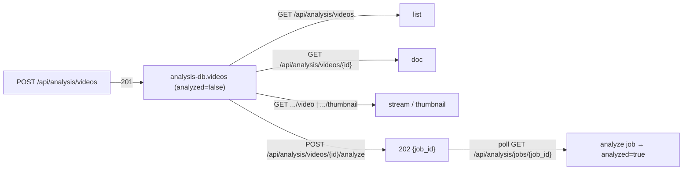

- `POST /api/analysis/videos` (multipart `.mp4`) → `201` (no job at upload; analysis is explicit).
- Analyze body optional: `{trick_label?, phase_frames?}` — empty `{}` means "no reference cohort".
- Histogram/summary/pose reads for a video use the tools slice (Flow 7) against `video_histograms`.
- **Phase 13.**

---

## Flow 10 — Coach endpoints (analysis slice)

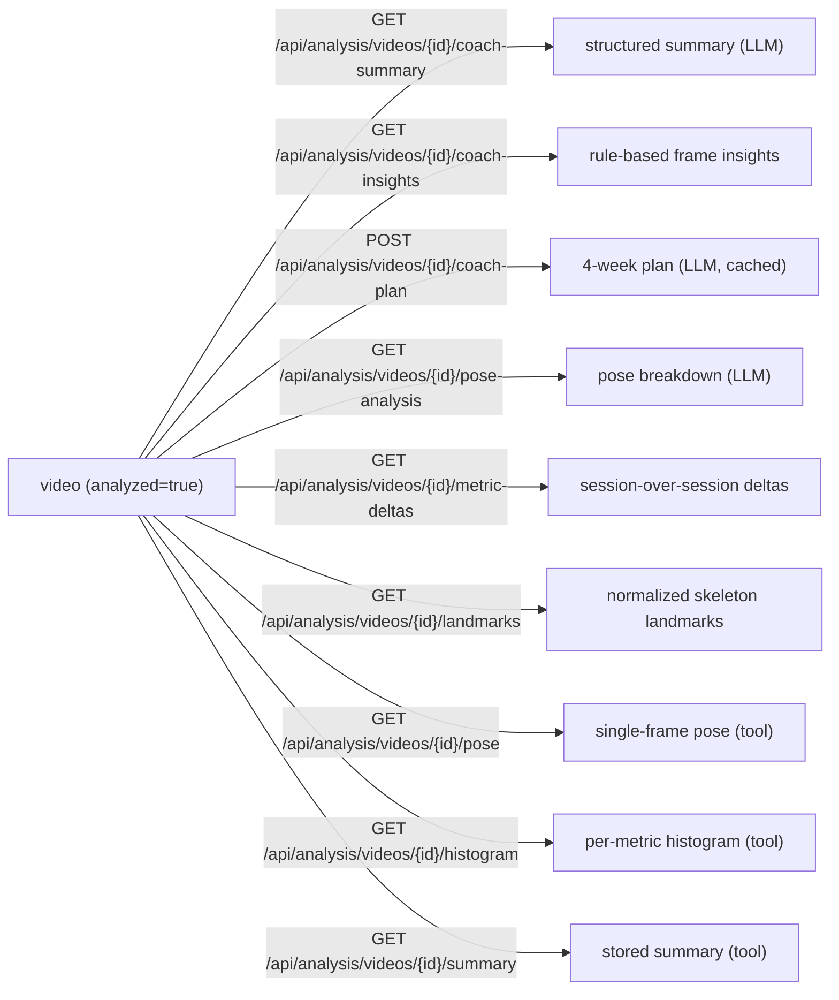

- All endpoints require the video to have `analyzed=true` (run Flow 9 first).
- `coach-summary` and `pose-analysis` are one-shot LLM calls; `coach-plan` is cached per video.
- `coach-insights` is rule-based (z-score thresholds, no LLM).
- `metric-deltas` compares the current video against the athlete's previous session for the same trick.
- **Phases 21, 22, 24.**

---

## Flow 11 — Chatbot video-analysis session (WebSocket)

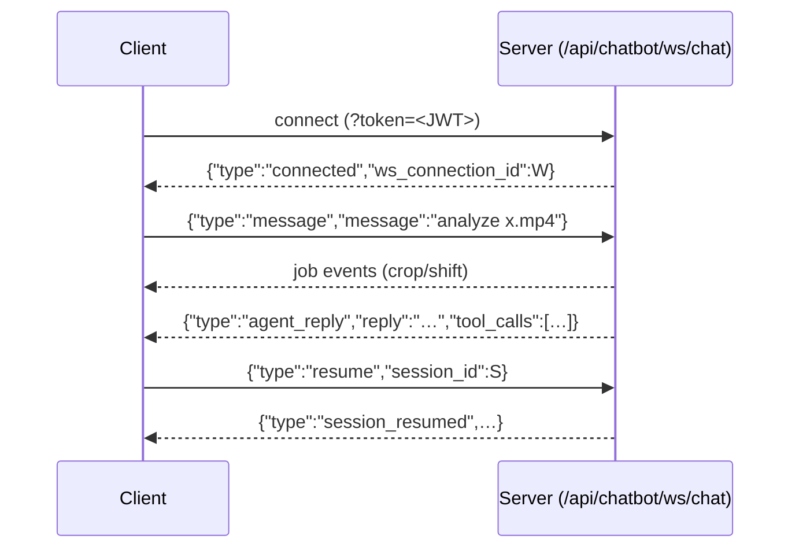

- Tools: `crop`, `shift` (jobs) + `histogram`, `similarity`, `correct` (sync).
- Rate limit → `{"type":"error","error":"Rate limit exceeded","retry_after":N}`.
- Session closes `ABANDONED` on disconnect.

---

## Flow 12 — Training chatbot session (WebSocket)

Same wire protocol as Flow 11, endpoint `WS /api/training-chatbot/ws/training-chat`.

- Tools: `hyperparameter_search`, `compare_models`, `dataset_stats`, `inspect_job`.
- Auth: `?token=<JWT>` query param or `Authorization: Bearer <JWT>` header.

---

## Flow 13 — Analyst chatbot session (WebSocket)

Same wire protocol as Flow 11, endpoint `WS /api/analyst-chatbot/ws/analyst-chat`.

- 17 tools (see API.intro.md §8): `histogram`, `classify`, `extract_frames`, `crop`, `compare_sessions`, `cohort_percentiles`, `improvement_plan`, `metric_deep_dive`, `frame_pose`, `progress_trend`, `focus_recommendation`, `risk_scan`, `get_coach_summary`, `get_coach_pose`, and more.
- Auth: `?token=<JWT>` query param or `Authorization: Bearer <JWT>` header.

---

## Flow 14 — Cutter configs (presets CRUD)

- Seeded at startup: `Default Extract`, `High Precision Crop`, `Instagram Optimized`.
- `GET/POST /api/video/cutter-configs`, `GET/PATCH/DELETE /api/video/cutter-configs/{config_id}`.
- Referenced from `POST …/cut` via `config_id` or `cutter_override`.

---

## Flow 15 — Delete videos / clips

- **Single video:** `DELETE /api/video/videos/{video_id}` (204) — hard delete file, doc, windows, embeddings; `409` if it has children.
- **Batch:** `POST /api/video/videos/delete` `{video_ids}` → `202 {job_id}` (skips videos with children).
- **Clip:** `DELETE /api/video/clips/{clip_id}` (204).
- **Class cascade:** `DELETE /api/training/classes/{class_id}` → `202 {job_id}` (`delete_class` job: clips → videos → files → windows → embeddings → class).

---

## Flow 16 — Manual video ingestion (path registration)

- `POST /api/training/classes/{class_id}/videos` `{local_path, kind?, parent_id?, source?}` → `201` video + thumbnail.
- Then Flow 5 (`extract → process → embed → promote`) or `PATCH /api/training/videos/{video_id}` to toggle flags.

---

## Flow 17 — Video streaming / frames

- Stream: `GET /api/video/videos/{video_id}/video`, thumbnail: `GET .../thumbnail`, metadata: `GET .../metadata`.
- Capture a frame: `POST /api/video/videos/{video_id}/frame` `{time, caption?}` → `201` picture doc.

---

## Flow 18 — Reference histograms generation (per trick)

```mermaid
flowchart LR
    R["POST /api/tools/histograms/references<br/>{trick_label, video_ids, bins?}"] -->|"202 {job_id}"| J["reference_generation job"]
    J -->|"done"| D["skeleton_trick_histograms (15 docs: 5 metrics × 3 phases)"]
    D -->|"GET /api/tools/histograms/references/{trick_label}"| G["per-trick reference histograms"]
    D -->|"GET /api/tools/histograms/references?trick_label="{trick_label}"| Q["query-param alias (200 or 422)"]
```

- Body `{trick_label, video_ids, bins?}`: `trick_label` identifies the trick; `video_ids` are approved clip IDs to pool; optional `bins` overrides the default 8-edge reference bins.
- Job runs `upsert_trick_histograms`: resamples each clip's 300-pt reference curves, z-scores them against the cohort `skeleton_cohort_signals` (mean/std), pools, and bins onto `REFERENCE_BINS` (z-scored). Produces one doc per `(trick_label, metric, phase)` = `5 metrics × 3 phases = 15 docs`.
- **Idempotent:** re-POSTing the same trick+clips replaces (upsert), not duplicates.
- Poll `GET /api/tools/jobs/{job_id}`; on `done` the job's `result_json` contains `{trick_label, source_count, docs_written, clips_used, clips_skipped, metrics, metrics_skipped}`.
- Read endpoints: `GET /api/tools/histograms/references/{trick_label}` returns metrics keyed by phase; `GET /api/tools/histograms/references?trick_label=` is a query-param alias (200 or 422 with `missing_metrics`).
- **Phase 16.**

---

## Flow 19 — Athlete profile

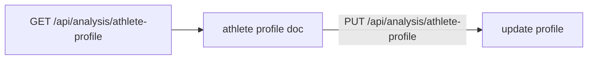

- `GET /api/analysis/athlete-profile` returns the current athlete's profile (name, bio, goals, preferences).
- `PUT /api/analysis/athlete-profile` updates the profile.
- Profile is used by coach endpoints (Flow 10) to personalize LLM outputs.
- **Phase 20.**

---

## Flow 20 — Phase detection (automatic)

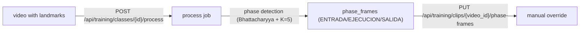

- Automatic phase detection runs during the process job (Phase 17).
- Manual override: `PUT /api/training/clips/{video_id}/phase-frames` `{phase_frames: [{frame, phase}]}`.
- Phase enum: `ENTRADA` (entry), `EJECUCION` (execution), `SALIDA` (exit).
- **Phase 17.**
