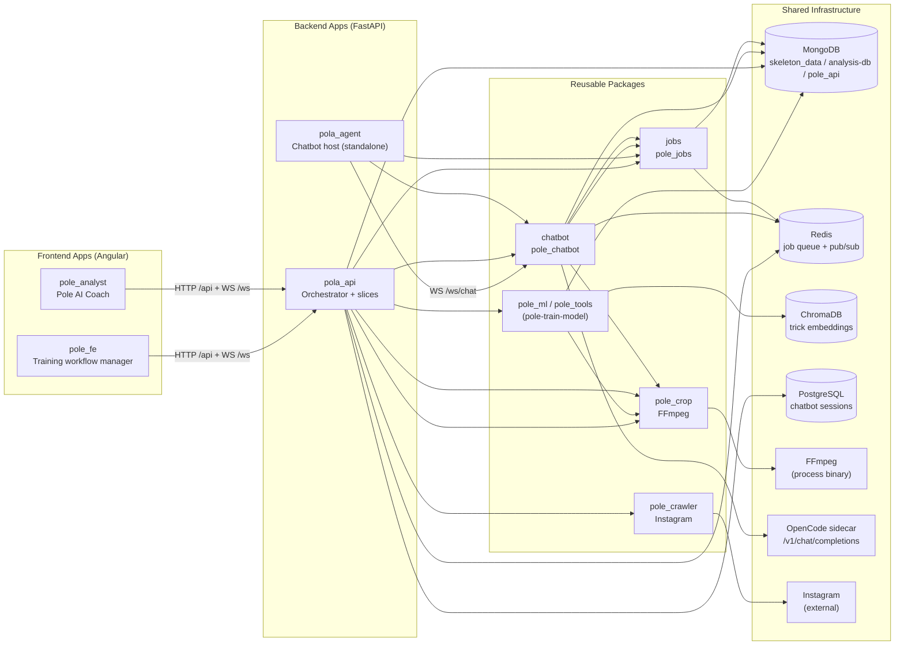

# System Architecture — `pole-ai`

> This document describes the **overall architecture** of the repository: the applications,
> the reusable packages, the communication layers between them, and the shared infrastructure.
> Per-component flow and class-level documents live in sibling folders:
> `docs/diagrams/<component>/FLOW.md` and `docs/diagrams/<component>/CLASSES.md`.

---

## 1. Architecture Diagram

---

## 2. Component Description

### Applications

| Component | Type | Description |
| :--- | :--- | :--- |
| **`pole_fe`** | Angular SPA | Training-workflow manager: tricks CRUD, video management + editor/shift, training studio, model registry, system jobs, and a chatbot page. Communicates with `pola_api` over HTTP (`/api`) and WebSocket (`/ws`). |
| **`pole_analyst`** | Angular SPA | Athlete-facing "Pole AI Coach": two-pane UI (chat + tools), video upload, analysis tabs (Summary/Histogram/Pose/Plan), resilient WebSocket + session resume. Consumes the `pola_api` `analysis` slice + chatbot WS. |
| **`pola_api`** | FastAPI app | Central orchestrator. Implements slices: `training`, `crawler`, `video`, `tools` (histograms), `analysis`, `chatbot`, and `training_chatbot`. Owns HTTP/WS controllers, application services, and Mongo repositories. |
| **`pola_agent`** | FastAPI app | Thin host of the `chatbot` package (standalone on port 8001) exposing `WS /ws/chat`. Being consolidated into `pola_api` as a slice (Phase 5). |

### Packages

| Component | Description |
| :--- | :--- |
| **`pole_ml`** | ML pipeline: skeleton extraction (MediaPipe), biomechanical + histogram feature processors, sliding windows, LSTM training, embeddings, Chroma + hybrid classifiers. Data source/sink for Mongo and ChromaDB. |
| **`pole_tools`** | Reusable tool wrappers: `CropTool`, `ShiftTool`, `HistogramAnalyzer`, `PoseCorrector`, `OpenCodeLLMClient`, plus a services facade (`crop`/`shift`/`histogram`/`similarity`). Phases are manual only (`phase_frames`) — automatic phase detection was removed. |
| **`pole_crop`** | FFmpeg video service: crop, shift, thumbnail, frame capture. |
| **`pole_crawler`** | Instagram video crawler: session, client, disk storage, notifications. |
| **`chatbot`** | ReAct conversational agent backend: `ReActAgent`, `ToolRegistry`, OpenCode LLM client, job handlers, WS router, session persistence. |
| **`jobs`** | Shared job infrastructure: `Job` model, Mongo repository, Redis queue + pub/sub events, `JobWorker`, `JobOrchestrator`, FastAPI job router. |

### Shared Infrastructure

| Component | Description |
| :--- | :--- |
| **MongoDB** | Primary datastore. DBs: `skeleton_data` (reference `signal_histograms`, `skeleton_histograms`, classes/clips), `pole_api` (training/crawler/video docs), `analysis-db` (`videos`, `skeleton-landmarks`, `video_histograms`), plus `*_testing` variants. |
| **Redis** | Job queue (FIFO of ids) + pub/sub job events (`job:started/progress/done/error`) for `jobs`/`chatbot`. |
| **ChromaDB** | Vector store for trick embeddings used by `pole_ml` classifiers and similarity retrieval. |
| **PostgreSQL** | Chatbot session persistence (`002_chatbot_sessions.sql`, `PostgresChatbotSessionRepository`). The `reference_*` Postgres vertical was removed with `pola_api` Phase 11 — reference data now lives in Mongo `skeleton_data.signal_histograms`. |
| **FFmpeg** | Video processing binary invoked by `pole_crop`. |
| **OpenCode sidecar** | `opencode serve` exposing `/v1/chat/completions` used by `pole_tools.OpenCodeLLMClient` / `chatbot.OpenCodeClient` for LLM feedback. |
| **Instagram** | External source crawled by `pole_crawler`. |

---

## 3. Communication Layers

| Edge | Protocol | Description |
| :--- | :--- | :--- |
| `pole_fe` / `pole_analyst` → `pola_api` | HTTP (`/api`), WebSocket (`/ws`) | REST controllers for CRUD/jobs; WS for chatbot and job progress. |
| `pola_agent` → `chatbot` | WS (`/ws/chat`) | Chatbot host delegates to `pole_chatbot` router. |
| `pola_api` → packages | Python imports | Uses `pole_ml`, `pole_tools`, `pole_crop`, `pole_crawler`, `chatbot`, `jobs` as libraries (imported as `pole_ml.*`, `pole_tools.*`, etc.). |
| `chatbot` → `pole_tools` | Python imports | Tool facade (`crop`/`shift`/`histogram`/`similarity`) — the **only** import surface chatbot may use. |
| packages → infra | Drivers | Mongo/Redis/Chroma clients, FFmpeg subprocess, httpx to OpenCode/Instagram. |

> **Reuse rule:** packages are installed editable by the pixi workspace and imported as
> `pole_ml.*` / `pole_tools.*` / `pole_crawler.*` — no `sys.path` hacks.
