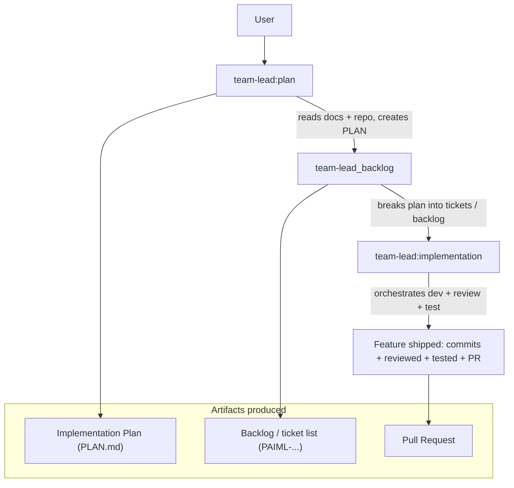
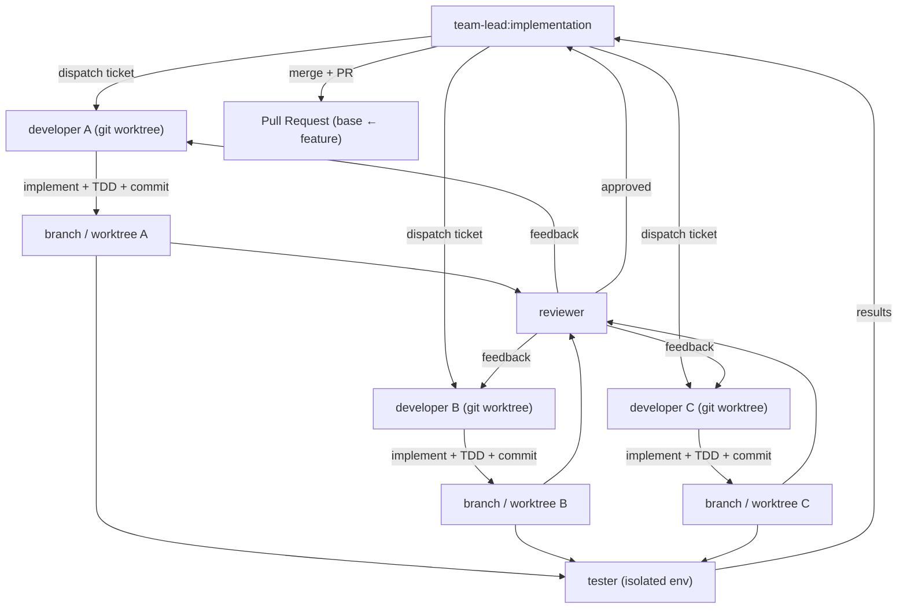
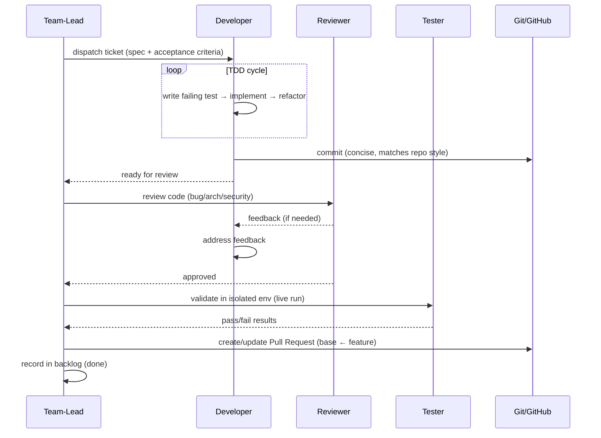

# Flow — Agents (Team-Lead Implementation Workflow)

> How the AI agent team implements a feature end-to-end. High-level command flow plus a low-level
> view of how **team-lead** orchestrates the **developer**, **reviewer** and **tester** agents,
> including commit → review → test → Pull Request.
>
> Roles referenced: **team-lead** (plans + orchestrates), **developer** (implements, TDD, git
> worktree), **reviewer** (code review/QA), **tester** (live validation), **general/explore**
> (research).

---

## 1. High-Level Flow (the commands a user runs)

**What each step does**

| Step | Command | Description |
| :--- | :--- | :--- |
| **Plan** | `team-lead:plan` | Team-lead reads the project docs (`docs/.../PLAN.md`, specs, tickets) and the current repo, then produces an implementation plan with phases/steps and a DoD. |
| **Backlog** | `team-lead_backlog` | Team-lead converts the plan into a concrete, ordered backlog of tickets (each scoped and sequenced), including dependencies and effort estimates. |
| **Implementation** | `team-lead:implementation` | Team-lead orchestrates the developer/reviewer/tester agents to implement the backlog, then integrate the result (review + test + PR). |

---

## 2. Low-Level Flow (how team-lead orchestrates the work)

### 2.1 Orchestration overview

> **Parallelization:** independent tickets run on **separate git worktrees** so multiple developers
> work at the same time without colliding. team-lead dispatches, then aggregates results.

### 2.2 Per-ticket lifecycle (developer → reviewer → tester)

---

## 3. Step-by-step Process (prose)

### 3.1 `team-lead:plan`
1. **Gather context** — team-lead reads the relevant docs (e.g. `docs/app/pola_api/PLAN.md`), the
   ticket(s), and the current codebase to understand the goal and constraints.
2. **Produce a plan** — an ordered set of phases/steps with scope, affected components, and a
   Definition of Done, written to a `PLAN.md`-style doc.
3. **Surface questions** — team-lead asks the user for confirmation/decisions before proceeding.

### 3.2 `team-lead_backlog`
1. **Break the plan down** — turn each phase into concrete, atomic tickets (with IDs like
   `PAIML-...`), each with scope, dependencies, and effort.
2. **Order and sequence** — tickets are ordered by dependency so parallel work is safe.
3. **Update tracking** — ticket counter (`PROJECT_VARS.md`) is advanced as tickets are created.

### 3.3 `team-lead:implementation`
1. **Dispatch** — each independent ticket goes to a **developer** running in its own **git
   worktree**; dependent tickets wait for their prerequisites.
2. **Develop (TDD)** — the developer writes a failing test, implements the change, and refactors,
   committing with a concise message matching the repo style. The worktree isolates the change.
3. **Review** — the **reviewer** inspects the branch for bugs, architecture, security, and test
   coverage; feedback loops back to the developer until approved.
4. **Test** — the **tester** runs the change in an isolated test environment (live execution /
   automated validation) and reports pass/fail to team-lead.
5. **Integrate** — approved, passing branches are merged and a **Pull Request** is opened from the
   feature branch to the base branch, summarizing the change.
6. **Track** — completed tickets are marked done in the backlog.

---

## 4. Key Principles

| Principle | Why |
| :--- | :--- |
| **Plan before code** | `plan` → `backlog` → `implementation` keeps work scoped and approved up front. |
| **Git worktree isolation** | Developers edit without conflicting; enables parallel feature work. |
| **TDD** | Failing-test-first guarantees each change is testable and covered. |
| **Independent review** | Reviewer catches bugs/arch/security that the developer may miss. |
| **Live validation** | Tester verifies behavior in an isolated environment, not just by inspection. |
| **Single PR per feature** | Clear, reviewable diff from feature → base. |
