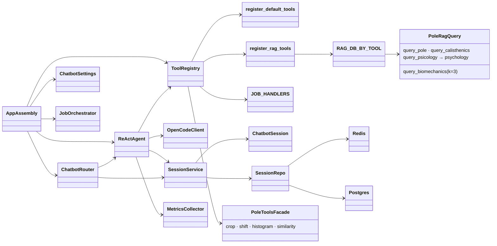

# Classes — `chatbot` (`pole_chatbot` Conversational Agent Backend)

> Exhaustive class map for the `chatbot` package (`packages/chatbot/src/pole_chatbot/`). For each
> class: role, collaborators, and the data it extracts/transforms.

---

## 0. Class Interaction Diagram

> **Legend:** `-->` = "depends on / calls". `PoleToolsFacade` is the `pole_tools` services facade;
> `PoleRagQuery` is `pole_rag.query` via `rag_tools.py` (staging `/data/rag`, unknown-DB `ToolError`);
> `JobOrchestrator` comes from the `jobs` package; `Redis`/`Postgres` are session backends.

---

## 1. Presentation

| Class | Role | Collaborators | Data |
| :--- | :--- | :--- | :--- |
| `ws.py` — `ChatbotRouter` | FastAPI WS endpoint `WS /ws/chat`; inbound `message` → `agent_reply`; relays filtered job events by `ws_connection_id` | `ReActAgent`, `SessionService` | WS frame ↔ agent reply + job events |

### Purpose & Use

- **`ChatbotRouter`** — The WebSocket boundary. Mounted at `/ws/chat`; it receives a client message,
  hands it to `ReActAgent`, and streams back the `agent_reply` plus any job events scoped to the
  connection. Use it whenever a client talks to the chatbot over a socket.

---

## 2. Application

| Class | Role | Collaborators | Data |
| :--- | :--- | :--- | :--- |
| `agent.py` — `ReActAgent` | Bounded tool-call loop (`max_iterations`, default 6), error capture, off-script rephrase | `OpenCodeClient`, `ToolRegistry`, `SessionService` | message + session → reply |
| `tools.py` — `ToolRegistry` | Registers/dispatches tools; sync (`histogram`, `similarity`) and job-mode (`crop`, `shift`) | `register_default_tools`, `pole_tools` facade, `JobHandlers` | tool call → result |
| `tools.py` — `register_default_tools` | Wire default tools into a registry | `ToolRegistry`, `pole_tools` services | — |
| `rag_tools.py` — `RAG_DB_BY_TOOL` | Tool name → DB dir map (`query_psicology` → `psychology` since 036; tool names unchanged) | `register_rag_tools`, `pole_rag.query` | tool name → DB folder |
| `rag_tools.py` — `register_rag_tools` | Wire 4 sync RAG tools (k=3, `source_document` metadata, `ToolError` on unknown DB) | `ToolRegistry`, `pole_rag.query` | query → k hits |
| `job_handlers.py` — `JOB_HANDLERS` | Worker-side handlers for job-mode tools with progress stages | `JobOrchestrator`, `pole_tools` facade | job → progress events |
| `llm.py` — `OpenCodeClient` | Text chat client to OpenCode sidecar (`/v1/chat/completions`) | httpx, config | prompt → text |
| `session_service.py` — `SessionService` | Load/create/persist/resume `ChatbotSession` | `session_schema`, session repos | session id ↔ session |

### Purpose & Use

- **`ReActAgent`** — The reasoning core. Given a user message + session, it iteratively asks the LLM
  for a tool call, executes it, and continues until it can produce a final answer or the budget runs
  out. This is the class you drive for any agentic conversation.
- **`ToolRegistry`** — The tool dispatch map. Register a tool name → handler; the agent asks the
  registry to invoke the tool the LLM requested. Sync tools return inline, job-mode tools spawn jobs.
- **`register_default_tools`** — Convenience function that wires the standard tool set into a fresh
  registry at startup.
- **`RAG_DB_BY_TOOL` / `register_rag_tools`** — The RAG tool map + wiring. Each tool queries its Chroma DB
  (`pole`, `calisthenics`, `psychology`, `biomechanics`) via `pole_rag.query` with `data_dir` from
  `POLE_RAG_DATA_DIR` (staging `/data/rag`); unknown DBs surface `FileNotFoundError` as `ToolError`
  without crashing the pod (030 contract).
- **`JOB_HANDLERS`** — The map of job-mode tools to worker handlers; the `JobWorker` uses these to
  run long operations (crop/shift) with progress.
- **`OpenCodeClient`** — The LLM transport. Send a prompt (text or multimodal) and get a response
  from the OpenCode sidecar. Used by the agent for both tool-call parsing and final feedback.
- **`SessionService`** — Owns session state across turns: create on first contact, load on resume,
  and persist after each turn so a conversation can be continued later.

---

## 3. Domain

| Class | Role | Data |
| :--- | :--- | :--- |
| `session_schema.py` — `ChatbotSession` | Pydantic model for conversation state (`original_video`, `current_crop`, `confirmed`, `history`, `session_id`, `status`) | domain state |
| `session_schema.py` — `ChatbotSessionCreate` | Input variant for new sessions | payload → session |

### Purpose & Use

- **`ChatbotSession`** — The validated domain object describing a conversation: which video, the
  current crop, confirmation flag, message history, and lifecycle status. The agent and service
  operate on this model, keeping it free of persistence concerns.
- **`ChatbotSessionCreate`** — The input DTO for starting a new session, so callers don't have to
  populate bookkeeping fields by hand.

---

## 4. Infrastructure

| Class | Role | Collaborators | Data |
| :--- | :--- | :--- | :--- |
| `session/base.py` | Abstract session repository interface | `SessionService` | contract |
| `session/redis_repo.py` | Redis-backed session persistence | Redis | session ↔ redis key |
| `session/postgres_repo.py` | Postgres-backed session persistence | PostgreSQL | session ↔ row |
| `metrics.py` — `MetricsCollector` | Collect tool latency + LLM token usage | `ReActAgent`, `OpenCodeClient` | timings → metrics |
| `config.py` — `ChatbotSettings` | Env settings (`OPENCODE_URL`, `OPENCODE_MODEL`, `AGENT_MAX_ITERATIONS`, DB names) | app assembly | env → settings |
| `exceptions.py` | Agent/tool error types | `ReActAgent` | error → typed exception |
| `app.py` | Assemble the FastAPI app + worker | `ChatbotRouter`, `ReActAgent`, `ToolRegistry`, `JobOrchestrator` | config → app |
| `__main__.py` | `python -m pole_chatbot` entrypoint (port 8001) | `app.py` | CLI → run |

### Purpose & Use

- **`session/base.py`** — Defines the repository contract (interface) so `SessionService` is backend-agnostic.
- **`session/redis_repo.py`** — Persists sessions in Redis; use for fast, ephemeral session state.
- **`session/postgres_repo.py`** — Persists sessions in PostgreSQL; use for durable, queryable state.
- **`MetricsCollector`** — Records tool latency and LLM token usage; used to monitor chatbot
  performance and cost.
- **`ChatbotSettings`** — Central config object read from env; the app is assembled from it, so all
  environment variables flow through here.
- **`exceptions.py`** — Typed exceptions the agent and tools raise; lets the router translate them
  into user-friendly errors.
- **`app.py`** — Composition root: builds the FastAPI app, wiring router, agent, registry,
  orchestrator, and worker.
- **`__main__.py`** — Lets you run `python -m pole_chatbot` to start the standalone server (port 8001).

---

## 5. Data Transformations (summary)

| From | To | Operation |
| :--- | :--- | :--- |
| WS message + session | tool-call prompt | `ReActAgent` + `OpenCodeClient` |
| Tool call | job / sync result | `ToolRegistry` → `pole_tools` facade |
| Result + plot | coaching reply | `OpenCodeClient` |
| Reply + job events | WS frames | `ChatbotRouter` (filtered) |
| Session state | persisted session | `SessionService` → Redis/Postgres repo |
| Tool/LLM timings | metrics | `MetricsCollector` |
