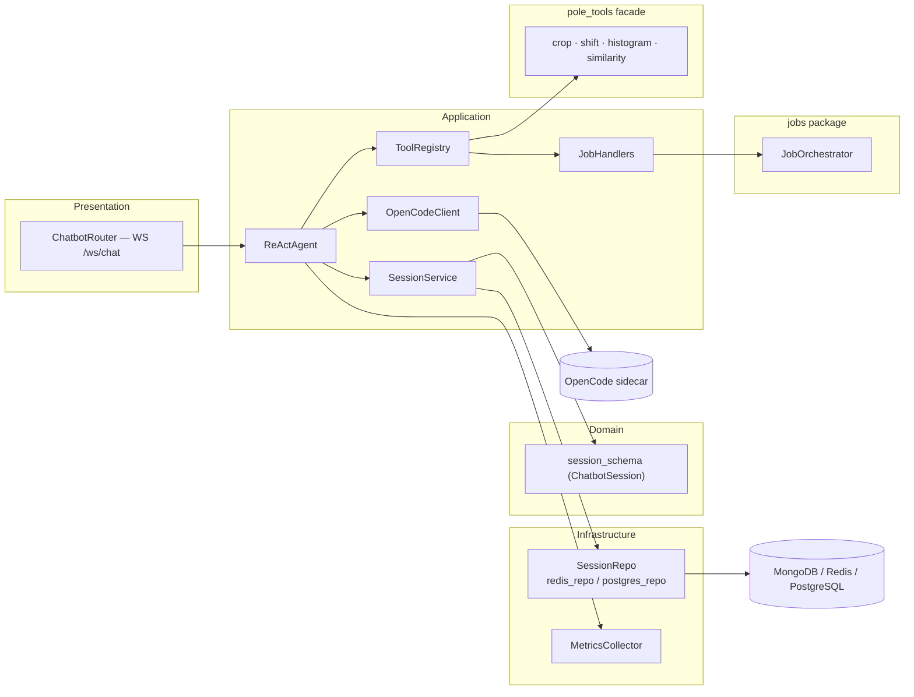
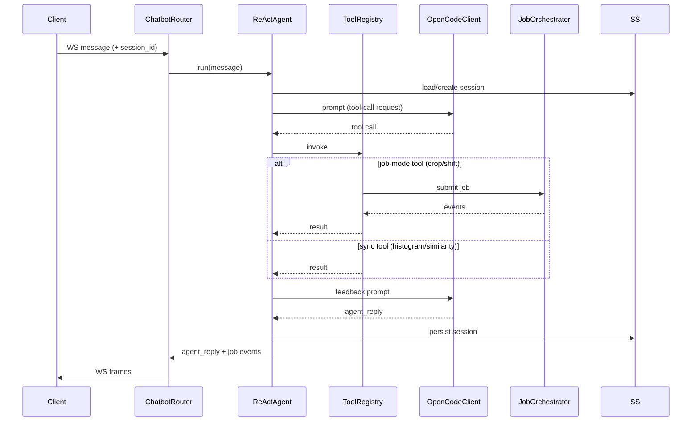

# Flow — `chatbot` (`pole_chatbot` Conversational Agent Backend)

> Layers and key classes of the ReAct conversational agent backend. Shipped in `packages/chatbot`.
> Class-level details: [CLASSES.md](./CLASSES.md).

---

## 1. Agent Architecture Diagram

---

## 2. ReAct Turn Sequence

### 2.1 Diagram Component Descriptions

| Node | Purpose & Use |
| :--- | :--- |
| **PRES — ChatbotRouter** | `WS /ws/chat` endpoint; receives messages and streams back replies + relayed job events. |
| **APP — ReActAgent** | Runs the bounded ReAct tool-call loop and produces the final reply. |
| **APP — ToolRegistry** | Resolves tool names to handlers (sync or job-mode). |
| **APP — JobHandlers** | Worker-side `crop`/`shift` handlers with progress stages. |
| **APP — OpenCodeClient** | LLM text client to the OpenCode sidecar. |
| **APP — SessionService** | Loads/creates/persists/resumes `ChatbotSession`. |
| **DOM — `session_schema`** | Pydantic `ChatbotSession` domain model. |
| **INFRA — SessionRepo (redis/postgres)** | Persistence backends for sessions. |
| **INFRA — MetricsCollector** | Collects tool latency + LLM token usage. |
| **TOOLS — `pole_tools` facade** | `crop · shift · histogram · similarity` import surface used by tools. |
| **JOB — JobOrchestrator** | From the `jobs` package; runs job-mode tools. |
| **OpenCode sidecar / MongoDB / Redis / PostgreSQL** | External LLM + datastores. |

---

## 3. Layers and Key Classes

### Presentation
- `ws.py` — `ChatbotRouter`: `WS /ws/chat` (message in → `agent_reply` + relayed job events).

### Application
- `agent.py` — `ReActAgent`: bounded ReAct loop, tool-call execution, error capture, off-script rephrase.
- `tools.py` — `ToolRegistry` + `register_default_tools` (sync `histogram`/`similarity`, job-mode `crop`/`shift`).
- `job_handlers.py` — `JOB_HANDLERS`: worker-side crop/shift handlers with progress stages.
- `llm.py` — `OpenCodeClient`: text chat to OpenCode sidecar.
- `session_service.py` — `SessionService`: session load/create/persist/resume.

### Domain
- `session_schema.py` — Pydantic `ChatbotSession` model (`original_video`, `current_crop`, `confirmed`, `history`, `status`).

### Infrastructure
- `session/redis_repo.py`, `session/postgres_repo.py`, `session/base.py` — persistence backends.
- `metrics.py` — `MetricsCollector` (tool latency, LLM tokens).
- `config.py` — `ChatbotSettings`.
- `exceptions.py` — error types.

---

## 4. Data Flow (extract → transform → respond)

| Step | Extract | Transform | Produce |
| :--- | :--- | :--- | :--- |
| Message | user text + session | ReAct prompt | tool call |
| Tool call | tool name + args | dispatch sync or job | result / job events |
| Feedback | result + plot | LLM prompt | `agent_reply` |
| Persist | session state | serialize | stored session (resume) |
| Metrics | tool/LLM timings | aggregate | metrics store |
