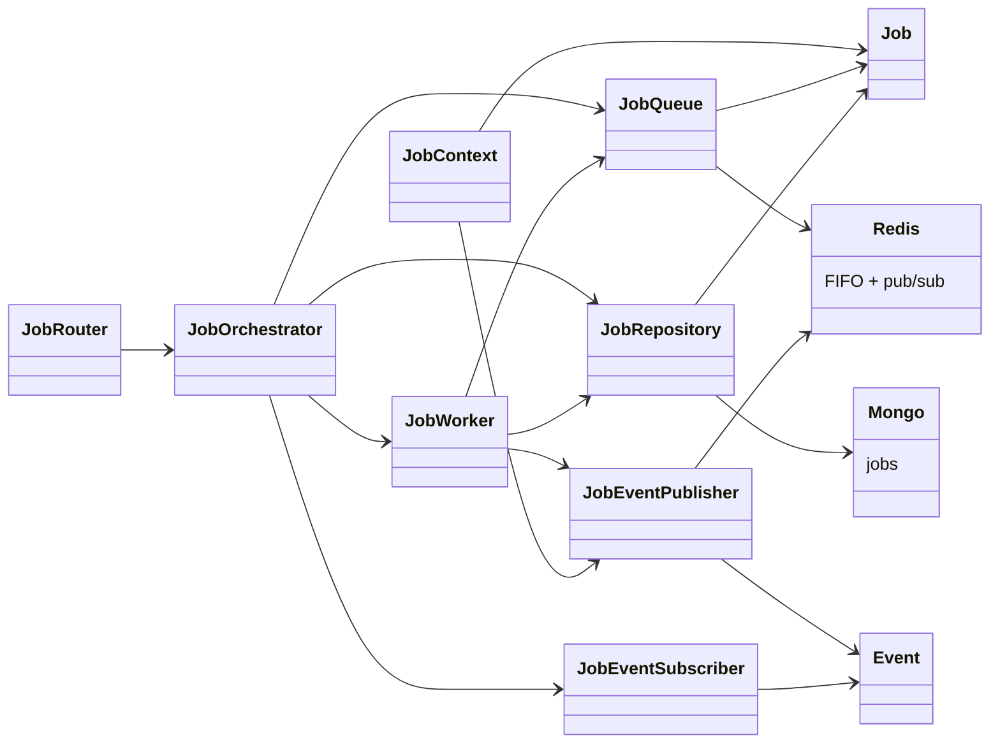

# Classes — `jobs` (`pole_jobs` Shared Job Infrastructure)

> Exhaustive class map for the `jobs` package (`packages/jobs/src/pole_jobs/`). For each class:
> role, collaborators, and the data it extracts/transforms.

---

## 0. Class Interaction Diagram

> **Legend:** `-->` = "depends on / calls". `Redis` (queue + pub/sub) and `Mongo` (job store)
> are external infrastructure.

---

## 1. Domain

| Class | Role | Collaborators | Data |
| :--- | :--- | :--- | :--- |
| `models.py` — `Job` | Job domain model (id, type, state `pending/running/done/failed/stopped`, progress, payload, result, error) | repository, worker | job spec ↔ state |

### Purpose & Use

- **`Job`** — The canonical representation of a unit of work. Created at submit time, mutated by the
  worker (state/progress/result), and read by consumers (polling, WS progress). Hold a reference in
  `JobQueue` (by id) and persist it via `JobRepository`.

---

## 2. Application / Orchestration

| Class | Role | Collaborators | Data |
| :--- | :--- | :--- | :--- |
| `orchestrator.py` — `JobOrchestrator` | Ties submit/list/cancel/worker/subscriber together | `JobQueue`, `JobRepository`, `JobEventSubscriber`, `JobWorker` | action → job lifecycle |
| `worker.py` — `JobWorker` | Consumes queued jobs, executes handlers with retries/backoff/cancel | `JobQueue`, `JobRepository`, `JobEventPublisher`, handlers | job id → run to completion |
| `worker.py` — `JobContext` | Per-job execution context exposing `set_progress` | `JobEventPublisher` | progress → event |
| `events.py` | Event dataclasses/types (`job:started/progress/done/error`) | publisher/subscriber, worker | event → payload |

### Purpose & Use

- **`JobOrchestrator`** — The single coordination point. Call it to `submit`, `list`, or `cancel`
  jobs and to start the worker + subscriber. Slices and agents interact with jobs through this,
  never directly with Redis/Mongo.
- **`JobWorker`** — Consumes the queue and runs a registered handler for each job, applying
  retries/backoff and honoring cancellation. It reports lifecycle via events.
- **`JobContext`** — Passed to each handler; lets a long-running handler report `set_progress`
  so callers see live status instead of waiting blindly.
- **`events.py`** — Defines the event payloads (`job:started/progress/done/error`) shared between
  publisher and subscriber, keeping event contracts consistent.

---

## 3. Infrastructure

| Class | Role | Collaborators | Data |
| :--- | :--- | :--- | :--- |
| `queue.py` — `JobQueue` | Redis FIFO queue of job ids | Redis, `JobRepository` | job id enqueue/dequeue |
| `queue.py` — `JobEventPublisher` | Publish job events to Redis pub/sub | Redis, `JobContext` | event → channel |
| `queue.py` — `JobEventSubscriber` | Subscribe to job event channels | Redis, `JobOrchestrator`/WS | channel → event |
| `repository.py` — `JobRepository` | Mongo job persistence | MongoDB | job id ↔ `Job` doc |
| `router.py` — `JobRouter` | FastAPI mixin: `POST /api/jobs`, `GET /api/jobs{/id}`, cancel, WS `/api/jobs/{id}/progress` | `JobOrchestrator`, `JobEventSubscriber` | HTTP/WS ↔ job actions + events |

### Purpose & Use

- **`JobQueue`** — Holds pending job ids in a Redis FIFO. Use it to enqueue a submitted job and for
  the worker to dequeue the next one.
- **`JobEventPublisher`** — Writes lifecycle events to a Redis channel; used by the worker/context.
- **`JobEventSubscriber`** — Reads lifecycle events from a channel; used by the WS router to stream
  progress to clients.
- **`JobRepository`** — Persists and loads `Job` docs in Mongo; the source of truth for status and
  results.
- **`JobRouter`** — A FastAPI mixin you attach to an app to expose the jobs HTTP/WS API; it
  delegates to `JobOrchestrator`.

---

## 4. Data Transformations (summary)

| From | To | Operation |
| :--- | :--- | :--- |
| Job payload | queued job | `JobOrchestrator.submit` → `JobQueue` + `JobRepository` |
| Queued job id | running job | `JobWorker` pop + execute |
| Worker step | progress event | `JobContext.set_progress` → `JobEventPublisher` |
| Handler result | done event + stored result | `JobEventPublisher` + `JobRepository` |
| Exception | retry/backoff or error event | `JobWorker` |
| Cancel request | stopped job | `JobOrchestrator.cancel` |
