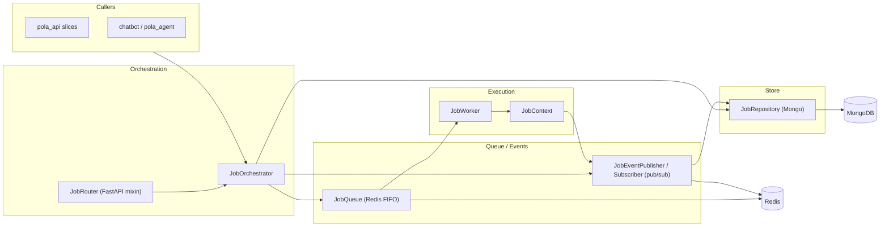

# Flow — `jobs` (`pole_jobs` Shared Job Infrastructure)

> Layers and key classes of the shared job infrastructure. Shipped in `packages/jobs`.
> Class-level details: [CLASSES.md](./CLASSES.md).

---

## 1. Job Lifecycle Diagram

### 1.1 Diagram Component Descriptions

| Node | Purpose & Use |
| :--- | :--- |
| **CALL — `pola_api` slices** | Backend slices (training/analysis/tools) that submit and monitor jobs. |
| **CALL — `chatbot` / `pola_agent`** | Agents that run job-mode tools (crop/shift) through this infrastructure. |
| **JobOrchestrator** | Central coordinator: submit/list/cancel jobs, start worker, wire subscribers. |
| **JobRouter (FastAPI mixin)** | HTTP/WS surface: `POST /api/jobs`, `GET`, cancel, WS progress. |
| **JobQueue (Redis FIFO)** | Ordered queue of pending job ids. |
| **JobEventPublisher / Subscriber** | Redis pub/sub for `job:started/progress/done/error`. |
| **JobRepository (Mongo)** | Persistent job state store. |
| **JobWorker** | Executes handlers with retries/backoff/cancel. |
| **JobContext** | Per-job execution context exposing `set_progress`. |
| **MongoDB / Redis** | External stores for job docs and queue/events. |

---

## 2. Layers and Key Classes

### Domain / Models
- `models.py` — `Job` model (id, type, state, progress, payload, result).

### Application / Orchestration
- `orchestrator.py` — `JobOrchestrator`: submit/list/cancel/worker/subscriber wiring.
- `worker.py` — `JobWorker` (retries/backoff/cancel) + `JobContext` (progress).

### Infrastructure
- `queue.py` — `JobQueue` (Redis FIFO of ids), `JobEventPublisher` / `JobEventSubscriber`.
- `repository.py` — `JobRepository` (Mongo).
- `events.py` — event definitions (`job:started/progress/done/error`).
- `router.py` — `JobRouter` FastAPI mixin (`POST /api/jobs`, `GET`, cancel, WS progress).

---

## 3. Data Flow

| Step | Extract | Transform | Persist |
| :--- | :--- | :--- | :--- |
| Submit | job payload | `JobOrchestrator.submit` | Mongo `Job` + Redis queue |
| Run | queued job id | `JobWorker` pops + executes with `JobContext` | running state |
| Progress | worker step | `JobContext.set_progress` → publish | progress event + Mongo update |
| Complete | handler result | publish `job:done` | done state + result |
| Error | exception | retry/backoff or `job:error` | failed state |
| Cancel | cancel request | set cancel flag | stopped state |

---

## 4. Job Events (`job:started/progress/done/error`)

| Event | Producer | Consumer | Payload |
| :--- | :--- | :--- | :--- |
| `started` | `JobWorker` | subscribers (chatbot WS) | job id |
| `progress` | `JobContext` | subscribers (WS relay) | job id + percent + stage |
| `done` | handler | subscribers | job id + result |
| `error` | worker | subscribers | job id + error |
