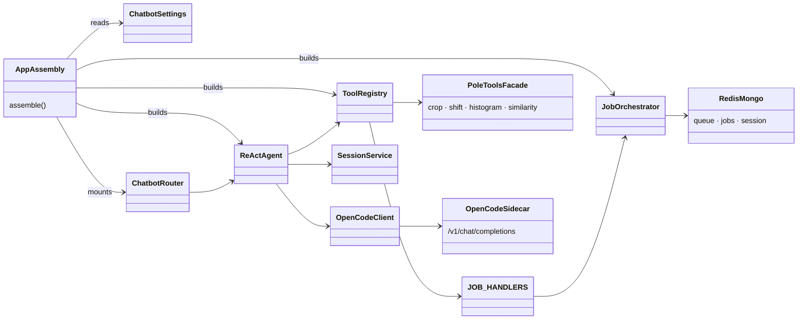

# Classes — `pola_agent` (Conversational AI Coaching Agent)

> Exhaustive class map for `pola_agent`. This app is a **thin assembly layer**: nearly all
> logic lives in the reusable packages. Class-level details for those live in
> `docs/diagrams/chatbot/CLASSES.md`, `docs/diagrams/pole_tools/CLASSES.md`, and
> `docs/diagrams/jobs/CLASSES.md`. Here we document the app's own surface and how it wires
> the packages together.

---

## 0. Class Interaction Diagram

> **Legend:** `-->` = "depends on / calls". `PoleToolsFacade`, `OpenCodeSidecar` and `RedisMongo`
> are external (from `pole_tools`, the LLM sidecar, and `jobs`/Redis/Mongo).

---

## 1. Owned Surface

| Class / Module | Role | Collaborators | Data |
| :--- | :--- | :--- | :--- |
| `app.py` | Assemble the FastAPI app + worker thread | `ChatbotRouter`, `ReActAgent`, `ToolRegistry`, `JobOrchestrator`, `settings` | config → app instance |
| `__main__.py` | `python -m pole_chatbot` entrypoint (port 8001) | `app.py` | CLI → run |
| `config.py` | `ChatbotSettings` from env (`OPENCODE_URL`, `OPENCODE_MODEL`, `AGENT_MAX_ITERATIONS`, DB names) | app assembly | env → typed settings |
| `exceptions.py` | Agent/tool error types | `ReActAgent`, tools | error → typed exception |

> These modules are actually shipped in the **`chatbot` package** (`pole_chatbot`). `pola_agent`
> as an app is that package's runnable entrypoint.

### Purpose & Use

- **`app.py`** — Composition root: builds the FastAPI app and starts the worker thread, wiring the
  router, agent, tool registry, and orchestrator from settings. Run it to start the service.
- **`__main__.py`** — The `python -m pole_chatbot` entrypoint; launches the assembled app on port 8001.
- **`config.py`** — `ChatbotSettings` holds all env configuration. Change connection/LLM settings here;
  the rest of the app reads from this single object.
- **`exceptions.py`** — Typed agent/tool errors raised through the system so failures surface
  predictably to the WS layer.

---

## 2. Wired Packages (imported classes)

| Package | Classes wired | Role in this app |
| :--- | :--- | :--- |
| `pole_chatbot.agent` | `ReActAgent` | conversation loop |
| `pole_chatbot.tools` | `ToolRegistry`, `register_default_tools` | tool dispatch |
| `pole_chatbot.llm` | `OpenCodeClient` | LLM calls to OpenCode sidecar |
| `pole_chatbot.ws` | `ChatbotRouter` | WS endpoint |
| `pole_chatbot.job_handlers` | `JOB_HANDLERS` | worker-side crop/shift jobs |
| `pole_chatbot.metrics` | `MetricsCollector` | tool latency + token metrics |
| `pole_chatbot.session*` | `session_service`, `session_schema`, `redis_repo`, `postgres_repo` | session persistence + resume |
| `pole_jobs.orchestrator` | `JobOrchestrator` | job lifecycle (Redis queue + Mongo store) |

### Purpose & Use

`pola_agent` composes these imported classes into a runnable chatbot: `ReActAgent` runs the loop,
`ToolRegistry`/`JOB_HANDLERS` resolve tools (using the `pole_tools` facade), `OpenCodeClient` talks to
the LLM, `ChatbotRouter` exposes the socket, `SessionService` (+ repos) persist state, and
`JobOrchestrator` manages job-mode tool execution. For the full per-class behavior, see the linked
package docs (`chatbot`, `pole_tools`, `jobs`).

---

## 3. Data Transformations (summary)

| From | To | Operation |
| :--- | :--- | :--- |
| WS message + session | tool-call prompt | `ReActAgent` + `OpenCodeClient` |
| Tool call | job / sync result | `ToolRegistry` → `pole_tools` facade |
| Analysis result + plot | coaching feedback | `OpenCodeClient` (LLM) |
| Agent reply + job events | WS frames | `ChatbotRouter` (filtered by `ws_connection_id`) |
| Session state | persisted session | `session_service` → Redis/Postgres repos |
