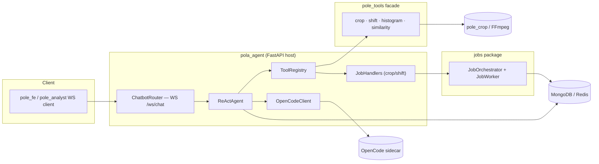
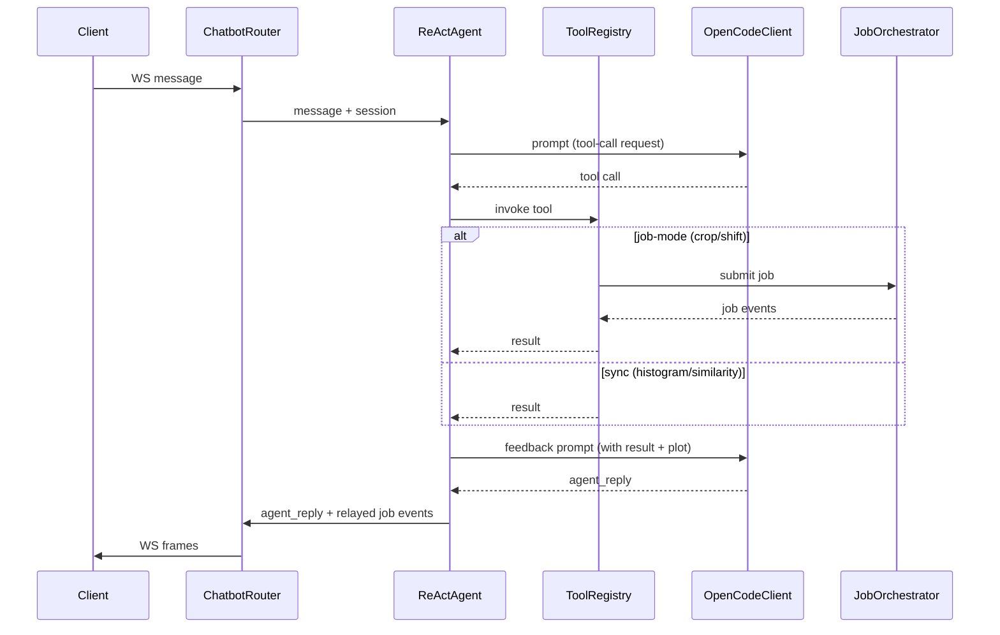

# Flow — `pola_agent` (Conversational AI Coaching Agent)

> Layers and key classes of the coaching agent. `pola_agent` is the standalone FastAPI host
> (`python -m pole_chatbot`, port 8001) of the `chatbot` package, wired to the `pole_tools`
> facade and the `jobs` package. Class-level details: [CLASSES.md](./CLASSES.md).
>
> **Note:** the agent's core logic lives in `packages/chatbot` and `packages/pole-tools`
> (see those docs). This app is the thin assembly layer that brings them together.

---

## 1. Agent Flow Diagram

### 1.1 Diagram Component Descriptions

| Node | Purpose & Use |
| :--- | :--- |
| **CLIENT — FE WS client** | `pole_fe` / `pole_analyst` WebSocket client that opens the chat session. |
| **ChatbotRouter — `WS /ws/chat`** | FastAPI endpoint that receives messages and streams back `agent_reply` + job events. |
| **ReActAgent** | Core conversation loop: prompts the LLM, parses tool calls, runs them, and produces a final coaching reply within an iteration budget. |
| **ToolRegistry** | Registry that resolves a requested tool name to its handler (sync `histogram`/`similarity` or job-mode `crop`/`shift`). |
| **JobHandlers (`crop`/`shift`)** | Worker-side handlers that run crop/shift as tracked jobs with progress stages. |
| **OpenCodeClient** | httpx client to the OpenCode sidecar for LLM chat/feedback. |
| **pole_tools facade** | `crop · shift · histogram · similarity` — the only import surface the agent uses for tools. |
| **JobOrchestrator + JobWorker** | From the `jobs` package; manages job lifecycle (Redis queue + Mongo store). |
| **OpenCode sidecar** | External LLM endpoint (`/v1/chat/completions`). |
| **MongoDB / Redis** | Datastores for jobs, sessions, and queue/events. |
| **pole_crop / FFmpeg** | Video processing used by crop/shift jobs. |

---

## 2. Conversation Flow (ReAct turn)

---

## 3. Layers and Key Classes

### Presentation
- `ChatbotRouter` — `WS /ws/chat`: inbound `message` → `agent_reply`; relays filtered job events
  by `ws_connection_id`.

### Application
- `ReActAgent` — bounded tool-call loop (`max_iterations`, default 6), error capture, off-script rephrase.
- `ToolRegistry` — registered tools: sync `histogram`/`similarity`, job-mode `crop`/`shift`.
- `JobHandlers` (`JOB_HANDLERS`) — worker-side handlers with progress stages.

### Infrastructure
- `OpenCodeClient` — httpx OpenAI-compatible client to the OpenCode sidecar.
- `JobOrchestrator` / `JobWorker` (from `packages/jobs`) — Redis queue + Mongo job store.

---

## 4. Data Flow (extract → transform → respond)

| Step | Extract | Transform | Produce |
| :--- | :--- | :--- | :--- |
| Crop | user message + video | `pole_tools.crop` via `pole_crop` ffmpeg | cropped clip (job) |
| Shift | cropped clip | `pole_tools.shift` via `pole_crop` | shifted clip (job) |
| Analyze | clip + phase_frames | `pole_tools.histogram` (metrics, Z-score, critical frame, plot) | analysis result + deviation plot |
| Feedback | analysis result + plot | LLM (`OpenCodeClient`) | coaching `agent_reply` |
| Correct | critical frame | `pole_tools` pose correction | correction overlay |
