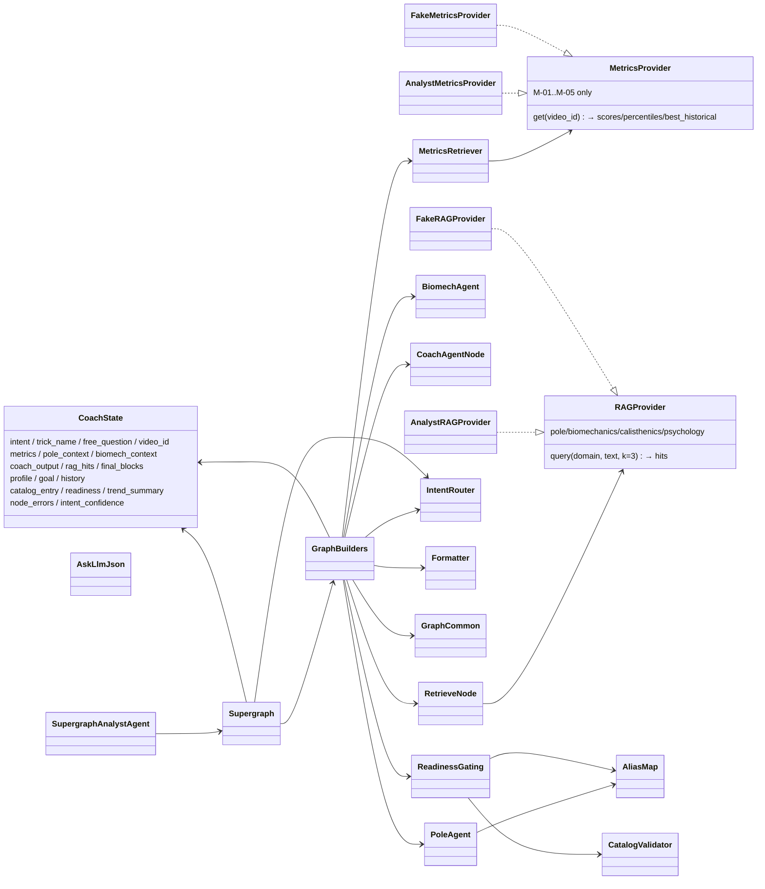

# Classes — `pole_coach` (LangGraph multi-agent virtual coach)

> Exhaustive class/function map for `packages/pole_coach/src/pole_coach/` plus the
> `pole_api` wiring that serves it. Flow overview: [FLOW.md](./FLOW.md).
> Plan: `packages/pole-coach/PLAN.md`.

---

## 0. Class Interaction Diagram

> **Legend:** `-->` = "depends on / calls", `..|>` = "implements protocol".
> `CoachState` is `state.py` (all keys optional, `total=False`); providers are
> `protocols.py` (framework-agnostic — no Mongo/numpy/torch in-process).

---

## 1. State + Protocols

| Unit | Role | Collaborators | Data |
| :--- | :--- | :--- | :--- |
| `state.py` — `CoachState` | Shared `TypedDict` threaded through all graphs (input + planning + diagnostics slices) | all nodes, graph builders, supergraph | turn state |
| `state.py` — `ask_llm_json` | One LLM call + one schema-validation retry (`validate_output` via `jsonschema`) | `pole_agent`, `biomechanics_agent`, `coach_agent`, `intent_router` | prompt → schema-valid JSON |
| `state.py` — `extract_message_content` | Normalise LLM response shapes to text | `ask_llm_json` | response → str |
| `protocols.py` — `METRIC_NAMES` | M-01…M-05 contract (`angular_speed`, `torso_tilt_speed`, `wrist_stability`, `hip_height`, `body_tilt`) | `validate_metrics`, `metrics_retriever` | metric vocabulary |
| `protocols.py` — `MetricsProvider` | `get(video_id)` protocol (scores/percentiles/`best_historical` over M-01…M-05) | implemented by `pole_api` (`AnalystMetricsProvider`); faked by `FakeMetricsProvider` | video → metrics |
| `protocols.py` — `RAGProvider` | `query(domain, text, k=3)` protocol (`RAG_DOMAINS` = pole, biomechanics, calisthenics, psychology) | implemented by `pole_api` (`AnalystRAGProvider`); faked by `FakeRAGProvider` | query → hits |
| `protocols.py` — `validate_metrics` | Reject unknown metric keys loudly (M-06…M-08 must never slide through) | `metrics_retriever` | payload → error list |
| `protocols.py` — `FakeMetricsProvider` / `FakeRAGProvider` | In-memory fakes for unit/integration tests | tests, `build_supergraph` in tests | fixtures → outputs |

### Purpose & Use

- **`CoachState`** — Every key optional; each node reads its input slice and writes its output slice. Phase-3 additive keys (`profile`/`goal`, `catalog_entry`/`readiness`, `trend_summary`/`history`, `node_errors`/`intent_confidence`) left Phase-2 producers/consumers untouched.
- **Protocols** — `pole_coach` never imports Mongo drivers; `pole_api` injects facade-backed providers through `build_supergraph(metrics_provider, rag_provider, llm)`.

---

## 2. Nodes (one file each)

| Unit | Role | Collaborators | Data |
| :--- | :--- | :--- | :--- |
| `nodes/retrieve.py` — `retrieve` | `retrieve(domain, query, k=3)` via `RAGProvider` → `hits[≤3]` (text + source + image meta); empty-hit mode returns zero hits without error | `RAGProvider` | query → hits |
| `nodes/pole_agent.py` — `pole_agent` | `trick_name` (alias-normalised) + RAG → `{description, anatomy{muscles,joints,contact_points}, conditioning[]}` | `AliasMap`, `RAGProvider`, `ask_llm_json` | trick → pole context |
| `nodes/biomechanics_agent.py` — `biomechanics_agent` | Pipeline input (`pole_context` + metrics + percentiles + risk + best-historical) → `metric_interpretation[]`; standalone `{free_question}` → `[]` | `MetricsProvider` output, `ask_llm_json` | metrics → interpretation |
| `nodes/coach_agent.py` — `coach_agent` | `{pole + biomech + free_question + profile/goal}` → `{advice, training_plan{weeks/days}|null, summary, recommendation[]}` (+ safety disclaimer when needed) | `ask_llm_json` | contexts → coaching |
| `nodes/metrics_retriever.py` — `metrics_retriever` | `video_id` → `MetricsProvider.get`; missing/unscored → typed `metrics_error` (never fabricated) | `MetricsProvider` | video → metrics |
| `nodes/intent_router.py` — `intent_router` | `{free_question}` → `{intent, confidence}` (one of the 7 labels); low-confidence → `query` fallback | `ask_llm_json` | question → intent |
| `nodes/formatter.py` — `formatter` | Pipeline outputs + `video_id` + RAG hits → `final_blocks[]` over `BLOCK_TYPES` (`md`/`score_summary`/`drills`/`metric_matrix`/`quick_replies`/`video_segment`/`image`); unknown types → `formatter_error` | `coach_agent` output | coaching → blocks |

---

## 3. Graphs + Supergraph

| Unit | Role | Collaborators | Data |
| :--- | :--- | :--- | :--- |
| `graphs/<label>.py` — 7 builders | `build_<label>_graph(metrics, rag, llm)` per label (`improve_trick`, `readiness`, `injury`, `training_plan`, `video_analysis`, `progress`, `query`); each `compile()`-able standalone | nodes, `GraphCommon` | providers → compiled graph |
| `graphs/__init__.py` — `GRAPH_MODULES` | Label → submodule map + lazy `get_graph_builder(label)` | `supergraph.py` | label → builder |
| `graphs/_common.py` — `make_*` factories | `make_router` / `make_fetch_metrics` / `make_retrieve_multi` / `make_pole` / `make_biomech` / `make_coach` / `make_finish` — closures reading/writing the `CoachState` slice, never raising (skips + typed errors → `node_errors`) | nodes | state slice → state slice |
| `graphs/_common.py` — `finish` / `SAFE_FALLBACK_ADVICE` | Terminal node guaranteeing `final_blocks` (formatter output, else safe fallback reply — never blank) | `formatter` | state → blocks |
| `supergraph.py` — `build_supergraph` | `StateGraph(CoachState)`: `router` → conditional edges (`_supergraph_route` over `ROUTER_TO_GRAPH`) → 7 compiled subgraphs → `END`; `llm` optional third arg (steps without LLM degrade to safe fallback) | `GRAPH_MODULES`, `make_router` | providers → compiled supergraph |

---

## 4. Catalog + Gating

| Unit | Role | Collaborators | Data |
| :--- | :--- | :--- | :--- |
| `catalog.py` — `validate_move` / `validate_catalog` | Schema + dangling-ref validation of `trick_catalog.json` (447 moves; `version`/`source`/`moves`/`errors`); non-zero-exit naming the bad slug on failure | scraper output, `gating.py` | catalog → error list |
| `aliases.py` — `label_for_slug` / `slugs_for_label` / `uncovered_labels` | `slug → trick_label` map bridging classifier labels to catalog slugs; coverage test fails on unmapped classifier labels | `pole_agent`, `gating.resolve_trick` | slug ↔ label |
| `gating.py` — `resolve_trick` | Alias/squashed-name resolution of a free-text trick name to a catalog entry; unknown → "unknown trick" guidance (never fabricates) | `AliasMap`, catalog | name → entry |
| `gating.py` — `prerequisites_for` / `progressions_for` | Catalog-driven prereq/regression/progression lists for an entry | catalog entry | entry → related moves |
| `gating.py` — `evaluate_readiness` | Prereq + metric/joint gates × latest-vs-best-historical → met / unmet-regression / progression-suggestion | `MetricsProvider` output, catalog | metrics + entry → readiness |

---

## 5. `pole_api` Wiring (`app/pole_api/src/analyst_chatbot/`)

| Unit | Role | Collaborators | Data |
| :--- | :--- | :--- | :--- |
| `coach_providers.py` — `AnalystMetricsProvider` | `MetricsProvider` over `AnalystFacade` (histogram scores, cohort percentiles, risk-scan flags, peak sessions, biomech snapshots); missing video/unscored raises `KeyError` → typed `metrics_error` | `AnalystFacade`, `pole_coach.protocols` | facade → metrics |
| `coach_providers.py` — `AnalystRAGProvider` | `RAGProvider` over `pole_rag.query.query` (lazy import; empty hits when unseeded) | `pole_rag`, `pole_coach.protocols` | RAG → hits |
| `coach_providers.py` — `build_coach_supergraph` | `build_supergraph(metrics, rag, llm)` factory; `None` when `pole_coach` not importable | `pole_coach.supergraph` | providers → supergraph |
| `coach_providers.py` — `SupergraphAnalystAgent` | `answer(message, history, session)` → `{reply, blocks, messages}` or `None` (delegate to ReAct); normalises `pole_coach` blocks to the analyst `blocks.py` contract | supergraph, `blocks.py` | turn → reply/blocks |
| `coach_providers.py` — `BE_TO_COACH_JOINTS` | BE `biomech_features` names → coach hinge names (Phase-33 shoulders/hips/spine pass through identically named) | `biomech_features.py` | joint-name bridge |
| `services.py` — brain-first | Supergraph brain first, ReAct fallback (17 analyst tools stay callable); lazy `pole_coach` import (ReAct-only boot without it) | `SupergraphAnalystAgent`, ReAct agent | turn → `AgentTurn` |
| `router.py` / `deps.py` | `get_supergraph_agent` via `Depends`; WS frame (`/ws/analyst-chat`) + answer blocks unchanged | `coach_providers.py` | request → agent |

---

## 6. Profile + Biomech (`app/pole_api/src/analysis/`)

| Unit | Role | Collaborators | Data |
| :--- | :--- | :--- | :--- |
| `schemas.py` — `AthleteProfile` / `Update` | `experience_level` enum, `goals` free-text, `days_per_week` 1–7, `injury_history`, `limitations` (all optional) | `controllers/profile.py`, FE form | profile fields |
| `controllers/profile.py` + `repositories/analysis_repository.py` | Profile CRUD over `analysis-db.athlete_profiles` | `schemas.py` | doc ↔ model |
| `services/biomech_features.py` | `FEATURE_NAMES` / `compute_frame_features` / `phase_feature_stats` incl. `shoulder_flexion_l/r_deg`, `hip_angle_l/r_deg`, `spine_angle_deg`; elbow/knee vertex-convention fix; legacy back-compute at read time | skeleton pipeline, coach joint bridge | frames → features |

---

## 7. Data Transformations (summary)

| From | To | Operation |
| :--- | :--- | :--- |
| chat turn | intent + confidence | `intent_router` (LLM, low-confidence → `query`) |
| intent | graph output | supergraph conditional edge → compiled subgraph |
| video_id | metrics | `metrics_retriever` over `MetricsProvider` (M-01…M-05; typed error on missing) |
| query + domain | hits[≤3] | `retrieve` over `RAGProvider` (k=3 per domain) |
| trick + hits | pole context | `pole_agent` (alias-normalised) |
| pole + metrics | interpretation | `biomechanics_agent` (dual-mode) |
| contexts + profile | coaching | `coach_agent` (+ disclaimer when needed) |
| coaching | `final_blocks[]` | `formatter` (`BLOCK_TYPES` only) / `finish` fallback (never blank) |
| trick name | readiness | `resolve_trick` → `evaluate_readiness` (latest vs best-historical; unknown → guidance) |
