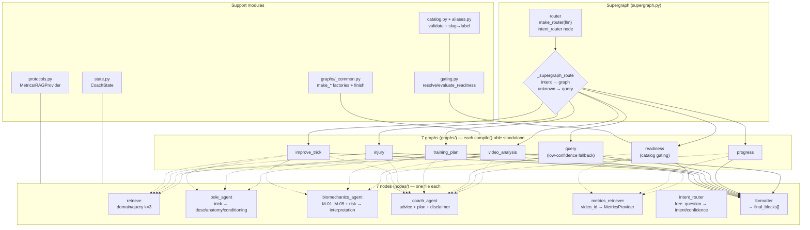
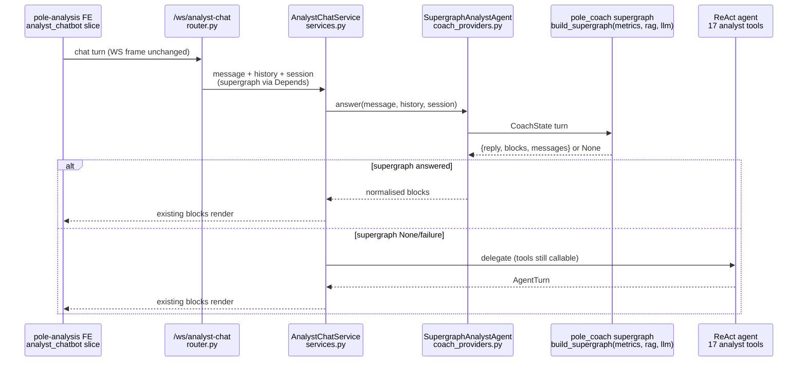

# Flow — `pole_coach` (LangGraph multi-agent virtual coach)

> Supergraph → 7 graphs → nodes composition, and the `analyst_chatbot` wiring
> that serves it. Shipped in `packages/pole_coach` (Option A: `src/`, PYTHONPATH,
> no pyproject — mirrors `pole_rag`). Class-level details: [CLASSES.md](./CLASSES.md).
> Plan: `packages/pole-coach/PLAN.md` · Phases 1–4 ✅ DONE, Phase 5 🟡 PARTIAL
> (code done, PR pending), Phase 6 📋 PLANNED.

---

## 1. Supergraph → Graphs → Nodes Diagram

### 1.1 Diagram Component Descriptions

| Node | Purpose & Use |
| :--- | :--- |
| **router** | LLM `intent_router` node: `free_question` → `{intent, confidence}` (one of the 7 graph labels); low-confidence → `query` fallback, logged. |
| **_supergraph_route** | Conditional-edge function: `state.intent` → graph label via `ROUTER_TO_GRAPH`; unknown intent → `query`. |
| **7 graphs** | Pure composition in `graphs/<label>.py`, each exposing `build_<label>_graph(metrics, rag, llm)`; importable + `compile()`-able without the supergraph. |
| **retrieve** | `retrieve(domain, query, k=3)` over the injected `RAGProvider` (`RAG_DOMAINS` = pole, biomechanics, calisthenics, psychology); empty hits → zero-hit output, no error. |
| **pole_agent** | `trick_name` (alias-normalised via `aliases.py`) + RAG hits → `{description, anatomy{muscles,joints,contact_points}, conditioning[]}`; one LLM call + one schema-validation retry. |
| **biomechanics_agent** | `{pole_context + metrics{M-01…M-05, percentiles, risk_flags, best_historical}}` → `metric_interpretation[]`; standalone `{free_question}` → `[]`. |
| **coach_agent** | `{pole + biomech + free_question + profile/goal}` → `{advice, training_plan{weeks/days}|null, summary, recommendation[]}` (+ safety disclaimer when needed). |
| **metrics_retriever** | `video_id` → `MetricsProvider.get(video_id)`; missing video/unscored analysis → typed `metrics_error` (never fabricated numbers). |
| **formatter** | Pipeline outputs → `final_blocks[]` using only `BLOCK_TYPES` (`md` / `score_summary` / `drills` / `metric_matrix` / `quick_replies` / `video_segment` / `image`); unknown types → `formatter_error`, never blank. |
| **`_common.finish`** | Graph-level fallback: formatter output when `coach_output` exists, else `SAFE_FALLBACK_ADVICE` — every graph guarantees `final_blocks`. |

---

## 2. `analyst_chatbot` Wiring (Phase 4, DONE)

### 2.1 Wiring notes

- `coach_providers.py` — `AnalystMetricsProvider` (facade-backed histogram scores, cohort percentiles, risk-scan flags, peak sessions, biomech snapshots), `AnalystRAGProvider` (wraps `pole_rag.query.query`; empty hits when unseeded), `build_coach_supergraph(metrics, rag, llm)` factory (`None` when `pole_coach` not importable — best-effort), `SupergraphAnalystAgent.answer()` adapter.
- `services.py` — supergraph brain first; any failure falls through to the ReAct agent (full tool registry stays callable). `pole_coach` is lazily imported so the slice still boots ReAct-only where the package is absent.
- `router.py` / `deps.py` — `get_supergraph_agent` injected via `Depends`; WS contract + answer blocks unchanged.
- Block normalisation (`coach_providers.py` → analyst `blocks.py` contract): `md.text → md.content`, hinge cards mapped, bare `video_segment → analysis_link`, unmappable cards dropped so the browser never receives unloadable payloads.
- Untouched: `chatbot` (video) and `training_chatbot` slices (still `PoleLangGraphAgent`).

---

## 3. Profile + Biomech Touchpoints (Phase 4, DONE)

| Touchpoint | Reality |
| :--- | :--- |
| **Profile schema** | `analysis/schemas.py`: `AthleteProfile/Update` — `experience_level` enum (`beginner`/`intermediate`/`advanced`/`professional`), `goals` free-text, `days_per_week` 1–7, `injury_history`, `limitations` (all optional, partial updates allowed). |
| **Profile flow** | `analysis/controllers/profile.py` ↔ `AthleteProfileRepository` (`analysis/repositories/analysis_repository.py`) ↔ `analysis-db.athlete_profiles`; FE model/form/modal validates the same ranges. Coach receives `profile`/`goal` via `CoachState`. |
| **Biomech features** | `analysis/services/biomech_features.py`: `FEATURE_NAMES` + `compute_frame_features` carry `shoulder_flexion_l/r_deg`, `hip_angle_l/r_deg`, `spine_angle_deg`; elbow/knee vertex-convention fix landed first; legacy docs back-compute at read time (no re-extraction). |
| **Joint-name bridge** | `BE_TO_COACH_JOINTS` in `coach_providers.py` (BE `elbow_angle_*`/`knee_angle_*` → coach hinge names; Phase-33 shoulders/hips/spine pass through identically named). |
| **Metrics contract** | `protocols.py`: `METRIC_NAMES` M-01…M-05 (`angular_speed`, `torso_tilt_speed`, `wrist_stability`, `hip_height`, `body_tilt`); `validate_metrics` rejects unknown keys (e.g. M-06…M-08) loudly. |
| **Catalog** | `packages/pole_coach/trick_catalog.json` (447 moves; `version`/`source`/`moves`/`errors`) + `images/` + `slug → trick_label` alias map (`aliases.py`: `label_for_slug`, `slugs_for_label`, `uncovered_labels`); readiness gating (`gating.py`: `resolve_trick`, `prerequisites_for`, `progressions_for`, `evaluate_readiness`) never fabricates unknown tricks. |

---

## 4. Resilience (applies to every turn)

| Rule | Mechanism |
| :--- | :--- |
| Nodes never raise | Typed errors → `state["node_errors"]`; skipped steps (missing input) recorded, not crashed. |
| Graphs always answer | Terminal `finish` (`_common.py`) guarantees `final_blocks` (formatter or `SAFE_FALLBACK_ADVICE`). |
| No direct Mongo in `pole_coach` | `MetricsProvider`/`RAGProvider` injected via `build_supergraph(metrics_provider, rag_provider, llm)`; `pole_api` injects facade-backed providers. |
| LLM budget | One call + one schema-validation retry per node (`ask_llm_json`); RAG capped at `k=3` per domain. |
