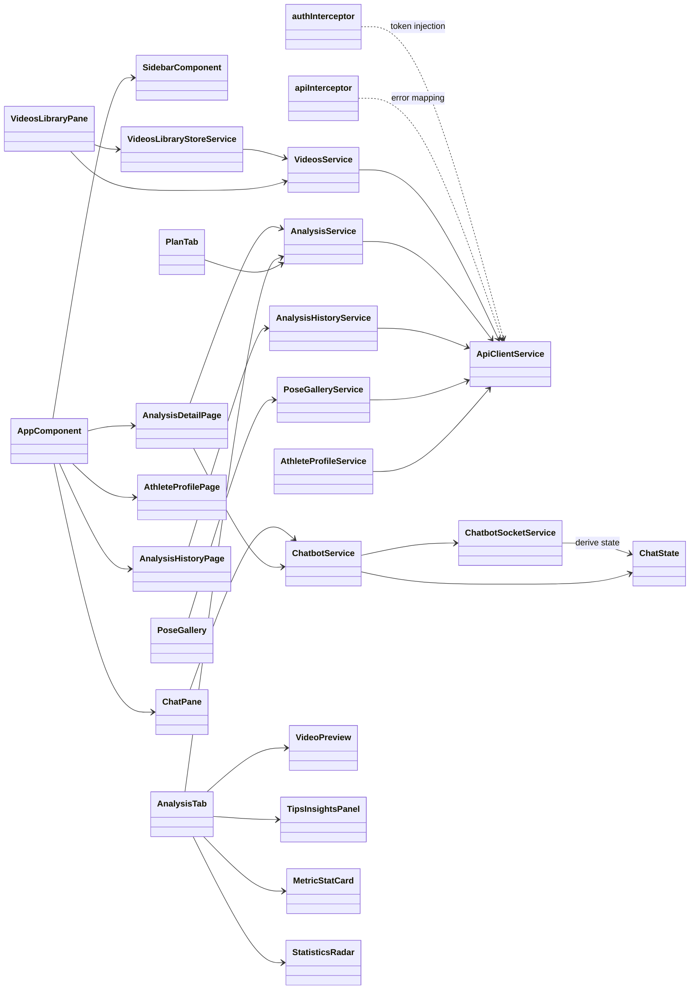

# Classes — `pole_analyst` (Angular "Pole AI Coach")

> Exhaustive class map for `pole_analyst`, reflecting the implemented code under
> `app/pole_analyst/src/app/` (Phases 1–20 done; Phase 7 Keycloak OIDC login deployed, per-user library deferred).
> Backend contract consumed: the `pole_api` `analysis` + `analyst_chatbot` slices
> (`docs/diagrams/pole_api/CLASSES.md`).

---

## 0. Class Interaction Diagram

> **Legend:** `-->` = "depends on / calls"; `..>` = auxiliary.

---

## 1. App Shell (`app.ts`)

| Class | Role | Collaborators | Data |
| :--- | :--- | :--- | :--- |
| `AppComponent` | Shell layout: sidebar + top bar + two-pane split (chat 40% / tools 60%) with draggable divider. | `SidebarComponent`, `RouterOutlet` | localStorage ↔ layout state |

---

## 2. Core (`core/`)

| Class | Role | Collaborators | Data |
| :--- | :--- | :--- | :--- |
| `ApiClientService` | Wraps Angular `HttpClient`; `get`/`post`/`upload` (progress), `streamUrl` | feature services | HTTP ↔ typed response |
| `apiInterceptor` | Maps backend `{detail}` envelope into typed `ApiError` | `ApiClientService` | HTTP error → typed error |
| `authInterceptor` | Attaches Keycloak Bearer token, proactive refresh (30s) | `KEYCLOAK` adapter | HTTP request → authorized request |
| `ChatbotSocketService` | WS client to `/api/analyst-chatbot/ws/analyst-chat`; reconnect + `session_id` resume | `ChatState` | WS frame ↔ `ChatWsFrame` |
| `ChatState` | Pure state model + reducer: Idle/Thinking/Working/Completed/Error | `ChatbotService` | `ChatEvent` → `ChatState` |
| `VideosLibraryStoreService` | Signal store: video list + upload state + `markAnalyzed` | `VideosService` | `VideoRecord[]` + upload events |
| DTO models (`api.models.ts`) | `VideoRecord`, `AnalysisJob`, `JobResponseDto`, `VideoHistogramDoc`, `AnalysisSummary`, `PoseFrame`, `ChatWsFrame`, `ApiError`, `AnalysisSummaryRecord` | services | wire ↔ domain |

---

## 3. Application services (`core/services/`)

| Class | Role | Collaborators | Data |
| :--- | :--- | :--- | :--- |
| `VideosService` | `list()` / `upload()` / `thumbnailUrl()` / `streamUrl()` | `ApiClientService` | file/DTO ↔ `VideoRecord[]` |
| `AnalysisService` | `trigger()`/`analyze()`, `summary()`, `getHistogram()`, `getPose()`, `coachSummary()`, `generatePlan()`, `poseAnalysis()`, `metricDeltas()` | `ApiClientService`, `VideosLibraryStoreService` | video_id → job/summary/histogram/pose/coach |
| `ChatbotService` | `state$` + `frames$`, `sendMessage()`, `resume()`, local assistant replies | `ChatbotSocketService`, `ChatState` | user message → frames → state |
| `AnalystSocketService` | WS client to `/api/analyst-chatbot/ws/analyst-chat` | `ChatbotSocketService` (child injector) | WS frame ↔ `ChatWsFrame` |
| `AnalysisActionsService` | Manual phases update, trick-name prompt, reprocess | `ApiClientService`, `VideosLibraryStoreService` | phase_frames/trick_label → server |
| `AnalysisHistoryService` | `GET /api/analysis/videos/summary` | `ApiClientService` | `AnalysisSummaryRecord[]` |
| `PoseGalleryService` | Multi-frame pose fetch with single-frame fallback | `ApiClientService` | video_id → `PoseFrameGallery` |
| `CoachPlanCacheService` | Session-scoped cache of coach plans | sessionStorage | video_id → `CoachPlanView` |
| `AthleteProfileService` | `GET/PUT /api/analysis/athlete-profile` | `ApiClientService` | athlete_id ↔ `AthleteProfile` |
| `LandmarksService` | Landmark data for skeleton rendering | `ApiClientService` | video_id → landmark frames |
| `ClassesService` | Class/trick names for autocomplete | `ApiClientService` | class names → suggestions |

---

## 4. Presentation — Analysis (`features/analysis/`)

### Pages
| Component | Role | Collaborators | Data |
| :--- | :--- | :--- | :--- |
| `AnalysisDetailPage` | Two-tab detail: Analysis / Plan. | `AnalysisService`, `ChatbotService`, `TabBar` | video_id → tab data |
| `AnalysisHistoryPage` | Enriched analysis history table. | `AnalysisHistoryService`, `AnalysisHistoryTable` | `AnalysisSummaryRecord[]` → table |

### Components (Analysis Tab Composition)
| Component | Role | Data |
| :--- | :--- | :--- |
| `AnalysisTabComponent` | Composition root: VideoPreview + TipsInsightsPanel + MetricStatCards + StatisticsRadar + Performance Summary. | summary + histogram + insights → composed tab |
| `VideoPreviewComponent` | Real `<video>` player with skeleton overlay + marker seeking. | video_id → player with overlays |
| `TipsInsightsPanelComponent` | Issues / working well groups with frame-jump. | `InsightView[]` → grouped panels |
| `MetricStatCardComponent` | Per-metric KPI card. | `StatCardView` → card |
| `StatisticsRadarComponent` | SVG radar chart (Metric Distribution). | `scores` → radar SVG |
| `MetricDetailModal` | Histogram chart modal for metric drill-down. | `HistogramChartData` → modal |
| `MetricDistributionCardComponent` | Session-over-session metric comparison. | `DistributionCardView` → card |
| `DetectedErrorCardComponent` | Worst metric from coach insights. | `InsightView` → error card |
| `PhaseDurationsBarComponent` | Phase timeline with durations. | `PhaseSpanInput[]` → bar |

### Components (Modals / Overlays)
| Component | Role |
| :--- | :--- |
| `PoseGallery` | Multi-frame pose gallery (correct/adjustment/improve). |
| `ManualPhasesModal` | Draggable phase boundary handles. |
| `PhasesConfigModal` | Phase capture configuration. |
| `TrickNamePrompt` | Trick classification with autocomplete. |
| `ClassNameModal` | Set video trick/class label. |
| `AnalysisNotification` | Auto-dismiss analysis completion banner. |
| `ProgressPanel` | Live 5-stage progress bar. |

### Models (`features/analysis/models/`)
| File | Key Types |
| :--- | :--- |
| `summary.ts` | `AnalysisSummary` |
| `histogram.ts` | `VideoHistogramDoc` |
| `pose.ts` | `PoseFrame`, `PoseFrameGallery` |
| `plan.ts` | plan steps, errors (legacy fallback) |
| `coach.ts` | `CoachSummaryView`, `CoachPlanView`, `PoseAnalysisView` |
| `coach-insights.ts` | `InsightView` |
| `analysis-overview.ts` | `TimelineMarker`, `StatCardView` |
| `distribution.ts` | `DistributionCardView` |
| `statistics.ts` | Radar geometry, `MetricLegendRow` |
| `pose-skeleton.ts` | `SkeletonJoint`, `SkeletonAccent`, `JOINT_MAP` |
| `pose-insight-list.ts` | `PoseInsightItem` |

---

## 5. Presentation — Videos / Chat / Profile / History

| Component | Role | Data |
| :--- | :--- | :--- |
| `VideosLibraryPaneComponent` | Search + filter + grid + upload + modals. | `VideoRecord[]` → grid |
| `VideoCardComponent` | Thumbnail, filename, badge, analyze/open. | `VideoRecord` → card |
| `ChatPaneComponent` | Message list + `StatusChip` + composer. | `ChatWsFrame[]` → bubbles |
| `AthleteProfilePage` | Athlete profile form. | `AthleteProfile` ↔ form |
| `AnalysisHistoryTable` | Enriched analysis summary table with filter + delete. | `AnalysisSummaryRecord[]` → table |
| `LibraryFilterModalComponent` | Filter by class/trick/date/score. | `LibraryFilter` ↔ modal |

---

## 6. Shared UI atoms (`shared/components/`)

| Component | Role |
| :--- | :--- |
| `SidebarComponent` | Collapsible nav group with icon rail. |
| `StatusChip` | Idle/Thinking/Working/Completed/Error |
| `TabBar` | WAI-ARIA tabs (roving tabindex) |
| `Card` / `Badge` / `UploadDropzone` / `MetricChart` / `AnnotatedFrame` / `SkeletonCard` | Standard UI atoms |
| `UsageRings` / `BiometricsGateModal` | Quota visualization / biometrics consent |

---

## 7. Data Transformations (summary)

| From | To | Operation |
| :--- | :--- | :--- |
| HTTP `{detail}` envelope | typed `ApiError` | `apiInterceptor` |
| Keycloak session | Bearer token on requests | `authInterceptor` |
| WS frame | `ChatState` + bubbles | `ChatbotService` + reducer |
| `VideoRecord[]` | grid cards | `VideosLibraryPane` + `VideoCard` |
| `VideoHistogramDoc` | chart series | `models/histogram.ts` → `MetricChart` |
| `AnalysisSummary` | metric cards + radar | `AnalysisTab` composition |
| `PoseFrame` / detections | overlay frame | `VideoPreview` skeleton overlay |
| `PoseFrameGallery` | multi-frame groups | `PoseGallery` (correct/adjustment/improve) |
| `InsightView[]` | issues/working panels | `TipsInsightsPanel` |
| `CoachSummaryView` / `CoachPlanView` | structured plan | `PlanTab` + `CoachPlanCacheService` |
| `DistributionCardView[]` | session comparison cards | `MetricDistributionCard` |
| `AnalysisSummaryRecord[]` | history table | `AnalysisHistoryTable` |
| `AthleteProfile` | profile form | `AthleteProfilePage` |
| job poll | card `analyzed` flag | `AnalysisService` + `VideosLibraryStoreService` |
| job stage events | 5-stage progress bar | `ProgressPanel` |
| phase_frames + totalFrames | modal timeline | `ManualPhasesModal` |
| trick_label query | autocomplete | `ClassesService` → `TrickNamePrompt` |
