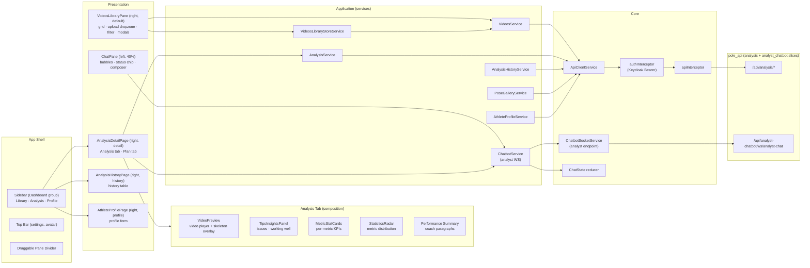

# Flow — `pole_analyst` (Angular "Pole AI Coach")

> Layers and key classes of the athlete-facing frontend. Reflects the implemented code under
> `app/pole_analyst/src/app/` (Phases 1–20 done; Phase 7 Keycloak OIDC login deployed, per-user library deferred).
> Class-level details: [CLASSES.md](./CLASSES.md).

---

## 1. UI Flow Diagram

### 1.1 Diagram Component Descriptions

| Node | Purpose & Use |
| :--- | :--- |
| **SHELL — Sidebar** | Collapsible icon rail (256px → 56px): brand + Dashboard group with Library/Analysis/Profile nav items. Option B (PAIML-POLE-ANALYST-068): no Coach item, no Upload button. Persisted collapsed state. |
| **SHELL — Top Bar** | 56px top bar with settings icon + avatar. |
| **SHELL — Draggable Pane Divider** | Pointer/keyboard draggable divider between chat (40%) and tools (60%) panes. Double-click resets. Persisted width. |
| **PRES — ChatPane** | Left panel: message list, `StatusChip`, composer. |
| **PRES — VideosLibraryPane** | Right default panel: search, filter modal, `VideoCard` grid, `UploadDropzone`, modals (ManualPhasesModal, TrickNamePrompt, ClassNameModal, PhasesConfigModal, BiometricsGateModal). |
| **PRES — AnalysisDetailPage** | Right detail pane: two-tab redesign (Analysis / Plan). Single fetch drives header + Analysis tab. |
| **PRES — AnalysisHistoryPage** | Right history pane: `AnalysisHistoryTable` with enriched summary list, filter, delete. |
| **PRES — AthleteProfilePage** | Right profile pane: athlete profile form. |
| **ANALYSIS_TAB** | Composite Analysis tab: `VideoPreview` + `TipsInsightsPanel` + `MetricStatCard` grid + `StatisticsRadar` + Performance Summary. |
| **APP — ChatbotService** | WS lifecycle + frame → `ChatState` adapter. Connects to analyst WS endpoint. |
| **APP — VideosService** | `list()`/`upload()`/`thumbnailUrl()`/`streamUrl()`. |
| **APP — AnalysisService** | `trigger()`/`analyze()` (job polling), `summary()`, `getHistogram()`, `getPose()`, `coachSummary()`, `generatePlan()`, `poseAnalysis()`, `metricDeltas()`. |
| **APP — VideosLibraryStoreService** | Signal store: video list + upload state + `markAnalyzed`. |
| **APP — AnalysisHistoryService** | `GET /api/analysis/videos/summary` (enriched summary list). |
| **APP — PoseGalleryService** | Multi-frame pose fetch with single-frame fallback. |
| **APP — AthleteProfileService** | `GET/PUT /api/analysis/athlete-profile`. |
| **INFRA — ApiClientService** | `HttpClient` wrapper: `get`/`post`/`upload` (progress) + `streamUrl`. |
| **INFRA — apiInterceptor** | Maps backend `{detail}` envelope into typed `ApiError`. |
| **INFRA — authInterceptor** | Attaches Keycloak Bearer token, proactive refresh. |
| **INFRA — ChatbotSocketService** | WS client with reconnect + `session_id` resume. Path overridden to analyst endpoint. |
| **INFRA — ChatState reducer** | Idle/Thinking/Working/Completed/Error state machine. |
| **BE — `/api/analysis/*`** | Backend analysis slice. |
| **BE — `/api/analyst-chatbot/ws/analyst-chat`** | Backend analyst chatbot WS (17 coach tools). |

---

## 2. Pages & Routes

| Route (tools outlet) | Page | Description |
| :--- | :--- | :--- |
| `''` → redirect to `chat` | — | Default redirect |
| `chat` (primary outlet) | `ChatPage` | Chat pane (always visible) |
| `videos` (tools outlet) | `VideosLibraryPage` → `VideosLibraryPane` | Video library + upload + modals |
| `videos/:videoId/analysis` (tools outlet) | `AnalysisDetailPage` | Two-tab detail: Analysis + Plan |
| `history` (tools outlet) | `AnalysisHistoryPage` | Enriched analysis history table |
| `profile` (tools outlet) | `AthleteProfilePage` | Athlete profile form |

---

## 3. Layers and Key Classes

### App Shell (`app.ts`)
- `AppComponent` — Shell layout: sidebar + top bar + two-pane split. Draggable divider with persisted width.

### Presentation (`features/`)

#### Analysis (`features/analysis/`)
**Pages:**
- `AnalysisDetailPage` (`pages/detail`) — Two-tab detail: Analysis / Plan.
- `AnalysisHistoryPage` (`pages/history`) — Enriched analysis history table.

**Components (Analysis tab composition):**
- `AnalysisTabComponent` — Composition root: VideoPreview + TipsInsightsPanel + MetricStatCards + StatisticsRadar + Performance Summary.
- `VideoPreviewComponent` — Real `<video>` player with skeleton overlay + marker seeking.
- `TipsInsightsPanelComponent` — Issues / working well groups with frame-jump.
- `MetricStatCardComponent` — Per-metric KPI card.
- `StatisticsRadarComponent` — SVG radar chart (Metric Distribution).
- `MetricDetailModal` — Histogram chart modal for metric drill-down.
- `MetricDistributionCardComponent` — Session-over-session metric comparison.
- `DetectedErrorCardComponent` — Worst metric from coach insights.
- `PhaseDurationsBarComponent` — Phase timeline with durations.

**Components (Modals / Overlays):**
- `PoseGallery` — Multi-frame pose gallery (correct/adjustment/improve).
- `ManualPhasesModal` — Draggable phase boundary handles.
- `PhasesConfigModal` — Phase capture configuration.
- `TrickNamePrompt` — Trick classification with autocomplete.
- `ClassNameModal` — Set video trick/class label.
- `AnalysisNotification` — Auto-dismiss analysis completion banner.
- `ProgressPanel` — Live 5-stage progress bar.

**Models (`features/analysis/models/`):**
- `summary.ts`, `histogram.ts`, `pose.ts`, `plan.ts` — DTO → view adapters.
- `coach.ts` — `CoachSummaryView`, `CoachPlanView`, `PoseAnalysisView`.
- `coach-insights.ts` — `InsightView` (issues / working well).
- `analysis-overview.ts` — `TimelineMarker`, `StatCardView`.
- `distribution.ts` — `DistributionCardView` (deltas + peak badges).
- `statistics.ts` — Radar chart data, `MetricLegendRow`.
- `pose-skeleton.ts` — `SkeletonJoint`, `SkeletonAccent`, `JOINT_MAP`.
- `pose-insight-list.ts` — `PoseInsightItem`, z-score thresholds.

#### Videos (`features/videos/`)
- `VideosLibraryPaneComponent` — Search + filter + grid + upload + modals.
- `VideoCardComponent` — Thumbnail, filename, badge, analyze/open.

#### Chat (`features/chat/`)
- `ChatPaneComponent` — Message list + `StatusChip` + composer.

#### Profile (`features/profile/`)
- `AthleteProfilePage` — Athlete profile form.

### Application services (`core/services/`)
- `VideosService`, `AnalysisService`, `ChatbotService`, `AnalystSocketService`, `AnalysisActionsService`.
- `AnalysisHistoryService`, `PoseGalleryService`, `CoachPlanCacheService`, `AthleteProfileService`.
- `LandmarksService`, `ClassesService`, `VideosLibraryStoreService`.

### Auth (`core/auth/`)
- `provideAuth` — Blocking Keycloak initializer.
- `authInterceptor` — Bearer token + proactive refresh.
- `authGuard` — Route guard (per-user library deferred).
- `keycloak.factory` — Keycloak adapter (realm `pole-ai`, client `pole-analyst`).

### Shared (`shared/components/`)
- `SidebarComponent`, `StatusChip`, `TabBar`, `Card`, `Badge`, `UploadDropzone`, `MetricChart`, `AnnotatedFrame`, `SkeletonCard`, `UsageRings`, `BiometricsGateModal`.

---

## 4. Data Flow

| Step | Extract | Transform | Render |
| :--- | :--- | :--- | :--- |
| Upload | file drop | `VideosService.upload` (multipart + progress) | video card (Not analyzed) |
| Analyze | `POST /api/analysis/videos/{id}/analyze` | `AnalysisService.analyze` poll → done/failed/no_skeleton | card flips to Analyzed / ProgressPanel |
| History | `GET /api/analysis/videos/summary` | `AnalysisHistoryService.list()` | AnalysisHistoryTable |
| Detail (Analysis) | Single fetch: summary + histogram + pose + coach-insights | `AnalysisTab` composition → radar + stat cards + tips + video | Analysis tab |
| Detail (Plan) | `GET coach-summary`, `POST coach-plan`, `GET pose-analysis` | `PlanTab` + `CoachPlanCacheService` | Plan tab |
| Profile | `GET/PUT /api/analysis/athlete-profile` | `AthleteProfileService` | AthleteProfilePage |
| Chat | WS frames (`/api/analyst-chatbot/ws/analyst-chat`) | frame → `ChatState` reducer | status chip + bubbles |
| Pose gallery | `GET /pose/frames` (fallback `/pose`) | `PoseGalleryService` → multi-frame | PoseGallery groups |
| Coach insights | Threshold-based frame classification | `CoachInsightsService` (backend) → `InsightView[]` | TipsInsightsPanel |
| Metric deltas | Session-over-session comparison | `AnalysisService.metricDeltas()` → `DistributionCardView[]` | MetricDistributionCard |
| Radar chart | `summary.scores` (5 metrics) | `statistics.ts` → radar geometry | StatisticsRadar SVG |
