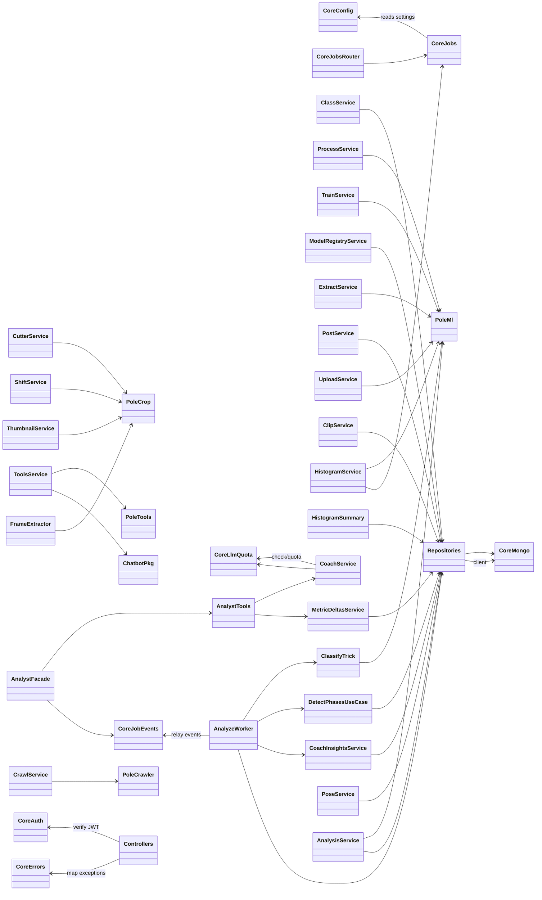

# Classes — `pole_api` (FastAPI Orchestrator)

> Exhaustive class map for `pole_api`. For each class: role, key collaborators, and the data it
> extracts/transforms. Grouped by slice and layer. Source: `app/pole_api/src/`.

---

## 0. Class Interaction Diagram

> **Legend:** `-->` = "depends on / calls". Controllers (not shown as nodes) call each service;
> services depend on repositories and reusable packages (`pole_ml`, `pole_tools`, `pole_crop`,
> `pole_crawler`, `chatbot`).

---

## 1. Core Infrastructure (`src/core/`)

| Class / Module | Role | Collaborators | Data in / out |
| :--- | :--- | :--- | :--- |
| `config.py` | App settings from env (`MONGODB_URI`, DB names, `FFMPEG_BIN`, `AUTH_ENABLED`, `KEYCLOAK_ISSUER`, stride) | all slices | Env → typed settings |
| `auth.py` | Keycloak JWT verification (realm `pole-ai`, roles `fe-user`/`analyst-user`, clients `pole-fe`/`pole-analyst`/`mcp-server`) | controllers | `Authorization: Bearer` → identity/roles |
| `ws_auth.py` | WebSocket auth (JWT bearer + `?token=`) | WS routers | WS query/headers → identity |
| `mongo.py` | Shared Mongo clients: `get_database` (app DB) + `get_analysis_database` (`analysis-db`) | repositories | Connection → Mongo client |
| `jobs.py` | Thread job runner: `pending/running/done/failed/stopped`, progress, cancel + rollback, orphan cleanup | services (training/analysis/tools) | Job spec → run result + progress |
| `jobs_router.py` | Reusable FastAPI jobs router (`GET/POST jobs`, cancel, paginated history) | slices | HTTP → Job orchestration |
| `job_events.py` | Job event relay pub/sub (WS streams to clients) | WS slices | job progress → client frames |
| `llm_quota.py` | LLM usage quota bookkeeping (Ollama/OpenRouter token budgets) | coach services | LLM usage → quota |
| `llm_usage_router.py` | `/api/me/llm-usage` per-user quota read | FE | HTTP → quota doc |
| `errors.py` | Domain exceptions + FastAPI handlers (`NotFound`→404, `Conflict`→409, `ValidationError`→422) | controllers | Python exception → HTTP response |
| `rate_limiter.py` | Per-session rate limiting (429/queue) | chatbot | Request → allow/429 |
| `e2e_fakes.py` | Env-driven stubs for E2E (fake crawl/cut/train) | E2E | Env flag → fake service |
| `status.py` | Status/health types | health endpoints | internal → status doc |
| `repositories/` | Shared repos (`video_repository.py`, `analysis_repository.py`, athlete-profile, video-summary) | analysis/video/training slices | ids ↔ Mongo docs |
| `services/` | Core application services (athlete-profile, video-summary) | controllers | HTTP → domain |

### Purpose & Use

- **`config.py`** — The single settings source; every slice reads DB names, keys, and paths from it.
- **`auth.py`** — Verifies Keycloak JWTs and maps roles to app access (default `AUTH_ENABLED=true`).
- **`ws_auth.py`** — Extends JWT auth to WebSocket connections and `?token=` media requests.
- **`mongo.py`** — Provides shared Mongo clients (app DB + `analysis-db`).
- **`jobs.py`** — Thread-based job runner with cancel + rollback.
- **`jobs_router.py`** — Reusable FastAPI jobs endpoints.
- **`job_events.py`** — Streams job progress/result events over WS.
- **`llm_quota.py` / `llm_usage_router.py`** — Meter LLM usage per user and expose it.
- **`errors.py`** — Maps domain exceptions to HTTP codes.
- **`rate_limiter.py`** — Per-session request budgets (429).
- **`e2e_fakes.py`** — Env-flagged stubs for Playwright E2E.
- **`repositories` / `services`** — Shared Mongo repositories and application services.

---

## 2. Training Slice (`src/training/`)

### Controllers
| Class | Role | Collaborators | Data |
| :--- | :--- | :--- | :--- |
| `classes.py` | `POST/GET/GET{id}/PATCH/DELETE /api/training/classes` + `/stats` + async create job | `ClassService` | HTTP ↔ `Class` DTO |
| `process.py` | `POST /classes/{id}/process` — window extraction | `ProcessService` | class_id → job |
| `train.py` | `POST /classes/{id}/train` — full training | `TrainService` | class_id → job |
| `retrain.py` | `POST /classes/{id}/retrain` — fine-tune | `TrainService` | class_id → job |
| `extract.py` | `POST /classes/{id}/extract` — landmark extraction | `ExtractService` | class_id → job |
| `models.py` | `GET /models`, activate/approve/reject | `ModelRegistryService` | HTTP ↔ model DTO |
| `phase_frames.py` | `PUT /clips/{video_id}/phase-frames` | `ClassService`/DB | frames → doc |
| `jobs.py` | Training job polling/cancel | `jobs` core | HTTP → job |

### Services
| Class | Role | Collaborators | Data |
| :--- | :--- | :--- | :--- |
| `ClassService` | Class CRUD + validation (name uniqueness, reserved names, hashtags) | `ClassRepository` | DTO → `classes` doc |
| `ProcessService` | Run `BiomechanicalDataProcessor` + `HistogramDataProcessor` → windows/histograms | `pole_ml`, repos | clip → `skeleton_windows`/`skeleton_video_signals` |
| `TrainService` | Train full / fine-tune, runs in `model_runs` | `pole_ml` (`ModelTrainer`) | classes → model files + run doc |
| `ModelRegistryService` | List/activate/approve/reject models | `ModelRunRepository` | model id → run status |
| `ExtractService` | `LandmarkExtractor` job on clips | `pole_ml`, `core.jobs` | clip → landmarks |
| `EmbedRunner` | Idempotent Chroma embed per model | `pole_ml` | windows → embeddings (Chroma) |

### Repositories
| Class | Role | Data |
| :--- | :--- | :--- |
| `ClassRepository` | Mongo `classes` | class_id ↔ `Class` doc |
| `ModelRunRepository` | Mongo `model_runs` | run_id ↔ run doc + path |

---

## 3. Crawler Slice (`src/crawler/`)

| Class | Role | Collaborators | Data |
| :--- | :--- | :--- | :--- |
| `CrawlService` | `POST /crawler/classes/{id}/crawl` — schedule crawl | `pole_crawler`, `CrawlRepository` | class_id → crawl job + posts |
| `PostService` | `GET /posts`, `POST /posts/{id}/qc` — QC pass | `PostRepository`, `CrawlRepository` | post id → QC status |
| `CrawlRepository` | Mongo `crawls` | — | crawl_id ↔ doc |
| `PostRepository` | Mongo `posts` (stored in shared `videos`) | — | post_id ↔ doc |
| `crawls.py` / `posts.py` / `jobs.py` | HTTP controllers | services above | HTTP ↔ DTO |

---

## 4. Video Slice (`src/video/`)

| Class | Role | Collaborators | Data |
| :--- | :--- | :--- | :--- |
| `UploadService` | Multipart `.mp4` → save + auto-embed job | `pole_ml`, `UploadRepository` | file → `uploads` doc + file on disk |
| `CutterService` | `POST /classes/{id}/cut` | `pole_crop`, `ClipRepository` | class_id → clip segments |
| `ClipService` | List/accept/discard/decision/apply clips | `ClipRepository` | clip_id → clip status |
| `ShiftService` | Shift / re-crop clip | `pole_crop`, `ClipRepository` | clip + delta → shifted clip |
| `ThumbnailService` | Eager + lazy thumbnails | `pole_crop` | video → thumbnail file |
| `PictureService` | Frame extraction (pictures) | `pole_crop` | video → frames |
| `VideoDeletionService` | Delete video + artifacts | repos, `pole_crop` | video_id → cleanup |
| `UploadRepository` / `ClipRepository` / `CutterConfigRepository` | Mongo `uploads`/`clips`/`cutter_configs` | — | ids ↔ docs |
| `uploads.py` / `cut.py` / `videos.py` / `cutter_configs.py` / `jobs.py` | HTTP controllers | services above | HTTP ↔ DTO |

---

## 5. Tools Slice (`src/tools/`)

| Class | Role | Collaborators | Data |
| :--- | :--- | :--- | :--- |
| `ToolsService` | Facade: crop/shift/correct/health + `submit_reference_generation` | `pole_tools`, `HistogramAnalysisService` | request → result |
| `HistogramAnalysisService` | `POST /api/tools/histograms/analysis` job (two-pass), `submit_reference_generation` job (z-score binning), `GET`, `PATCH` | `pole_ml`, `HistogramRepository`, `TrickHistogramRepository`, `core.jobs` | video_ids → `skeleton_video_signals`; trick_label+clip_ids → `skeleton_trick_histograms` |
| `HistogramSummary` | Read-only summary (z_mean, scores, detections, critical_*) | `HistogramRepository` | video_id → summary DTO |
| `FrameExtractor` | Extract JPEG per detected point | `pole_crop` | video + index → frame image |
| `HistogramRepository` | Mongo `skeleton_video_signals` (idempotent upsert, `patch_phases`) | — | video_id ↔ histogram doc |
| `TrickHistogramRepository` | Mongo `skeleton_trick_histograms` (idempotent upsert, find by trick) | — | (trick_label, metric, phase) ↔ histogram doc |
| `ReferenceGenerationRequest` | Pydantic schema: `trick_label`, `video_ids`, `bins?` | controllers | HTTP body validation |
| `controllers/tools.py` / `histograms.py` / `jobs.py` | HTTP controllers: `POST /references` (202), `GET /references?trick_label=` | services above | HTTP ↔ DTO |

---

## 6. Analysis Slice (`src/analysis/`)

### Controllers
| Class | Role | Collaborators | Data |
| :--- | :--- | :--- | :--- |
| `controllers/videos.py` | `POST/GET/GET{id}/PATCH/DELETE /api/analysis/videos`, `GET /videos/summary`, `GET histogram/summary/metric-deltas/pose/pose/frames/landmarks`, coach endpoints (`coach-summary`, `coach-plan`, `pose-analysis`, `coach-insights`), `POST analyze` (202) | `AnalysisService`, coach services | HTTP ↔ DTO |
| `controllers/profile.py` | `GET/PUT /api/analysis/athlete-profile` | `AthleteProfileService` | HTTP ↔ `AthleteProfile` |
| `controllers/jobs.py` | Analysis job polling/cancel (reuses `make_jobs_router`) | `core.jobs` | HTTP → job |

### Services
| Class | Role | Collaborators | Data |
| :--- | :--- | :--- | :--- |
| `AnalysisService` | Upload/list/get orchestration + reads | `pole_ml`, `AnalysisRepository`, `core.jobs` | file/video_id → `analysis-db` docs + job |
| `AnalyzeWorker` | Full analysis job: landmarks → classify-first → phase detection → histogram → z-score → insights; relays job events | `ClassifyTrick`, `DetectPhasesUseCase`, `CoachInsightsService`, `core.jobs`/`job_events` | video_id → `analysis-db` docs + events |
| `ClassifyTrick` | LSTM trick classification (correct reference selection for phase detection) | `pole_ml` | landmarks → class/trick label |
| `DetectPhasesUseCase` / `PhaseDetector` | Phase detection (ENTRADA/EJECUCIÓN/SALIDA) via reference histograms + Bhattacharyya distance + K=5 consensus | `TrickHistogramRepository` | landmarks + references → phase frames |
| `CoachInsightsService` | Threshold-based frame classification (rule-based insights) | `AnalysisRepository` | histogram + detections → insight list |
| `CoachService` | Deterministic data gather + one-shot LLM (Ollama/OpenRouter) + cached coach envelopes | `CoachPrompts`, `core.llm_quota` | video summary + profile → coach-summary/plan/pose-analysis |
| `CoachPrompts` | Prompt templates + builders + JSON schemas | `CoachService` | context → prompt |
| `MetricDeltasService` | Session-over-session metric comparison + peak flags | `AnalysisRepository` | video_id → deltas |
| `PoseService` | Single-frame + multi-frame annotated pose + joint angles | `AnalysisRepository`, `pole_crop` | video/frame → pose frames |
| `BiomechFeatures` | Per-frame biomechanical feature helpers (angles, phases) | `ClassifyTrick`, `PoseService` | landmarks → features |
| `ThumbnailService` | Thumbnail/stream for analysis videos | `pole_crop` | video → thumbnail |

### Repositories / Schemas
| Class | Role | Data |
| :--- | :--- | :--- |
| `AnalysisRepository` | `analysis-db` (`videos`, `skeleton-landmarks`, `video_histograms`, coach envelopes) | ids ↔ docs |
| `VideoSummaryRepository` | Enriched analysis summary aggregation (`videos/summary`) | video_id ↔ summary |
| `AthleteProfileRepository` | `analysis-db` athlete profile | athlete_id ↔ profile |
| `schemas.py` | Pydantic DTOs (`VideoRecord`, `Job`, summary, pose, coach envelopes, `TrickPhase`) | wire ↔ domain |

---

## 7. Analyst Chatbot Slice (`src/analyst_chatbot/`)

| Class | Role | Collaborators | Data |
| :--- | :--- | :--- | :--- |
| `router.py` | WS `/ws/analyst-chat` mount + auth + job-event relay | `AnalystFacade`, `sessions` | WS frame → agent reply |
| `facade.py` | `AnalystFacade` — agent loop over the 17 tools | `AnalystTools`, `sessions`, `core.job_events` | message → tool calls → reply |
| `tools.py` | Tool registry: `compare_sessions`, `cohort_percentiles`, `improvement_plan`, `metric_deep_dive`, `frame_pose`, `progress_trend`, `focus_recommendation`, `risk_scan`, `get_coach_summary`/`get_coach_pose`, plus `histogram`/`classify`/`extract_frames`/`crop` | `MetricDeltasService`, `CoachService`, `AnalysisService` | tool name → handler |
| `sessions.py` | Analyst chat session storage/resume | Redis/Mongo | session_id → history |
| `prompts.py` / `blocks.py` | System/envelope prompts + composed blocks | facade | context → prompt |
| `services.py` | Slice services wiring (facade construction) | `AnalysisService`, tools | config → dependencies |
| `deps.py` | FastAPI dependency wiring | router | app state → services |

---

## 8. Chatbot Slice (`src/chatbot/`, `src/training_chatbot/`)

| Class | Role | Collaborators | Data |
| :--- | :--- | :--- | :--- |
| `chatbot/router.py` | WS `/api/chatbot/ws/chat` mount | `chatbot` package | WS frame → `agent_reply` |
| `chatbot/deps.py`, `health.py` | Dependency wiring + health | `chatbot` | config → session |
| `training_chatbot/router.py` | WS endpoint for training assistant | `training_chatbot.facade` | WS frame → reply |
| `training_chatbot/facade.py` | ReAct facade over training tools | `training_chatbot.tools` | message → agent reply |
| `training_chatbot/tools.py` | Training-domain tool registry | `pole_ml`, `pole_tools` | tool name → handler |
| `training_chatbot/prompts.py` | LLM system prompts | facade | context → prompt |

---

## 9. Data Transformations (summary)

| From | To | Operation |
| :--- | :--- | :--- |
| Uploaded `.mp4` | landmarks | MediaPipe (`pole_ml.LandmarkExtractor`) |
| Landmarks (time series) | biomechanical features | `pole_ml.BiomechanicalDataProcessor` |
| Landmarks (time series) | histogram metrics (8 signals) | `pole_ml.HistogramDataProcessor` |
| Histogram signals + cohort stats | z-scores / 0-100 scores / detections | `pole_tools` / `HistogramService` second pass |
| Approved clip reference curves + cohort mean/std | z-score-binned trick histograms (8 bins × 5 metrics × 3 phases) | `HistogramAnalysisService.upsert_trick_histograms` (reference_generation job) |
| Raw clip | cropped/shifted/thumbnail/frame | `pole_crop` ffmpeg |
| Windows | embeddings | `pole_ml` LSTM bottleneck / Chroma |
| Landmarks + LSTM classification | trick label (classify-first reference selection) | `ClassifyTrick` |
| Landmarks + per-trick references | phase frames (ENTRADA/EJECUCIÓN/SALIDA) | `DetectPhasesUseCase` (Bhattacharyya + K=5) |
| Video doc + detections | rule-based coach insights | `CoachInsightsService` |
| Video summary + athlete profile | coach-summary / plan / pose-analysis envelopes | `CoachService` + LLM (cached) |
| Video id | metric deltas + peak flags | `MetricDeltasService` |
| Video id | single/multi-frame annotated poses | `PoseService` |
| WS message + tool results | agent reply | `AnalystFacade` + coach tools |
| WS message + tool results | agent reply | `chatbot.ReActAgent` + LLM |
