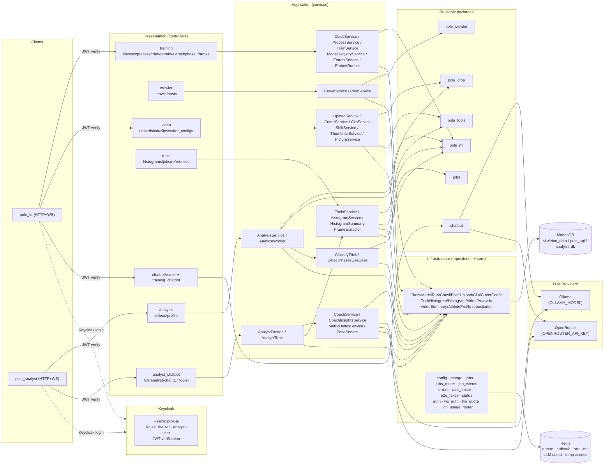

# Flow — `pole_api` (FastAPI Orchestrator)

> Layers and key classes of the central backend, how the slices interact, and the data each
> layer extracts/transforms. Class-level details: [CLASSES.md](./CLASSES.md).

---

## 1. Slice Flow Diagram

### 1.1 Diagram Component Descriptions

| Node | Purpose & Use |
| :--- | :--- |
| **CLIENT — `pole_fe` / `pole_analyst`** | External Angular frontends. They call `pole_api` over HTTP (`/api`) for REST and WebSocket (`/ws`) for chatbot/analyst-chat/job-progress streams. Auth via Keycloak JWT (`Authorization: Bearer`). |
| **KC — Keycloak** | Identity provider. Realm `pole-ai`, roles `fe-user`/`analyst-user`, clients `pole-fe`/`pole-analyst`/`mcp-server`. JWT verification at API layer (`core/auth.py`). |
| **PRES — training controllers** | HTTP layer for the training slice: classes CRUD, process/embed, train/retrain, extract, phase-frames, model registry, jobs. |
| **PRES — crawler controllers** | HTTP layer for the crawler slice: `crawls`, `posts`, `jobs`. |
| **PRES — video controllers** | HTTP layer for the video slice: uploads, cut, videos, cutter-configs, jobs. |
| **PRES — tools controllers** | HTTP layer for the tools slice: `tools.py` (crop/shift/correct/health), `histograms.py`, `references` (POST 202, GET `?trick_label=`), `jobs.py`. |
| **PRES — analysis controllers** | HTTP layer for the `analysis` slice: video CRUD, analyze (202), histogram/summary/pose/coach endpoints, metric-deltas, athlete-profile. |
| **PRES — analyst_chatbot** | WS `/api/analyst-chatbot/ws/analyst-chat` — 17 coach tools (compare_sessions, cohort_percentiles, improvement_plan, metric_deep_dive, frame_pose, progress_trend, focus_recommendation, risk_scan, get_coach_summary/pose, histogram, classify, extract_frames, crop). |
| **PRES — chatbot controllers** | WS routers (`chatbot/router.py`, `training_chatbot/router.py`) for general + training chatbot. |
| **APP — training services** | `ClassService`, `ProcessService`, `TrainService`, `ModelRegistryService`, `ExtractService`, `EmbedRunner`. |
| **APP — crawler services** | `CrawlService`, `PostService`. |
| **APP — video services** | `UploadService`, `CutterService`, `ClipService`, `ShiftService`, `ThumbnailService`, `PictureService`, `VideoDeletionService`. |
| **APP — tools services** | `ToolsService`, `HistogramService`, `HistogramSummary`, `FrameExtractor`. |
| **APP — analysis services** | `AnalysisService` (upload/list/get orchestration), `AnalyzeWorker` (full pipeline: classify-first → phase detection → insights). |
| **APP — classify/detect** | `ClassifyTrick` (LSTM trick classification), `DetectPhasesUseCase`/`PhaseDetector` (ENTRADA/EJECUCIÓN/SALIDA via Bhattacharyya + K=5 consensus). |
| **APP — coach services** | `CoachService` (deterministic data gather + one-shot LLM + cached envelopes), `CoachInsightsService` (rule-based z-score insights), `MetricDeltasService` (session-over-session deltas + peak flags), `PoseService` (single/multi-frame annotated poses). |
| **APP — analyst tools** | `AnalystFacade` (agent loop over 17 tools), `AnalystTools` (tool registry delegating to coach services). |
| **INFRA — repositories** | Mongo repositories for all collections across slices + `analysis-db`. |
| **INFRA — core** | `config`, `mongo`, `jobs`, `jobs_router`, `job_events`, `errors`, `rate_limiter`, `e2e_fakes`, `status`, `auth` (Keycloak JWT), `ws_auth` (WS + `?token=`), `llm_quota`, `llm_usage_router`. |
| **PKG — `pole_ml`** | ML pipeline (extract/process/train/embed). |
| **PKG — `pole_tools`** | Tool wrappers + services facade (crop/shift/histogram/correct). |
| **PKG — `pole_crop`** | FFmpeg service (cut/shift/thumbnail/frame). |
| **PKG — `pole_crawler`** | Instagram crawler. |
| **PKG — `chatbot`** | Conversational agent (ReAct + LangGraph). |
| **PKG — `jobs`** | Thread-based job runner. |
| **LLM — Ollama / OpenRouter** | LLM providers for coach prompts and chatbot. `LLM_PROVIDER` env selects backend. |
| **MONGO / REDIS** | Three Mongo DBs (`pole_api`, `skeleton_data`, `analysis-db`); Redis for queue/pub-sub/rate-limit/LLM-quota/temp-access. |

---

## 2. Layers and Key Classes

### Presentation (controllers)
- **`training/controllers`** — `classes.py` (CRUD + stats/jobs), `process.py`, `train.py`, `retrain.py`,
  `extract.py`, `models.py`, `phase_frames.py`, `jobs.py`.
- **`crawler/controllers`** — `crawls.py`, `posts.py`, `jobs.py`.
- **`video/controllers`** — `uploads.py`, `cut.py`, `videos.py`, `cutter_configs.py`, `jobs.py`.
- **`tools/controllers`** — `tools.py` (crop/shift/correct/health), `histograms.py` (POST `analysis` 202, GET/PATCH per-video, POST `references` 202, GET `references?trick_label=`), `jobs.py`.
- **`analysis/controllers`** — `videos.py` (CRUD, analyze 202, histogram/summary/pose/metric-deltas/coach endpoints), `profile.py` (athlete-profile GET/PUT), `jobs.py`.
- **`analyst_chatbot/router.py`** — WS `/api/analyst-chatbot/ws/analyst-chat` (17 coach tools).
- **`chatbot/router.py`** + **`training_chatbot/router.py`** — WS chatbot endpoints.

### Application (services)
- **Training:** `ClassService`, `ProcessService`, `TrainService`, `ModelRegistryService`,
  `ExtractService`, `EmbedRunner`.
- **Crawler:** `CrawlService`, `PostService`.
- **Video:** `UploadService`, `CutterService`, `ClipService`, `ShiftService`, `ThumbnailService`,
  `PictureService`, `VideoDeletionService`.
- **Tools:** `ToolsService`, `HistogramService`, `HistogramSummary`, `FrameExtractor`.
- **Analysis:** `AnalysisService`, `AnalyzeWorker`, `ClassifyTrick`, `DetectPhasesUseCase`/`PhaseDetector`,
  `BiomechFeatures`, `ThumbnailService`.
- **Coach:** `CoachService`, `CoachInsightsService`, `CoachPrompts`, `MetricDeltasService`, `PoseService`.
- **Analyst Chatbot:** `AnalystFacade`, `AnalystTools`.

### Infrastructure
- **Repositories:** `ClassRepository`, `ModelRunRepository`, `CrawlRepository`, `PostRepository`,
  `UploadRepository`, `ClipRepository`, `CutterConfigRepository`, `TrickHistogramRepository`,
  `HistogramRepository`, `VideoRepository` (core), `VideoSummaryRepository`, `AthleteProfileRepository`,
  `AnalysisRepository`.
- **Core:** `config.py`, `mongo.py` (app DB + `analysis-db`), `jobs.py` (thread job runner), `jobs_router.py`,
  `job_events.py`, `errors.py`, `rate_limiter.py`, `e2e_fakes.py`, `status.py`,
  `auth.py` (Keycloak JWT), `ws_auth.py` (WS + `?token=`), `llm_quota.py`, `llm_usage_router.py`.

### Packages reused
- `pole_ml` (extract/process/train/embed), `pole_tools` (crop/shift/histogram/correct),
  `pole_crop` (ffmpeg), `pole_crawler` (Instagram), `chatbot` (ReAct/LangGraph/WS), `jobs` (thread jobs).

---

## 3. Data Flow (extract → transform → persist)

| Slice | Extract | Transform | Persist |
| :--- | :--- | :--- | :--- |
| **Training** | video file, class id | MediaPipe landmarks → windows → histogram/embedding via `pole_ml` | Mongo `classes`, `skeleton_windows`, `skeleton_video_signals`, Chroma embeddings |
| **Crawler** | Instagram post list | filter/QC via `pole_crawler` | Mongo `videos` (source=crawler), `posts`, `crawls` |
| **Video** | uploaded `.mp4` | crop/shift/thumbnail/frame extraction via `pole_crop` | Mongo `uploads`/`clips`, video files on disk |
| **Tools** | video + request body | histogram metrics, z-scores, scores, detections via `pole_tools` | Mongo `skeleton_video_signals` |
| **Tools (reference)** | trick_label + clip_ids + cohort stats | z-score binning of pooled 100-pt phase curves → 8-bin histograms (5 metrics × 3 phases) | Mongo `skeleton_trick_histograms` |
| **Analysis** | video id | **classify-first** → LSTM picks correct trick → phase detection (Bhattacharyya + K=5) → histogram → z-score → coach insights | `analysis-db` (`videos`, `skeleton-landmarks`, `video_histograms`, `coach_*` envelopes) |
| **Coach (LLM)** | video summary + athlete profile | deterministic data gather → one-shot LLM (Ollama/OpenRouter) → cached envelope | `analysis-db` coach envelopes (summary/plan/pose-analysis) |
| **Coach (rule-based)** | histogram + detections | z-score threshold classification (|z| ≤ 0.5 perfect / ≤ 2 adjustment / > 2 wrong) | `analysis-db` coach_insights |
| **Metric Deltas** | video id + previous session | session-over-session metric comparison + peak flags | response only (no persistence) |
| **Analyst Chatbot** | WS message + 17 tools | tool calls → facade → agent reply | WS frame → client |
| **Chatbot** | WS message | ReAct/LangGraph tool loop via `chatbot` package | Redis session + jobs |
