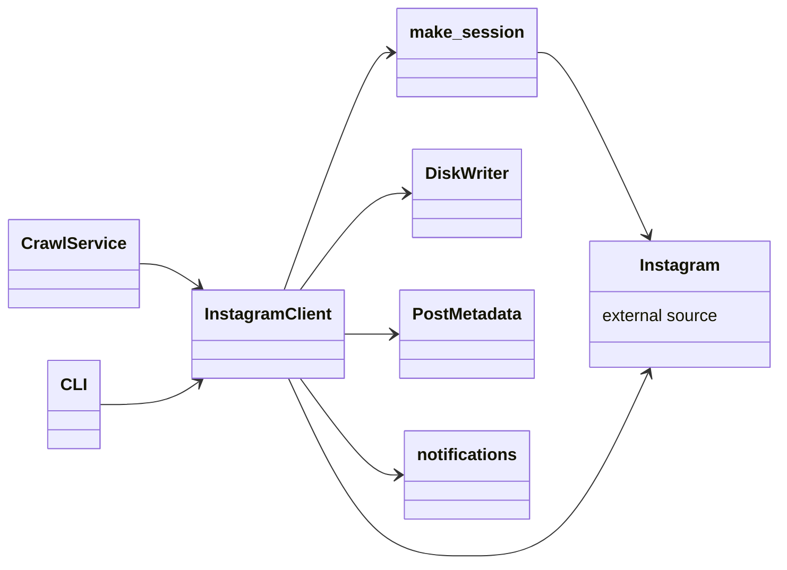

# Classes — `pole_crawler` (Instagram Video Crawler)

> Exhaustive class map for the `pole_crawler` package (`packages/pole-crawler/src/pole_crawler/`).

---

## 0. Interaction Diagram

> **Legend:** `-->` = "depends on / calls". `CrawlService` comes from `pola_api`'s crawler slice;
> `Instagram` is the external source.

---

## 1. Application

| Class | Role | Collaborators | Data |
| :--- | :--- | :--- | :--- |
| `client.py` — `InstagramClient` | Fetch Instagram posts/videos with anti-bot waits; drives the crawl | `make_session`, `storage`, `notifications` | target → post list + media |
| `make_session.py` — `make_session` | Create an authenticated `requests`/session object | credentials | credentials → session |

### Purpose & Use

- **`InstagramClient`** — The main entry point to crawl. Given a target (account/hashtag), it
  authenticates via `make_session`, fetches posts with anti-bot delays, and streams media to
  `DiskWriter`. Used by `CrawlService` (from `pola_api`) or the CLI.
- **`make_session`** — Builds the authenticated HTTP session the client needs. Use it to supply
  credentials and obtain a reusable session for a crawl run.

---

## 2. Infrastructure

| Class | Role | Collaborators | Data |
| :--- | :--- | :--- | :--- |
| `storage.py` — `DiskWriter` | Write downloaded media to disk | — | media → files |
| `storage.py` — `PostMetadata` | Persist metadata for crawled posts | — | post → metadata doc |
| `notifications.py` | Completion / error notifications | `InstagramClient` | result → notification |
| `__init__.py` | Public API exports | — | — |

### Purpose & Use

- **`DiskWriter`** — Saves the downloaded video/media bytes to disk. Used by `InstagramClient`
  during each crawl item so files are available for later processing.
- **`PostMetadata`** — Stores the post's metadata (URL, caption, id, source) so a crawl is
  reproducible and auditable.
- **`notifications`** — Emits completion/error signals after a crawl, so callers (e.g. the
  crawler slice's job) know when processing finished or failed.
- **`__init__.py`** — Re-exports the public surface so consumers import from the package.

---

## 3. Collaborators

| Collaborator | Direction | Purpose |
| :--- | :--- | :--- |
| `pola_api.crawler.CrawlService` | caller | triggers crawls via `InstagramClient` |
| CLI main | caller | standalone crawl run |
| Instagram | external | source of posts/videos |
| Disk | sink | media + metadata persistence |

---

## 4. Data Transformations (summary)

| From | To | Operation |
| :--- | :--- | :--- |
| Credentials | authenticated session | `make_session` |
| Target account/class | post list | `InstagramClient` crawl (anti-bot waits) |
| Post URL | video file + metadata | `DiskWriter` + `PostMetadata` |
| Crawl result | notification | `notifications` |
