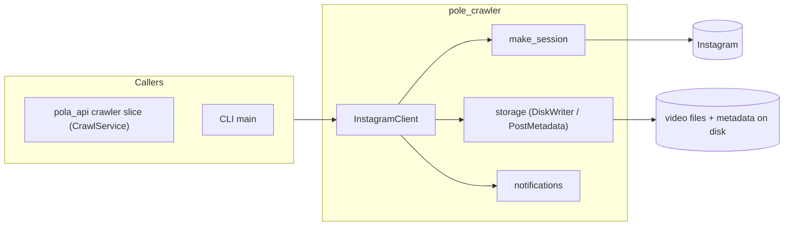

# Flow — `pole_crawler` (Instagram Video Crawler)

> Layers and key classes of the Instagram video crawler. Shipped in `packages/pole-crawler`.
> Class-level details: [CLASSES.md](./CLASSES.md).

---

## 1. Crawl Flow Diagram

### 1.1 Diagram Component Descriptions

| Node | Purpose & Use |
| :--- | :--- |
| **CALL — `pola_api` crawler slice** | `CrawlService` triggers crawls through `InstagramClient`. |
| **CALL — CLI main** | Standalone crawl run from the command line. |
| **make_session** | Creates an authenticated session for Instagram requests. |
| **InstagramClient** | Fetches posts/videos with anti-bot waits; drives the crawl. |
| **storage (DiskWriter / PostMetadata)** | Saves media files and post metadata to disk. |
| **notifications** | Sends completion/error notifications. |
| **Instagram** | External source of posts/videos. |
| **Disk** | Sink for video files + metadata. |

---

## 2. Layers and Key Classes

### Application
- `client.py` — `InstagramClient`: fetch posts/videos with anti-bot waits.
- `make_session.py` — session creation (`make_session`) for authenticated requests.

### Infrastructure
- `storage.py` — `DiskWriter` / `PostMetadata`: save media files + metadata.
- `notifications.py` — completion/error notifications.
- `__init__.py` — public API.

---

## 3. Data Flow (extract → transform → store)

| Step | Extract | Transform | Store |
| :--- | :--- | :--- | :--- |
| Session | credentials | `make_session` | authenticated session |
| Crawl | target account/class | `InstagramClient` fetch with anti-bot waits | post list |
| Download | post URL | `DiskWriter` | video file + `PostMetadata` |
| Notify | result | `notifications` | completion signal |
