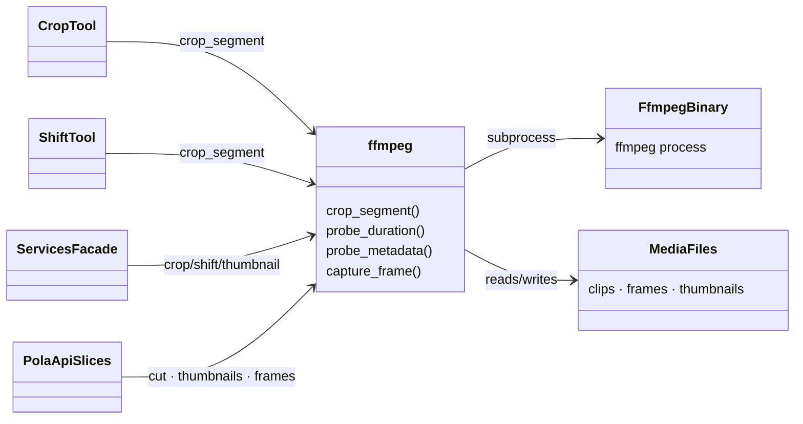

# Classes — `pole_crop` (FFmpeg Video Service)

> Exhaustive class map for the `pole_crop` package (`packages/pole-crop/src/pole_crop/`).

---

## 0. Interaction Diagram

> **Legend:** `-->` = "depends on / calls". `CropTool`/`ShiftTool`/`ServicesFacade` come from
> `pole_tools`; `PolaApiSlices` from the `pola_api` video/tools/analysis slices.

---

## 1. Module Inventory

| Module | Role | Data |
| :--- | :--- | :--- |
| `ffmpeg.py` | All FFmpeg operations (subprocess wrapper) | video/media ↔ clips/frames |
| `__init__.py` | Public API exports | — |

### Purpose & Use

- **`ffmpeg.py`** — The single module that talks to the FFmpeg binary. Every video operation in the
  system (crop, shift, thumbnail, frame capture, probe) funnels through here. Use it by importing the
  functions directly; `pole_tools` wrappers and `pola_api` slices are the main callers.
- **`__init__.py`** — Re-exports the public functions so callers use the package as the public API.

---

## 2. `ffmpeg.py` Functions

| Function | Role | Data in / out |
| :--- | :--- | :--- |
| `crop_segment` | Extract a time segment of a video (frame-accurate re-encode or stream-copy mode) | `(source, start, end, out_path)` → cropped file |
| `probe_duration` | Return media duration | `path` → seconds |
| `probe_metadata` | Return container metadata | `path` → dict |
| `capture_frame` | Extract a still frame (JPEG) at a timestamp | `(video, time, out_path)` → image file |

### Purpose & Use

- **`crop_segment(source, start, end, out_path)`** — Cuts a video to a given time window. Choose
  re-encode mode for frame accuracy or stream-copy for speed. Used by `CropTool`/`ShiftTool` for
  crop and shift operations.
- **`probe_duration(path)`** — Reads how long a media file is. Used to validate inputs and compute
  timestamps before cutting.
- **`probe_metadata(path)`** — Reads container info (codec, resolution, etc.). Used for validation
  and quality checks.
- **`capture_frame(video, time, out_path)`** — Extracts a single JPEG at a timestamp. Used for
  thumbnails and detected-point frame extraction.

---

## 3. Collaborators

| Collaborator | Direction | Purpose |
| :--- | :--- | :--- |
| `pole_tools.CropTool` / `ShiftTool` | caller | crop/shift via `crop_segment` |
| `pole_tools.services` facade | caller | video operations behind the facade |
| `pola_api` video / tools / analysis slices | caller | thumbnail, cut, frame extraction |
| `ffmpeg` binary (subprocess) | dependency | underlying codec work |

---

## 4. Data Transformations (summary)

| From | To | Operation |
| :--- | :--- | :--- |
| Video + bounds | cropped clip | `crop_segment` (re-encode / stream-copy) |
| Clip + delta | shifted clip | `crop_segment` re-crop |
| Video + timestamp | JPEG frame | `capture_frame` |
| Media | duration / metadata | `probe_duration` / `probe_metadata` |
