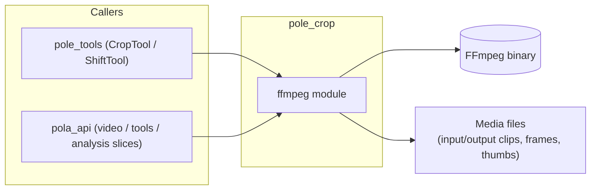

# Flow — `pole_crop` (FFmpeg Video Service)

> Layers and key classes of the FFmpeg video service. Shipped in `packages/pole-crop`.
> Class-level details: [CLASSES.md](./CLASSES.md).

---

## 1. Service Flow Diagram

### 1.1 Diagram Component Descriptions

| Node | Purpose & Use |
| :--- | :--- |
| **CALL — `pole_tools` (CropTool / ShiftTool)** | Tool wrappers that call `crop_segment` for crop/shift operations. |
| **CALL — `pola_api` slices** | Video/tools/analysis slices that use crop, thumbnails, and frame capture. |
| **ffmpeg module** | The single module exposing all FFmpeg operations (subprocess wrapper). |
| **FFmpeg binary** | The underlying codec/processing process. |
| **Media files** | Input/output clips, frames, and thumbnails on disk. |

---

## 2. Operations

| Function | Description | Data |
| :--- | :--- | :--- |
| `crop_segment` | Extract a time segment; frame-accurate re-encode or stream-copy | video + bounds → cropped clip |
| `probe_duration` | Read media duration | media → duration |
| `probe_metadata` | Read container metadata | media → metadata |
| `capture_frame` | Extract a still frame (JPEG) at a time offset | video + time → frame image |

---

## 3. Layers and Key Classes

### Infrastructure
- `ffmpeg.py` — the single module exposing all FFmpeg operations (subprocess wrapper around the
  `ffmpeg` binary).

---

## 4. Data Flow (extract → transform → produce)

| Step | Extract | Transform | Produce |
| :--- | :--- | :--- | :--- |
| Crop | video + bounds | ffmpeg re-encode / stream-copy | cropped segment |
| Shift | clip + delta | ffmpeg re-crop | shifted clip |
| Frame | video + timestamp | ffmpeg `-ss` capture | JPEG frame |
| Probe | media | ffmpeg `-i` parse | duration / metadata |
