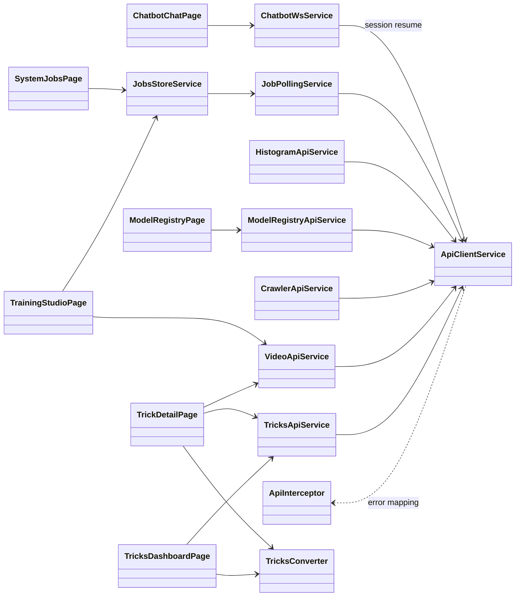

# Classes — `pole_fe` (Angular Training Workflow Manager)

> Exhaustive class map for `pole_fe`. For each class: role, collaborators, and the data it
> extracts/transforms. Source: `app/pole_fe/src/app/`.

---

## 0. Class Interaction Diagram

> **Legend:** `-->` = "depends on / calls"; `..>` = non-essential / auxiliary. Components
> (not shown as nodes) call the feature services; services depend on `ApiClientService`.

---

## 1. Core Infrastructure (`core/`)

| Class | Role | Collaborators | Data |
| :--- | :--- | :--- | :--- |
| `ApiClientService` | Wraps Angular `HttpClient`; normalizes requests/responses, upload progress | feature API services | HTTP call ↔ typed response |
| `ApiInterceptor` | HTTP interceptor mapping backend `{detail}` error envelope into typed errors; auth header | `ApiClientService` | HTTP error → typed error |
| `TricksApiService` | `GET/POST/PATCH/DELETE /api/training/classes`, `/stats`, videos | `ApiClientService` | DTO in ↔ DTO out |
| `VideoApiService` | `/api/video/*` (upload, cut, clips, thumbnails, shift) | `ApiClientService` | DTO/file ↔ DTO |
| `CrawlerApiService` | `/api/crawler/*` (crawl, posts, QC) | `ApiClientService` | DTO in ↔ DTO out |
| `ModelRegistryApiService` | `/api/models*` (list, activate, approve, reject) | `ApiClientService` | model id ↔ DTO |
| `JobPollingService` | Polls a job until terminal state | `ApiClientService` | job_id → status stream |
| `JobsStoreService` | Central job state store shared by dashboards | `JobPollingService` | job events → store |
| `HistogramApiService` | `/api/tools/histograms/*` (analysis, summary, references, classes) | `ApiClientService` | histogram/ref DTO ↔ server |

### Purpose & Use

- **`ApiClientService`** — Central `HttpClient` wrapper; every feature API service goes through it,
  giving a single place for base URL, headers, and upload progress.
- **`ApiInterceptor`** — Applies the auth header and translates the backend `{detail}` envelope into
  typed FE errors for consistent handling.
- **`TricksApiService`** — Talks to `/api/training/classes` for trick CRUD + stats; used by dashboard
  and detail pages.
- **`VideoApiService`** — Talks to `/api/video/*` for upload, cut, clips, thumbnails, and shift.
- **`CrawlerApiService`** — Talks to `/api/crawler/*` for crawl, posts, and QC.
- **`ModelRegistryApiService`** — Talks to `/api/models*` for list/activate/approve/reject.
- **`JobPollingService`** — Polls a single job until it reaches a terminal state, emitting status.
- **`JobsStoreService`** — Central store aggregating job status so multiple dashboards share one
  source of truth.
- **`HistogramApiService`** — Talks to `/api/tools/histograms/*` for analysis triggers, summaries,
  reference generation, and class-level histogram stats.

---

## 2. Feature: Tricks (`features/tricks/`)

| Class | Role | Collaborators | Data |
| :--- | :--- | :--- | :--- |
| `TricksDashboardPage` | Lists tricks as cards; navigate to detail | `TricksApiService`, `TrickCardComponent` | `Class[]` → cards |
| `TrickDetailPage` | Detail view: videos, process, cut | `TricksApiService`, `VideoApiService`, `CropReviewModalComponent` | class_id → detail state |
| `TrickCardComponent` | Renders a single trick card | models | `Class` → card |
| `CropReviewModalComponent` | Modal to review/accept/discard cut | `VideoApiService` | clip + decision → result |
| `ClassHistogramStatsComponent` | Per-class cohort histogram stats panel (mean curves + 8-bin charts) | `HistogramApiService` | class_id → metric stats |
| `TricksConverter` | Maps API DTO ↔ domain model | models | DTO → domain / domain → DTO |
| `tricks.routes` | Lazy route config | pages | URL → component |

### Purpose & Use

- **`TricksDashboardPage`** — The landing list of tricks; navigates into a trick's detail.
- **`TrickDetailPage`** — The main per-trick workspace: manage videos, run processing, and cut.
- **`TrickCardComponent`** — Renders a single trick summary in the grid.
- **`CropReviewModalComponent`** — Modal where a user reviews a crop and accepts/discards it.
- **`ClassHistogramStatsComponent`** — Renders per-class cohort histogram stats: mean curves and
  8-bin metric charts; includes "Generate Reference Histograms" action with job progress.
- **`TricksConverter`** — Keeps the API wire shape separate from the domain model used by components.
- **`tricks.routes`** — Declares the lazy-loaded routes for the tricks feature.

---

## 3. Feature: Training (`features/training/`)

| Class | Role | Collaborators | Data |
| :--- | :--- | :--- | :--- |
| `TrainingStudioPage` | Orchestrates process/embed/train/retrain workflow | `VideoApiService`, `JobsStoreService` | class_id + action → job |

### Purpose & Use

- **`TrainingStudioPage`** — The training UI: lets a user kick off process/embed/train/retrain for a
  class and watch job progress via the shared jobs store.

---

## 4. Feature: Model Registry (`features/model-registry/`)

| Class | Role | Collaborators | Data |
| :--- | :--- | :--- | :--- |
| `ModelRegistryPage` | Lists models; activate/approve/reject actions | `ModelRegistryApiService` | model list → registry UI |

### Purpose & Use

- **`ModelRegistryPage`** — Lists trained models and provides activate/approve/reject actions,
  driving the registry workflow.

---

## 5. Feature: System Jobs (`features/system-jobs/`)

| Class | Role | Collaborators | Data |
| :--- | :--- | :--- | :--- |
| `SystemJobsPage` | Jobs dashboard: poll/cancel jobs | `JobsStoreService`, `JobPollingService` | job list → dashboard |

### Purpose & Use

- **`SystemJobsPage`** — A global jobs dashboard showing all jobs with polling and cancel controls,
  powered by the shared jobs store.

---

## 6. Feature: Chatbot (`features/chatbot/`)

| Class | Role | Collaborators | Data |
| :--- | :--- | :--- | :--- |
| `ChatbotWsService` | WebSocket client to `/api/chatbot/ws/chat`; send/recv frames, reconnect, `session_id` resume | `chatbot.models` | WS frame ↔ `ChatWsFrame` |
| `ChatbotChatPage` | Chat UI: bubbles, status chip, composer, artifact rendering | `ChatbotWsService` | `ChatWsFrame` → view state |
| `chatbot.models` | `ChatWsFrame` / `ChatState` types | page/service | wire ↔ domain |
| `fake-websocket` (testing) | Test double for the WS client | `ChatbotWsService` | scripted frames |

### Purpose & Use

- **`ChatbotWsService`** — Manages the chat WebSocket: connect, send, receive, reconnect, and resume
  via `session_id`. Used by the chat page.
- **`ChatbotChatPage`** — The chat screen: renders message bubbles, a status chip, the composer, and
  analysis artifacts.
- **`chatbot.models`** — Typed models for WS frames and chat state.
- **`fake-websocket`** — A test double so the chat page/service can be unit-tested without a real
  socket.

---

## 7. Data Transformations (summary)

| From | To | Operation |
| :--- | :--- | :--- |
| `Class` API DTO | `Trick` domain | `TricksConverter` |
| HTTP `{detail}` envelope | typed FE error | `ApiInterceptor` |
| WS frame (`connected`/`agent_reply`/`job_*`/`error`) | `ChatState` + bubbles | `ChatbotWsService` + page |
| Job poll responses | shared job store | `JobPollingService` / `JobsStoreService` |
| Model run DTO | registry row/actions | feature services + converters |
| Trick label + clip_ids | `reference_generation` job | `HistogramApiService.generateReferences` → job poll |
| Class cohort signals | 8-bin histogram cards (mean curves) | `ClassHistogramStatsComponent` via `HistogramApiService` |
