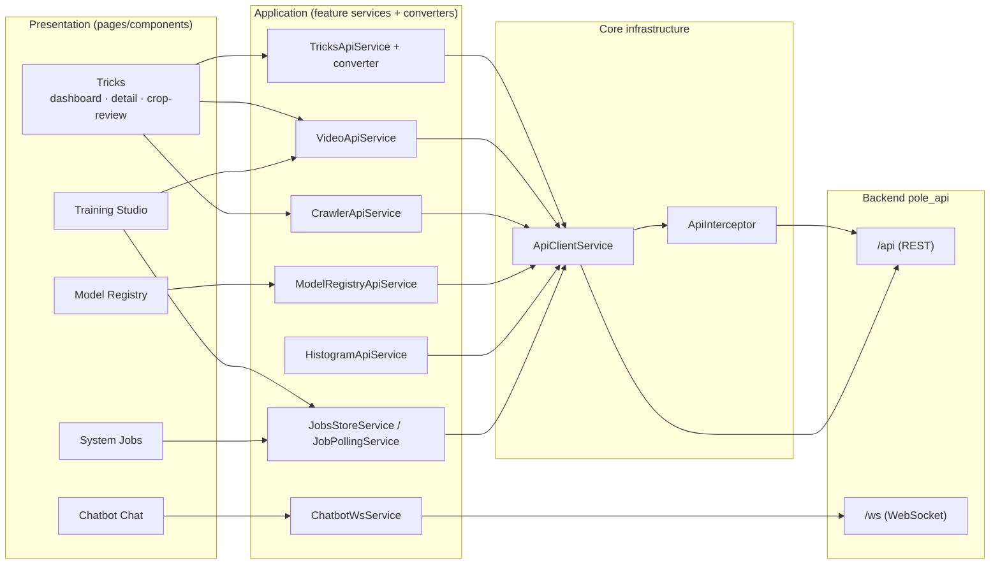

# Flow — `pole_fe` (Angular Training Workflow Manager)

> Layers and key classes of the Angular frontend, how features interact, and the data each layer
> extracts/transforms. Class-level details: [CLASSES.md](./CLASSES.md).

---

## 1. Feature Flow Diagram

### 1.1 Diagram Component Descriptions

| Node | Purpose & Use |
| :--- | :--- |
| **PRES — Tricks** | `TricksDashboardPage`, `TrickDetailPage`, `CropReviewModalComponent`, `TrickCardComponent`. Renders trick list/detail and the crop-review flow. |
| **PRES — Training Studio** | `TrainingStudioPage`. UI to run process/embed/train/retrain actions. |
| **PRES — Model Registry** | `ModelRegistryPage`. Lists models and triggers activate/approve/reject. |
| **PRES — System Jobs** | `SystemJobsPage`. Jobs dashboard with poll/cancel. |
| **PRES — Chatbot** | `ChatbotChatPage`. Chat UI with bubbles + status chip. |
| **APP — TricksApiService** | Calls `/api/training/classes`; used by the tricks pages. |
| **APP — VideoApiService** | Calls `/api/video/*`; used by tricks detail, studio, crop-review. |
| **APP — CrawlerApiService** | Calls `/api/crawler/*`; crawl + QC operations. |
| **APP — ModelRegistryApiService** | Calls `/api/models*`; registry operations. |
| **APP — HistogramApiService** | Calls `/api/tools/histograms/*`; analysis triggers, summaries, reference generation, class-level histogram stats. |
| **APP — ChatbotWsService** | WebSocket client to the chatbot endpoint. |
| **APP — JobsStoreService / JobPollingService** | Shared job state + polling used by dashboards and studio. |
| **INFRA — ApiClientService** | Central `HttpClient` wrapper; single outbound HTTP path. |
| **INFRA — ApiInterceptor** | Maps backend `{detail}` errors to typed FE errors; auth header. |
| **BE — pole_api REST** | Backend HTTP surface consumed by all API services. |
| **BE — pole_api WS** | Backend WebSocket endpoint consumed by the chatbot. |

---

## 2. Layers and Key Classes

### Presentation
- **`features/tricks`** — `tricks-dashboard.page`, `trick-detail.page`, `crop-review-modal.component`,
  `trick-card.component`.
- **`features/training`** — `training-studio.page`.
- **`features/model-registry`** — `model-registry.page`.
- **`features/system-jobs`** — `system-jobs.page` (jobs dashboard).
- **`features/chatbot`** — `chatbot-chat.page`.

### Application (feature services + converters)
- **`core/services`** — `TricksApiService`, `VideoApiService`, `CrawlerApiService`,
  `ModelRegistryApiService`, `HistogramApiService`, `JobPollingService`, `JobsStoreService`.
- **`features/chatbot/services`** — `ChatbotWsService` (WS client).
- **`features/tricks/converters`** — `TricksConverter` (DTO ↔ domain).

### Infrastructure
- **`core/services`** — `ApiClientService` (HttpClient wrapper), `ApiInterceptor` (error envelope mapping).

### Models
- **`core/models`, `core/converters`, `shared/models`** — typed DTOs/domain models.
- **`features/chatbot/models`** — `ChatWsFrame`/`ChatState` types.

---

## 3. Data Flow (extract → transform → render)

| Feature | Extract | Transform | Render / Persist |
| :--- | :--- | :--- | :--- |
| **Tricks** | `GET /api/training/classes` | `TricksConverter` DTO→domain | dashboard cards, detail page |
| **Class histogram stats** | `GET /api/tools/histograms/classes/{id}` | `HistogramApiService` → mean curves + 8-bin charts | `ClassHistogramStatsComponent` |
| **Reference generation** | `POST /api/tools/references` (trick_label + video_ids) | `HistogramApiService.generateReferences` → job poll | job progress |
| **Video mgmt** | `GET/POST /api/video/*` | api service mapping | upload UI, crop-review modal |
| **Training** | `POST /api/training/*` jobs | job status mapping | studio progress |
| **Model registry** | `GET /api/models*` | api service mapping | registry list/activate/reject |
| **System jobs** | `GET /api/jobs` + polling | `JobsStoreService` | jobs dashboard |
| **Chatbot** | WS frames `/api/chatbot/ws/chat` | frame → `ChatState` | chat bubbles + status chip |
