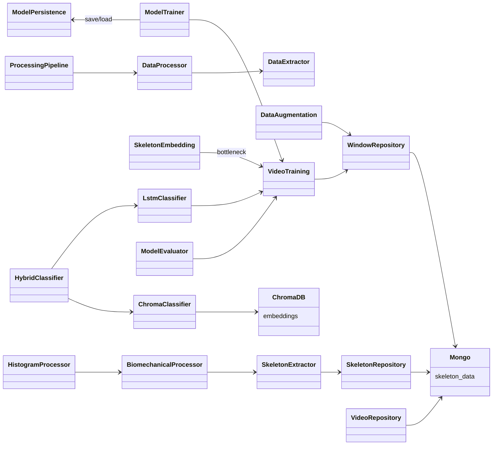

# Classes — `pole_ml` (ML Training & Inference Pipeline)

> Exhaustive class map for the `pole_ml` package (`packages/pole-train-model/src/pole_ml/`).
> For each class: role, collaborators, and the data it extracts/transforms. The CLI tools
> (`pole_tools`) live in the same package and are documented under `docs/diagrams/pole_tools/`.

---

## 0. Class Interaction Diagram

> **Legend:** `-->` = "depends on / calls". `Mongo` and `ChromaDB` are external stores.

---

## 1. Processors (`processors/`)

| Class | Role | Collaborators | Data in / out |
| :--- | :--- | :--- | :--- |
| `SkeletonExtractor` | MediaPipe landmark extraction + normalization (hip-center translation, shoulder-width scale) | MediaPipe, `SkeletonRepository` | video → normalized landmarks |
| `BiomechanicalProcessor` | Compute biomechanical feature time-series | `SkeletonExtractor`, `WindowRepository` | landmarks → biomechanical features |
| `HistogramProcessor` | 8-signal histogram metrics per phase, resampled (100 pts/phase) | `BiomechanicalProcessor` | features + phase_frames → histogram signals |
| `DataAugmentation` | Augment windows (mirror/timing/perturbation) | windows | window → augmented windows |
| `DataExtractor` | Extract raw data from storage for processing | repositories | source → raw samples |
| `DataProcessor` | Coordinate extract→process pipeline | `DataExtractor`, processors | raw → processed docs |
| `ProcessingPipeline` | End-to-end processing orchestration | processors, repositories | input → windows/histograms |
| `SkeletonEmbedding` | Generate embeddings from LSTM bottleneck layer | `VideoTraining`, `ChromaClassifier` | window → embedding vector |
| `BlipCaption` | (optional) image captioning helper | models | frame → caption |

### Purpose & Use

- **`SkeletonExtractor`** — Runs MediaPipe on each video and normalizes the landmarks (hip-centered,
  shoulder-width scaled) so results are position/size-invariant. Use it as the first stage of any
  extraction pipeline.
- **`BiomechanicalProcessor`** — Converts the normalized landmark time-series into per-frame
  biomechanical features (angles/speeds). Feeds both window generation and histogram metrics.
- **`HistogramProcessor`** — Aggregates the biomechanical series into the 8-signal histogram metrics
  per phase, resampled to 100 points/phase for consistent comparison across videos.
- **`DataAugmentation`** — Expands the training set by producing transformed window variants
  (mirror, timing, perturbation) to improve generalization.
- **`DataExtractor`** — Pulls raw source data from storage so downstream processing has a clean,
  typed input.
- **`DataProcessor`** — Coordinates the extract→process sequence for a batch of samples.
- **`ProcessingPipeline`** — End-to-end orchestration: from input video to windows + histograms.
- **`SkeletonEmbedding`** — Produces a fixed-length embedding from the LSTM bottleneck for a window;
  used to populate and query the vector store.
- **`BlipCaption`** — Optional helper that captions a frame image (used for auxiliary ML tasks).

---

## 2. Models (`models/`)

| Class | Role | Collaborators | Data |
| :--- | :--- | :--- | :--- |
| `VideoTraining` | LSTM Sequence-to-Vector architecture | `ModelTrainer` | window → logits + embedding |
| `ModelTrainer` | Training loop (Categorical Crossentropy, Leave-One-Out, callbacks) | `VideoTraining`, `ModelData` | windows/labels → trained weights |
| `ModelEvaluator` | Evaluate on held-out set (accuracy, per-class metrics) | `VideoTraining`, `ModelData` | model → metrics |
| `ModelPersistence` | Save/load `.keras` / SavedModel + metadata | model files | weights ↔ disk |
| `ModelData` | Load/split window dataset | `WindowRepository` | store → (X, y) |

### Purpose & Use

- **`VideoTraining`** — Defines the LSTM sequence-to-vector architecture. Its forward pass yields
  both classification logits and a bottleneck embedding; the model of record for training/inference.
- **`ModelTrainer`** — Runs the training loop (Categorical Crossentropy) with Leave-One-Out splits
  and callbacks, producing trained weights.
- **`ModelEvaluator`** — Measures the trained model on a held-out set (accuracy, per-class metrics)
  to gate release.
- **`ModelPersistence`** — Saves/loads the trained artifact (`.keras`/SavedModel) plus metadata so a
  trained model can be versioned and reused.
- **`ModelData`** — Loads and splits the window dataset into `(X, y)` tensors for training/eval.

---

## 3. Classifiers (`classifiers/`)

| Class | Role | Collaborators | Data |
| :--- | :--- | :--- | :--- |
| `BaseClassifier` | Common classifier interface | — | window/embedding → prediction |
| `LstmClassifier` | Predict from LSTM logits | `VideoTraining`, `ModelPersistence` | window → label + confidence |
| `ChromaClassifier` | Nearest-neighbor retrieval over embeddings | ChromaDB | embedding → similar tricks + distances |
| `HybridClassifier` | Combine LSTM + Chroma; similarity fallback on low confidence | `LstmClassifier`, `ChromaClassifier` | window → final label |

### Purpose & Use

- **`BaseClassifier`** — The common interface all classifiers implement, so callers are agnostic to
  the underlying strategy.
- **`LstmClassifier`** — Produces a label + confidence from LSTM logits for a given window.
- **`ChromaClassifier`** — Retrieves nearest-neighbor tricks from Chroma for an embedding, giving a
  similarity-based label and distances.
- **`HybridClassifier`** — Combines LSTM and Chroma; when LSTM confidence is low it falls back to the
  similarity result — the recommended classifier for inference.

---

## 4. Filters (`filters/`)

| Class | Role | Data |
| :--- | :--- | :--- |
| `TransitionFilter` | Filter/flag transition windows | windows → filtered subset |
| `ClipUtils` | Clip/segment helper utilities | video/segments → clips |

### Purpose & Use

- **`TransitionFilter`** — Removes or flags transition windows (where a trick isn't clearly executed)
  so they don't pollute training/QC.
- **`ClipUtils`** — Helpers for clipping/segmenting videos into usable units for processing.

---

## 5. Repositories (`repositories/`)

| Class | Role | Data |
| :--- | :--- | :--- |
| `SkeletonRepository` | Persist/load skeleton landmarks | landmarks ↔ `skeleton_data` |
| `VideoRepository` | Video doc access | video_id ↔ video doc |
| `WindowRepository` | Persist/load sliding windows | windows ↔ `skeleton_windows` |
| `Storage` | File/storage abstraction | blobs ↔ disk |

### Purpose & Use

- **`SkeletonRepository`** — Stores and loads skeleton landmark docs; the persistence point for
  extraction output.
- **`VideoRepository`** — Reads/writes video metadata docs by `video_id`.
- **`WindowRepository`** — Persists and loads sliding-window samples used by training.
- **`Storage`** — Abstracts file/blob persistence so callers don't touch the disk directly.

---

## 6. Data Transformations (summary)

| From | To | Operation |
| :--- | :--- | :--- |
| Video frames | normalized landmarks | MediaPipe + normalization (`SkeletonExtractor`) |
| Landmarks | biomechanical features | joint angles/speeds (`BiomechanicalProcessor`) |
| Biomechanical series | histogram signals (8 metrics) | phase resample + aggregation (`HistogramProcessor`) |
| Windows | augmented windows | `DataAugmentation` |
| Windows | LSTM logits + embeddings | `VideoTraining` forward pass |
| Embeddings | nearest neighbors | `ChromaClassifier` |
| LSTM logits + neighbors | trick label | `HybridClassifier` |
