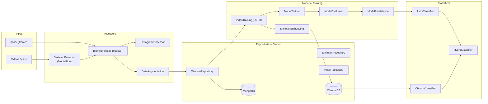

# Flow — `pole_ml` (ML Training & Inference Pipeline)

> Layers and key classes of the ML pipeline: skeleton extraction, feature processors, windows,
> LSTM training, embeddings, and classification. Shipped in the `pole-train-model` package
> alongside `pole_tools` (see `docs/diagrams/pole_tools/FLOW.md`). Class-level details:
> [CLASSES.md](./CLASSES.md).

---

## 1. Pipeline Flow Diagram

### 1.1 Diagram Component Descriptions

| Node | Purpose & Use |
| :--- | :--- |
| **VID — Videos / clips** | Raw input media fed into skeleton extraction. |
| **PH — `phase_frames`** | Manual phase boundaries used by the biomechanical processor. |
| **SkeletonExtractor** | MediaPipe extraction + normalization (hip-center + shoulder-width scale) of landmarks. |
| **BiomechanicalProcessor** | Turns landmark series into biomechanical feature time-series. |
| **HistogramProcessor** | Produces the 8-signal histogram metrics per phase (resampled 100 pts/phase). |
| **DataAugmentation** | Expands the window dataset via transformations (mirror/timing). |
| **SkeletonRepository / VideoRepository / WindowRepository** | Persist/load landmarks, videos, and sliding windows to/from Mongo. |
| **MongoDB** | Store for `skeleton_data` (landmarks, windows, histograms). |
| **ChromaDB** | Vector store for trick embeddings. |
| **ModelTrainer / ModelEvaluator / ModelPersistence** | Train (Leave-One-Out), evaluate, and save/load the LSTM. |
| **VideoTraining (LSTM)** | Sequence-to-Vector architecture producing logits + bottleneck embeddings. |
| **SkeletonEmbedding** | Generates embeddings from the LSTM bottleneck for Chroma. |
| **LstmClassifier / ChromaClassifier / HybridClassifier** | Predict from logits, retrieve nearest neighbors, and combine both for low-confidence fallback. |

---

## 2. Layers and Key Classes

### Processors (`processors/`)
- `SkeletonExtractor` — MediaPipe landmarks extraction + normalization (hip-center + shoulder-width scale).
- `BiomechanicalProcessor` — biomechanical feature time-series.
- `HistogramProcessor` — 8-signal histogram metrics per phase (resampled 100 pts/phase).
- `DataAugmentation` — window augmentation.
- `SkeletonEmbedding` — embedding generation from LSTM bottleneck.
- `DataExtractor`, `DataProcessor`, `ProcessingPipeline` — orchestration helpers.

### Models (`models/`)
- `VideoTraining` — LSTM architecture (Sequence-to-Vector).
- `ModelTrainer` — training loop (Categorical Crossentropy, Leave-One-Out).
- `ModelEvaluator` — accuracy metrics on held-out data.
- `ModelPersistence` — save/load `.keras` / SavedModel.
- `ModelData` — data loading utilities.

### Classifiers (`classifiers/`)
- `LstmClassifier` — classifier from LSTM logits.
- `ChromaClassifier` — nearest-neighbor via Chroma embeddings.
- `HybridClassifier` — combines LSTM + similarity (low-confidence fallback).
- `BaseClassifier` — common interface.

### Filters (`filters/`)
- `TransitionFilter` — filters transition windows.
- `ClipUtils` — clip/segment helpers.

### Repositories (`repositories/`)
- `SkeletonRepository`, `VideoRepository`, `WindowRepository`, `Storage` — data access to Mongo/files.

---

## 3. Data Flow (extract → transform → persist)

| Step | Extract | Transform | Persist |
| :--- | :--- | :--- | :--- |
| Skeleton | video frames | MediaPipe → normalized landmarks (31+ keypoints) | `skeleton_data` landmarks |
| Biomechanical | landmarks + `phase_frames` | per-frame joint/angle/speed features | `skeleton_windows` |
| Histogram | biomechanical series | 8 metrics, resample 100/phase, cohort mean/std | `skeleton_histograms` |
| Augment | windows | transforms (mirror/timing) | `skeleton_windows` |
| Train | windows | LSTM → logits/embeddings (Leave-One-Out) | model files + `model_runs` |
| Embed | windows | LSTM bottleneck → embedding | ChromaDB |
| Classify | window/embedding | LSTM + Chroma hybrid | trick label + confidence |
