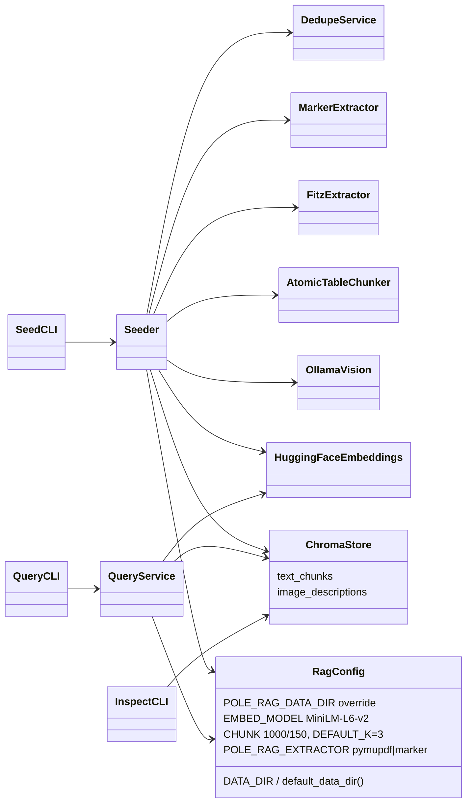

# Classes — `pole_rag` (Multimodal RAG Seeder + Query)

> Exhaustive class map for the `pole_rag` package (`packages/pole_rag/src/pole_rag/`).
> Flow overview: [FLOW.md](./FLOW.md). Plan: `packages/pole_rag/PLAN.md`.

---

## 0. Class Interaction Diagram

> **Legend:** `-->` = "depends on / calls". `RagConfig` is `config.py` (028 override, 033 extractor
> switch); `ChromaStore` holds the two collections per DB under `<data>/<name>/`.

---

## 1. Extraction

| Class | Role | Collaborators | Data |
| :--- | :--- | :--- | :--- |
| `extractor.py` — `MarkerExtractor` | Legacy PDF → Markdown + images (`convert_single_pdf` + `save_output`) | `Seeder`, `DedupeService` | PDF → (md, images_dir) |
| `fitz_extractor.py` — `FitzExtractor` | Default PyMuPDF backend (`page_chunks` + `write_images`) | `Seeder`, `RagConfig.normalize_extractor` | PDF → (md, images_dir) |

### Purpose & Use

- **`MarkerExtractor`** — Kept as fallback (`POLE_RAG_EXTRACTOR=marker`); dropped as default in 032/033 (Surya multi-GB CPU hang, `llava` per-image cost over ~560 MB / 16 PDFs).
- **`FitzExtractor`** — Deterministic default; same `convert` contract; `--skip-images` supported on the seed CLI.

---

## 2. Application

| Class | Role | Collaborators | Data |
| :--- | :--- | :--- | :--- |
| `dedupe.py` — `DedupeService` | sha256 duplicate detection; warns per file | `Seeder` | PDFs → unique set |
| `chunker.py` — `AtomicTableChunker` | Atomic `|...|` tables + 3-line context + `RecursiveCharacterTextSplitter` | `Seeder` | md → `list[str]` |
| `seeder.py` — `Seeder` | `seed_resource` orchestration (full rebuild, deterministic ids) | extractor, chunker, vision, embeddings, `ChromaStore` | sources → DBs |
| `query.py` — `QueryService` | Similarity over both collections, merged top-k | `ChromaStore`, `HuggingFaceEmbeddings` | query → k hits |
| `config.py` — `RagConfig` | Constants + `default_data_dir()` + `normalize_extractor()` | all modules, `rag_tools.py` | env → paths/settings |

### Purpose & Use

- **`DedupeService`** — Removes byte-identical PDFs (e.g. `... (1).pdf`) before extraction.
- **`AtomicTableChunker`** — Tables never split; plain text chunked 1000/150.
- **`Seeder`** — Per-PDF error isolation; ids `{source_stem}_text_{i}` / `_img_{i}`; metadata `{source_document, file_name, type, image_path, image_title}`.
- **`QueryService`** — Merges `text_chunks` + `image_descriptions` by distance ascending; raises `FileNotFoundError` for missing DBs (surfaced as `ToolError` by `rag_tools.py`).
- **`RagConfig`** — `POLE_RAG_DATA_DIR` wins when set/non-empty (staging `/data/rag`); otherwise package `data/`; `EXTRACTOR` snapshot (`pymupdf` default).

---

## 3. Infrastructure

| Class | Role | Collaborators | Data |
| :--- | :--- | :--- | :--- |
| `embeddings.py` — `HuggingFaceEmbeddings` | Shared MiniLM instance (384-dim) | `Seeder`, `QueryService` | text/caption → vector |
| `vision.py` — `OllamaVision` | `describe` / `describe_many` via `ChatOllama(llama3.2-vision)`; tqdm bar (034) | `Seeder` | image → caption |
| `chroma_store.py` — `ChromaStore` | `PersistentClient(path=<output>/<name>)`, two collections; drop + recreate on reseed | `Seeder`, `QueryService` | chunks ↔ Chroma |

### Purpose & Use

- **`HuggingFaceEmbeddings`** — Baked into the base image with pre-downloaded weights (035) via CPU-only torch (037); offline query (`HF_HUB_OFFLINE=1`).
- **`OllamaVision`** — Per-image failure isolation (fallback caption, never abort).
- **`ChromaStore`** — Staging path `/data/rag/<name>/chroma.sqlite3`; `/data/chroma` (`movement_embeddings`) never touched.

---

## 4. Presentation

| Class | Role | Collaborators | Data |
| :--- | :--- | :--- | :--- |
| `cli/seed.py` — `SeedCLI` | `rag-seed -i <folder> -o <dir> --name <db>` (full rebuild) | `Seeder` | args → DBs |
| `cli/reseed.py` | `rag-reseed` alias (same full-rebuild semantics) | `Seeder` | args → DBs |
| `cli/query.py` — `QueryCLI` | `rag-query -o <dir> --name <db> --query "…" [-k 3]` | `QueryService` | query → hits |
| `cli/inspect.py` — `InspectCLI` | `rag-inspect -o <dir> [--name <db>]` (DBs/collections/counts/sources) | `ChromaStore` | DBs → report |

---

## 5. Data Transformations (summary)

| From | To | Operation |
| :--- | :--- | :--- |
| PDFs | unique PDFs | `DedupeService` (sha256) |
| PDF | md + images | `MarkerExtractor` / `FitzExtractor` |
| md | chunks | `AtomicTableChunker` (atomic tables + 1000/150) |
| images | captions | `OllamaVision` (`llama3.2-vision`) |
| chunks/captions | vectors | `HuggingFaceEmbeddings` (MiniLM-L6-v2) |
| vectors + metadata | Chroma | `ChromaStore` (two collections) |
| query | k hits | `QueryService` (merge by distance) |
