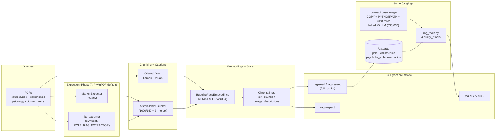
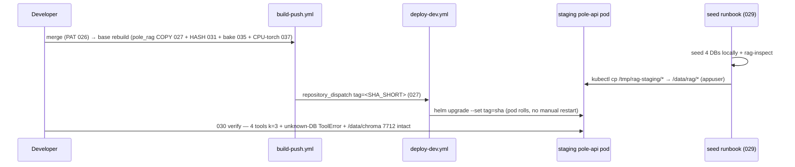

# Flow — `pole_rag` (Multimodal RAG Seeder + Query)

> Layers and key classes of the local CLI RAG seeder and its query path. Shipped in
> `packages/pole_rag` (no pyproject — root `pixi.toml`, `PYTHONPATH=src`). Chatbot tools:
> [`chatbot/FLOW.md`](../chatbot/FLOW.md). Class-level details: [CLASSES.md](./CLASSES.md).
> Plan: `packages/pole_rag/PLAN.md` · Phase 6: `packages/pole_rag/plan/PLAN_PHASE_6.md` (✅ DONE).

---

## 1. Seed → Query Flow Diagram

### 1.1 Diagram Component Descriptions

| Node | Purpose & Use |
| :--- | :--- |
| **Sources** | 4 resource folders (`pole`, `calisthenics`, `psicology`, `biomechanics`); dedupe by sha256 before seeding. |
| **MarkerExtractor / fitz_extractor** | PDF → Markdown + images. `POLE_RAG_EXTRACTOR=pymupdf\|marker` (default `pymupdf` since 033); Marker dropped in 032 (Surya CPU hang + `llava` cost). |
| **AtomicTableChunker** | Keeps `|...|` tables atomic, injects ≤3 preceding lines, splits rest with `RecursiveCharacterTextSplitter` (1000/150). |
| **OllamaVision** | Captions each image via local `llama3.2-vision`; per-image fallback, `tqdm captioning` bar (034), `--skip-images` on seed CLI. |
| **HuggingFaceEmbeddings / ChromaStore** | Shared MiniLM instance; `PersistentClient(path=<data>/<name>)`, deterministic ids `{stem}_text_{i}` / `_img_{i}`. |
| **CLI** | `rag-seed`/`rag-reseed` (full rebuild), `rag-query -k 3` (merges both collections by distance), `rag-inspect` (counts + sources). |
| **Serve** | Base image carries `pole_rag` (027) + baked embedder (035 CPU-torch 037, `HF_HOME` pre-download, `HF_HUB_OFFLINE=1`); staging reads `/data/rag` via `POLE_RAG_DATA_DIR` (028/029); 4 tools verified per 030. |

---

## 2. Staging Ship Sequence (Phase 6, DONE)

---

## 3. Layers and Key Classes

### Extraction
- `extractor.py` — `MarkerExtractor.convert(pdf) -> (markdown, images_dir)`; per-PDF warn-and-continue.
- `fitz_extractor.py` — PyMuPDF backend (`page_chunks` + `write_images`); default since 033.

### Application
- `dedupe.py` — sha256 duplicate detection.
- `chunker.py` — `chunk_markdown_with_atomic_tables(md) -> list[str]`.
- `seeder.py` — `seed_resource(input_dir, output_dir, name)` (full rebuild).
- `query.py` — similarity over both collections, merged top-k (`DEFAULT_K=3`).
- `config.py` — `DATA_DIR`, `default_data_dir()` (`POLE_RAG_DATA_DIR` override, 028), `EMBED_MODEL`, `CHUNK_SIZE/OVERLAP`, `EXTRACTOR`.

### Infrastructure
- `embeddings.py` — shared `HuggingFaceEmbeddings` (`all-MiniLM-L6-v2`).
- `vision.py` — `OllamaVision.describe(image_path)` + `describe_many` (tqdm).
- `chroma_store.py` — `ChromaStore(output_dir, name)` (`text_chunks` + `image_descriptions`).

### Presentation
- `cli/seed.py`, `cli/reseed.py`, `cli/query.py`, `cli/inspect.py` — thin CLIs behind root pixi tasks.

---

## 4. Data Flow (extract → transform → respond)

| Step | Extract | Transform | Produce |
| :--- | :--- | :--- | :--- |
| Seed | PDFs + images | extract → chunk/caption → embed | Chroma DBs (`chroma.sqlite3` per resource) |
| Transfer | local `/tmp/rag-staging` | `kubectl cp` → PVC | `/data/rag/<name>/chroma.sqlite3` |
| Query | query string + k | embed → similarity over both collections, merge by distance | k hits + `source_document` (+ `image_path`) |
| Unknown DB | bad `--name` | `FileNotFoundError` → `ToolError` | safe error, no crash |
