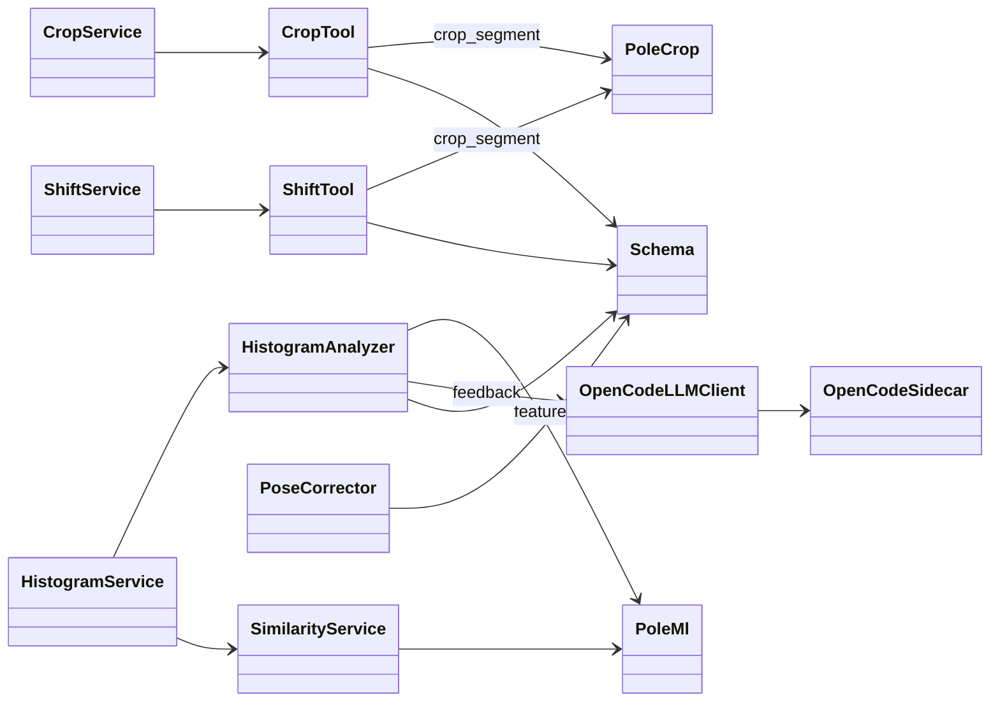

# Classes — `pole_tools` (Reusable Tools + CLI)

> Exhaustive class map for `pole_tools` (`packages/pole-train-model/src/pole_tools/`). For each
> class: role, collaborators, and the data it extracts/transforms. Includes the tool wrappers,
> the services facade, and the CLI entrypoints.

---

## 0. Class Interaction Diagram

> **Legend:** `-->` = "depends on / calls". External collaborators: `pole_crop` (FFmpeg),
> `pole_ml` (features/embeddings), and the OpenCode sidecar. Reference cohort data
> (`skeleton_data.signal_histograms`) is read by `pola_api`, not by `pole_tools` directly.

---

## 1. Tool Wrappers

| Class | Role | Collaborators | Data in / out |
| :--- | :--- | :--- | :--- |
| `CropTool` | Crop a video segment using explicit boundaries | `pole_crop.ffmpeg.crop_segment`, `schema` | video + bounds → `CropResult` |
| `ShiftTool` | Shift/re-crop a clip | `pole_crop.ffmpeg.crop_segment` | clip + delta → `ShiftResult` |
| `HistogramAnalyzer` | Compute M-01..M-08 metrics, classify (STATIC/SPIN/MOMENTUM), phase resample (100/phase), Z-score, critical frame, deviation plot, feedback prompt | `pole_ml` features, `OpenCodeLLMClient`, `schema` | landmarks + `phase_frames` → `AnalysisResult` + artifacts |
| `PoseCorrector` | straighten_leg / point_foot / level_hips + red/green overlay | `schema` | landmarks → corrected landmarks + issue list + overlay |
| `OpenCodeLLMClient` | Multimodal wrapper over OpenCode `/chat/completions` (injectable httpx) | httpx, settings | prompt + images → text |

### Purpose & Use

- **`CropTool`** — Crops a video to explicit time boundaries via ffmpeg. Use it to extract the exact
  window of a trick from a longer source.
- **`ShiftTool`** — Re-crops/shifts an already-cropped clip by a time delta; used to fine-tune a
  crop boundary.
- **`HistogramAnalyzer`** — The analysis workhorse: computes the 8 metrics, classifies trick type,
  resamples phases, computes Z-scores, finds the critical frame, builds a deviation plot, and
  assembles the feedback prompt. Consumed wherever video analysis is needed. Phase boundaries are
  supplied **manually** via `phase_frames` (automatic phase detection was removed —
  `PAIML-POLE-AGENT-015`).
- **`PoseCorrector`** — Fixes common form errors (bent leg, unpointed foot, uneven hips) and returns
  corrected landmarks plus a red/green overlay for visual feedback.
- **`OpenCodeLLMClient`** — Multimodal LLM client (text + images) to the OpenCode sidecar; used for
  coaching feedback.

---

## 2. Services Facade (`services/`)

> The **only** import surface external callers (chatbot/pola_api) may use.

| Class | Role | Data |
| :--- | :--- | :--- |
| `crop.py` | Facade `crop_clip` | video + bounds → clip |
| `shift.py` | Facade `shift_clip` | clip + delta → clip |
| `histogram.py` | Facade `compute_histogram`, `compute_metrics`, `embed_window`, `classify_window` | input → histogram/embedding/class |
| `similarity.py` | Facade `find_similar` | embedding → similar tricks |

### Purpose & Use

- **`crop.py`** — Exposes `crop_clip` as the public crop API for callers.
- **`shift.py`** — Exposes `shift_clip` as the public shift API.
- **`histogram.py`** — Exposes histogram/metric/embedding/classify operations as the single public
  analysis API.
- **`similarity.py`** — Exposes `find_similar` for nearest-neighbor retrieval.

> Callers must depend on this facade only — never import tool internals directly.

---

## 3. Schema & Config

| Module | Role | Data |
| :--- | :--- | :--- |
| `schema.py` | Pydantic domain models | `CropResult`, `ShiftResult`, `AnalysisResult`, metrics |
| `config.py` | Settings (`OPENCODE_URL`, `OPENCODE_MODEL`, DB names) | env → settings |
| `exceptions.py` | Tool error types (`ToolError`, `VideoError`, `LLMError`) | error → typed exception |

### Purpose & Use

- **`schema.py`** — Typed result models returned by the tools; keeps results consistent and validated
  across the system.
- **`config.py`** — Central settings read from env, consumed by the LLM client and reference tooling.
- **`exceptions.py`** — Typed errors so callers can distinguish tool/video/LLM failures and map them
  to HTTP codes.

---

## 4. CLI Entrypoints (`cli/`)

| Command | Role | Data |
| :--- | :--- | :--- |
| `process_data.py` | Extract + process source videos → windows/histograms | videos → `skeleton_windows`/`skeleton_histograms` |
| `train_model.py` | Train LSTM (Leave-One-Out) | windows/labels → model |
| `process_embeddings.py` | Populate ChromaDB with trick embeddings | windows → Chroma |
| `samples_info.py` | Report dataset samples per class | store → info |
| `video_cutter.py` | Cut videos into clips | video → clips |
| `evaluate_video.py` | Evaluate a video against model | video → prediction |
| `find_by_similarity.py` | Nearest-neighbor retrieval | embedding → similar |
| `audit_clips.py` | Audit/QC clips | clips → audit report |
| `extract_data.py` | Extract raw data | source → raw |
| `migrate_windows.py` | Migrate window schema | old windows → new windows |
| `clip_resolver.py` | Resolve clip paths/ids helper | id → path |
| `eval_utils.py` | Evaluation helpers | predictions → metrics |
| `config.py` | CLI settings | env → settings |

### Purpose & Use

These are the runnable commands (`pixi run ...`) for the data lifecycle. Use `process_data` to build
the dataset, `train_model` to train, `process_embeddings` to populate Chroma, and the rest for
QC/evaluation utilities.

---

## 5. Data Transformations (summary)

| From | To | Operation |
| :--- | :--- | :--- |
| Video + bounds | cropped clip | `CropTool` → `pole_crop` ffmpeg |
| Clip + delta | shifted clip | `ShiftTool` → `pole_crop` ffmpeg |
| Landmarks + phase_frames | metrics / Z-score / critical frame / plot | `HistogramAnalyzer` |
| Landmarks | corrected landmarks + overlay | `PoseCorrector` |
| Analysis + plot | coaching text | `OpenCodeLLMClient` |
