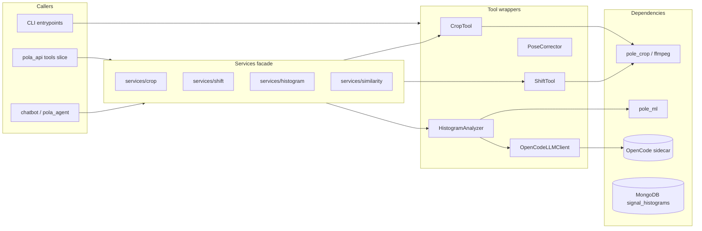
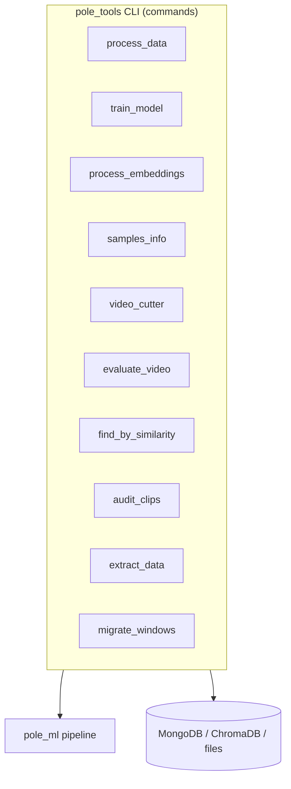

# Flow — `pole_tools` (Reusable Tools + CLI)

> Layers and key classes of the reusable tools package: tool wrappers, the services facade, and
> the CLI entrypoints (`pole_tools`). Shipped in the `pole-train-model` package alongside
> `pole_ml`. Class-level details: [CLASSES.md](./CLASSES.md).

---

## 1. Tools Flow Diagram

---

## 2. CLI Flow Diagram

### 2.1 Diagram Component Descriptions

| Node | Purpose & Use |
| :--- | :--- |
| **CALL — `pola_api` tools slice** | Backend HTTP slice that exposes crop/shift/correct/histogram to clients. |
| **CALL — `chatbot` / `pola_agent`** | Conversational agents that call the tools facade to perform actions. |
| **CALL — CLI entrypoints** | `pole_tools` command-line tools for data processing/training. |
| **FACADE — services/crop · shift · histogram · similarity** | The **only** public import surface for callers; each facade wraps the matching tool. |
| **CropTool** | Wraps `pole_crop` ffmpeg `crop_segment` to crop a video segment. |
| **ShiftTool** | Wraps `pole_crop` to shift/re-crop a clip. |
| **HistogramAnalyzer** | Computes metrics, classifies trick type, resamples phases (manual `phase_frames`), Z-score, critical frame, deviation plot, feedback. |
| **PoseCorrector** | Straighten/point/level corrections + red/green overlay. |
| **OpenCodeLLMClient** | Multimodal LLM wrapper over `/chat/completions`. |
| **DEP — `pole_crop` / ffmpeg** | Video processing dependency. |
| **DEP — `pole_ml`** | Feature/embedding dependency. |
| **DEP — OpenCode sidecar** | LLM endpoint. |
| **DEP — MongoDB** | Reference cohort `skeleton_data.signal_histograms` (mean/std per trick/metric). |

---

## 3. Layers and Key Classes

### Tool wrappers
- `CropTool`, `ShiftTool` — wrap `pole_crop.ffmpeg.crop_segment`.
- `HistogramAnalyzer` — M-01..M-08 metrics, classify, phase resample (100/phase, manual
  `phase_frames`), Z-score, critical frame, deviation plot, feedback prompt.
- `PoseCorrector` — straighten_leg / point_foot / level_hips + red/green overlay.
- `OpenCodeLLMClient` — multimodal wrapper over `/chat/completions`.

### Services facade (`services/`)
- `crop.py`, `shift.py`, `histogram.py`, `similarity.py` — the **only** import surface for callers.

### Schema / config
- `schema.py` — Pydantic domain models (`CropResult`, `ShiftResult`, `AnalysisResult`).
- `config.py` — settings.

### CLI (`cli/`)
- `process_data`, `train_model`, `process_embeddings`, `samples_info`, `video_cutter`,
  `evaluate_video`, `find_by_similarity`, `audit_clips`, `extract_data`, `migrate_windows`,
  `clip_resolver`, `eval_utils`.

---

## 4. Data Flow (extract → transform → produce)

| Tool | Extract | Transform | Produce |
| :--- | :--- | :--- | :--- |
| Crop | video + bounds | ffmpeg `crop_segment` | cropped clip |
| Shift | clip + delta | ffmpeg re-crop | shifted clip |
| Histogram | landmarks + phase_frames | metrics, phase resample, Z-score, critical frame, plot | `AnalysisResult` + artifacts |
| Pose correct | critical frame landmarks | straighten/point/level | corrected landmarks + overlay |
| LLM feedback | analysis + plot | prompt → LLM | coaching text |
| CLI (process_data) | raw videos | `pole_ml` extract→process | windows + histograms |
