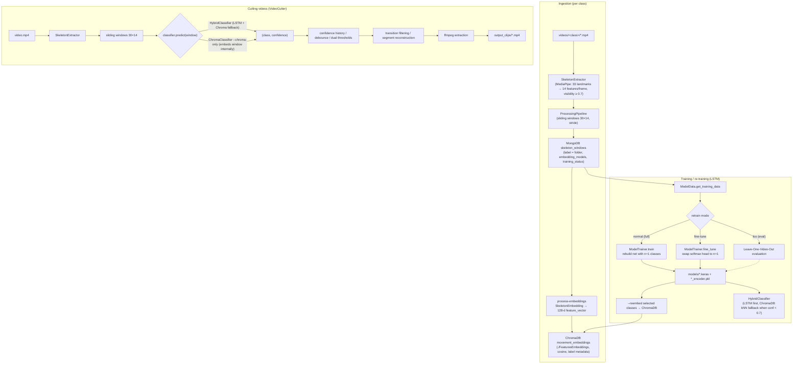
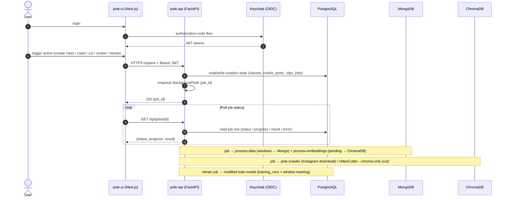
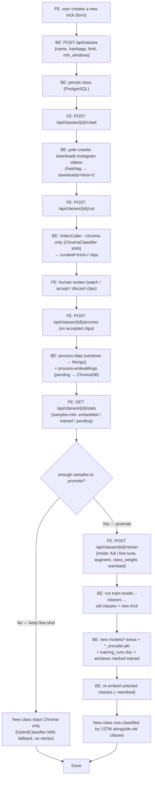

# Pipeline & Integration Diagrams (Pole AI)

**Scope:** Mermaid diagrams documenting the current ML pipeline and the planned FE↔BE integration.
**Sources:** `docs/project/retraining-tool-plan.md`, `docs/project/pole-api-plan.md`, `docs/project/VIDEO_CUTTER.md`.
**Date:** 2026-08-04

> Status note: the ingestion steps (`process-embeddings` tracking fields, `samples-info`,
> modified `train-model`, `ModelTrainer.fine_tune`) are **planned** (see retraining-tool-plan.md).
> The `Classifier` interface, window→embedding `ChromaClassifier`, and `VideoCutter --chroma-only`
> are **implemented** (commit `d8d78e5`). `pole-api` / `pole-ui` are **planned** (pole-api-plan.md).

---

## 1. Current pipeline: training / re-training & cutting

**Reading notes**
- The **training / re-training** branch starts from Mongo windows; `transition` doubles as the
  noise/negative class in the cutter.
- The **cutting** branch is classifier-agnostic: `VideoCutter` only calls the shared
  `Classifier.predict(window) → (class, confidence, metadata)` contract, so a new trick can be
  cut through `--chroma-only` (ChromaClassifier embeds the window internally) with no LSTM.

---

## 2. FE ↔ BE API interaction (pole-ui ↔ pole-api)

---

## 3. FE ↔ BE flow: add a class, download from Instagram, re-train

**Sequence summary**
1. **Add class** — user creates the trick in `pole-ui`; `pole-api` stores it in PostgreSQL.
2. **Download from Instagram** — `crawl` job runs `pole-crawler`; raw videos land in `downloads/<trick>/`.
3. **Cut & review** — `cut` job runs `VideoCutter --chroma-only`; the user accepts/discards clips in the UI.
4. **Process** — accepted clips go through `process-data` (windows → Mongo) + `process-embeddings` (pending → ChromaDB).
5. **Decide** — `samples-info`-powered stats drive the promotion decision.
6. **Re-train (promote)** — `retrain` runs the modified `train-model` (`full`/`fine-tune`) + `--reembed`;
   until promoted the new class is served by the ChromaDB few-shot path.
